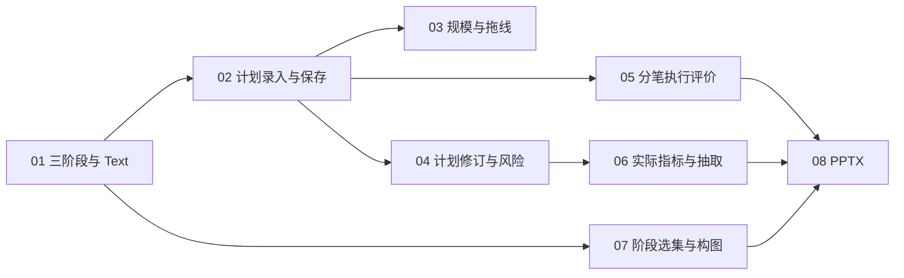

# 主图优先三阶段复盘 · 执行拆分提案

日期：2026-09-26。状态：用户要求多个 Astra-light Agent 推进并行开发，按已呈现八票与 Astra low 映射执行。

依据：[最终需求规格](../../docs/specs/2026-09-25-chart-first-review-ui.md)、[元素规范](../../docs/specs/2026-09-25-chart-first-review-ui-elements.md)、[已确认视觉 demo](../../docs/designs/2026-09-25-chart-first-review/index.html)。

父任务：[主图优先三阶段复盘：结构化计划、执行记录与演示导出](../chart-first-review-design/issues/01-chart-first-review.md)。按 to-tickets 保持父任务原样；批准后在本功能目录下一票一文件发布，不替换父任务或已交付设计包。

## 执行方式

- 本轮是产品实施，承接已经确认的设计，不重新讨论布局路线。
- 用户指定 Astra Light 作为主力开发子模型，覆盖项目默认 Luna 约定。当前可调用型号为 `gpt-6-astra`，轻量推理为 `low`；本轮按已说明的 Astra low 映射执行，不声称存在独立 Astra Light 型号。
- 每票交给新的主力开发子代理；协调者负责接口约定、文件所有权、独立审查与浏览器验收。开发子代理不得自行扩大范围或另派代理。
- 不按前端、后端、数据库拆水平票。每张票交付一个可演示的用户行为，同时完成所需校验、持久化、查询投影和验收。
- 复用现有版本化 Recall 文档、保存 API、服务端 SQLite、双游标回放和导出 manifest。不需要先做跨全库的机械重构；必要的小范围抽取归入首个需要它的切片。
- 结构化数据的冻结与可查询性从第一票开始，随字段扩展；不能最后再给旧图补配最新数字。

## 01 — 三阶段回放与图上 Text 连续记录

**Blocked by:** 无，可立即开始。

**What it delivers:** 入场前、持仓中、事后三个阶段顺畅切换；逐根推进和图上 Text 保持在主图内；持仓阶段显示只读已知事实，原计划尚未记录时明确缺失，返回早期阶段恢复其行情与成交边界。

- 紧凑顶栏、绘图工具和底部回放条；完整记录列表按需展开，保留全部决策及快照。
- 行情/成交双游标独立；同 K 多决策、未完成 K、缺失行情、切周期和回看不提前揭示。
- 不要求填表或留存才能继续；输入数字、Text、中文 IME 期间不响应回放快捷键，编辑时暂停播放。
- 保存阶段上下文、Text 稳定身份/修订和来源；查看未来后回补早期文字标为已看后续补记。
- 留存时冻结阶段、行情/成交双游标、图文修订与已看后续标记；修改工作图不覆盖旧快照。
- 手机工具区保留选择/Text/更多，44px 命中区；趋势与输入上下同屏。
- 验收：留存前后切换/重开、中文输入与方向键、用户样式/图表设置不丢、逐根与同 K 决策反例。

## 02 — 边看图边录入并保存买入前计划

**Blocked by:** 01 — 三阶段回放与图上 Text 连续记录。

**What it delivers:** 在原 Recall 入口，以主图旁的紧凑侧栏填写入场、止损、目标和计划数量；图中计划线与输入同步，保存后关闭重开仍恢复，留存快照同时保留该版计划与初始风险。

- 侧栏参与布局，价格轴及标签在其左侧；桌面不遮挡，空间不足时上下分区；沿用应用颜色、字体、图标和用户图表设置。
- 首次买入前仅展示可知行情和计划，不泄露实际买入、后续退出或最终结果。
- 完成方向、币种、数量、空值和价格关系校验；显示计划风险与预期 R，允许缺项草稿。
- 沿用版本化自动保存与乐观并发，失败/冲突保留输入；旧文档没有结构化计划时显示未记录，不从成交反造计划。
- 保存计划稳定身份、补记来源、记录时点、观察截止和可重建查询投影；留存时冻结计划版本/风险基准，不改变原成交。
- 验收：真实工作区输入→保存→重开→留存；兼容旧文档、冲突与失败；图表和价格轴边界测量。

## 03 — 用金额或仓位定规模，并拖线调整计划

**Blocked by:** 02 — 边看图边录入并保存买入前计划。

**What it delivers:** 数量、名义金额、仓位比例三种方式录入同一计划；参考资金按需展开；拖动计划线与精确输入双向同步，派生风险和占比即时更新并可重开。

- 一次只有一个主输入，其余数值派生；保留主输入、换算数量、单位和最小交易单位舍入结果。
- 资金基数保存金额、币种、时点及来源；手填显示参考资金，缺失/不同币种不伪造比例。
- 超过参考资金的仓位明确提示，不静默截断；原始成交不受计划输入影响。
- 拖线/编辑共用计划对象；做空方向相反，错误价格和零风险不靠绝对值掩盖。
- 新字段随计划保存、留存和查询投影原子更新。
- 验收：三种规模模式换算与重开、空值、舍入、做空、拖线、侧栏 resize 不改变窗口/游标。

## 04 — 持仓计划调整、风险基准与显式纠错

**Blocked by:** 02 — 边看图边录入并保存买入前计划。

**What it delivers:** 在持仓中记录调整后的止损、目标或计划数量，同时保留原计划；初始输入错误可显式更正，旧快照和已留存结果不被覆盖。

- 每次修订有稳定身份、父版本、理由、决策归属、录入时点和观察截止。
- 初始风险基准冻结；后移止损、减仓不改变原 R 分母。
- 多次建仓分别记录风险；全回合预算必须在加仓前有明确来源，否则提示基准待确认。
- 无原止损可使用有来源固定风险预算并标为预算 R，不能混用价格推算 R。
- 更正新建修订，受影响成果标待重新确认；保留旧版和比较依据。
- 验收：持仓调整→留存→回看原版→重开；券商拆分成交、加仓、风险纠错和重导关联变化。

## 05 — 事后逐次评价退出并关联图上证据

**Blocked by:** 02 — 边看图边录入并保存买入前计划。

**What it delivers:** 事后侧栏选择每次减仓/清仓，记录是否提前、原因、符合度与归因标签；切换决策和重开后各次评价独立，原计划和真实成交只读。

- 提前退出是/否/不确定，未填为未评价；不能由价格未达目标自动判定，也不把提前退出等同错误。
- 保存比较的计划/目标版本、评价来源、记录时间及 Text/快照证据；其他原因需短说明。
- 仓位/入场/退出/判断为人工标签及词典版本，不自动作因果归因。
- 草稿评价可继续修改，留存版本组合保持原评价；查询投影与文档同事务更新。
- 为未来抽取保留决策数量、评价覆盖率与三态，明确“是/(是+否)”和数量加权的不同分母。
- 验收：两次退出互不串值、无原计划、未评价/不确定、快照后修改、保存失败/冲突及只读成交。

## 06 — 展示可信的计划/实际结果与可抽取指标

**Blocked by:** 04 — 持仓计划调整、风险基准与显式纠错。

**What it delivers:** 在对应阶段看到计划与实际的数量/价格偏差、部分已实现和浮盈亏；平仓后显示扣费净盈亏、实际 R 及其明确风险分母，结构化结果可按回合/决策抽取。

- 十进制计算、数量加权退出均价、费用只扣一次；入场费用分配到已关闭和剩余部分，末笔处理舍入差。
- 缺费用、成本、数量、币种或风险基准时返回空值与原因，不把兼容零值当已知。
- 多次建仓、固定预算 R、原币口径、模拟运行隔离均按主规格执行；不新建统计大屏。
- 指标带文档/成交/计划/口径版本；查询投影可重建，不能独立编辑或使用最新草稿覆盖旧成果。
- 验收：合成样例净额 6,760、实际 1.69R；部分退出、做空、多次建仓、未知费用和跨币种；HTTP 保存后从数据库查询到同版字段。

## 07 — 选择三阶段代表快照与比较构图

**Blocked by:** 01 — 三阶段回放与图上 Text 连续记录。

**What it delivers:** 从每阶段已留存内容选择一张代表图并保存选择，预览可比较的三张图；无中间成交也可留存持仓观察图，缺阶段明确显示，不伪造快照。

- 本票仅选择已留存快照引用与构图。01 已冻结阶段和图文上下文；02/05/06 各自负责随数据加入冻结计划/评价/指标，本票不以这些字段已经存在为前提。
- 持仓观察快照仍归属现有决策或全局图，不制造成交或增加决策完成数量。
- 固定可比较观察窗口；早期价格轴不能根据未来高低点反推；范围不同标差异，重排只生成副本。
- 缺阶段明确缺失，未留存编辑明确排除；草稿/正式版本可选择，不自动完成回合。
- 保留全部决策与多快照；清仓、每个决策有快照、全局确认的原完成规则继续有效。
- 本票验收：选择→保存→重开→预览；缺阶段、缺全局汇总、同窗与重导孤立记录。与02/05汇合后的集成验收另验证“留存后改计划/评价不污染导出”，不把尚未实现的字段作为本票前置。

## 08 — 导出可离线打开的三图一表 PPTX

**Blocked by:** 05 — 事后逐次评价退出并关联图上证据；06 — 展示可信的计划/实际结果与可抽取指标；07 — 选择三阶段代表快照与比较构图。

**What it delivers:** 从现有导出入口下载 16:9 演示文稿：三阶段图依次出现，最后是可编辑的交易数据总结表；保留既有 Markdown/图片导出。

- 各阶段图文取各自所选快照的冻结版本组合，第四页取选定全局/正式成果的版本组合；导出 manifest 固定这组引用，均排除最新草稿，不能把三阶段套进同一时点的数据。
- 图表为高分辨率静态图，文本/表格可编辑，来源与缺失状态清晰；不包含工作区工具、侧栏或选中框。
- 汇总数量、资金基数、风险、每笔退出、费用、净额、R、原因与执行符合度；过长明细分附页，字体不无限缩小。
- 图文按稳定身份/修订去重；缺图不伪造，所有图片内嵌，无应用内部 URL。
- 导出选定留存版本，失败不改变复盘；文件名和 XML 文本处理长中文与特殊字符。
- 验收：真实浏览器下载、解包检查、离线打开/渲染和表格可编辑性；缺阶段、长文本、多次退出与导出失败，旧导出回归。

## 依赖与调度

- 01 验收后，02/07 具备并行条件；02 验收后，03/04/05 具备并行条件。实际调度仍要求文件所有权不冲突；共享工作区入口由单一代理整合，不能为共享文件而伪造业务阻塞边。
- 03 不阻塞阶段或评价主路径，但属于本轮完整交付范围，最终验收必须包含它。
- 每票包含红→绿行为测试、最小实现、相关回归和协调者审查。整体验收是全部八票完成后的交付门槛，不另设只做测试的水平功能票。

## 总体验收门槛

- 最高测试切面复用 Recall 工作区集成流程；补充保存 API/服务端仓储的原子提交与版本冲突，以及数值和导出契约。
- 用显式隔离数据库、独立端口验收；共享业务数据库默认配置保留。先取得 SQLite 一致性备份，再进行写入演示，记录原成交摘要并核对未改原事实。
- 桌面 1440×900 / 1280×800、约390px窄屏：边看图边输入，价格轴与侧栏分离，长文本与输入焦点可见；真实移动软件键盘单独验证，不以桌面改宽冒充。
- 路径：旧回合打开→计划录入→逐根/中文 Text→持仓修订→逐次退出评价→留存/关闭重开→四页导出；另覆盖并发冲突、未知值及重导关联。
- 运行相关测试、全量回归、类型检查与构建；协调者最终浏览器验收后提供运行中的产品预览与启动方式。
- 不推送、合并或发布，除非用户另行要求；父任务不修改。已交付视觉包保留为设计基线。

## 规格覆盖

| 需求组 | 执行票 |
| --- | --- |
| 主图、紧凑控件、价格轴、侧栏与窄屏 | 01 / 02 / 03 / 05，各票自带响应式验收 |
| 双游标、逐根、中文 Text、阶段边界与来源 | 01 |
| 价格、规模、资金分母、初始风险、缺失 | 02 / 03 |
| 修订、冻结风险、多次建仓、保留原始成交 | 04 / 06 |
| 提前退出、原因、执行符合度、人工标签 | 05 |
| 净额/费用/实际 R、统计字段与可抽取性 | 02 / 05 / 06，随字段同步持久化和投影 |
| 草稿、快照版本、正式成果、失败/冲突 | 01 起贯穿每票，02/05/06 随字段扩展留存组合，08 汇合导出 |
| 三图一表、缺阶段、附录、离线可编辑表格 | 07 / 08 |
| 原风格/图表设置/工具能力、数据保护与回归 | 每票及最终门槛 |

## 执行授权

2026-09-26 用户指示“使用多个Astra-light Agent推动并行开发”，接续上一轮列出的八票与模型映射。按此启动，不重复请求方案批准。主力子模型明确使用 gpt-6-astra / low。
