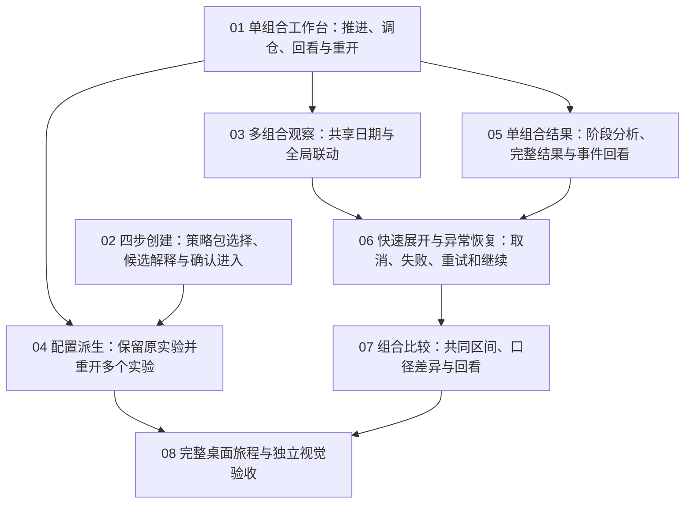

# 策略桌面 UX v2：任务拆分与执行方案

日期：2026-09-29。状态：**已发布，用户授权开始实施**。

来源：[桌面设计方案](../../docs/specs/2026-09-29-strategy-desktop-ux-design.md)与[设计规格总票](../strategy-portfolio-backtesting/issues/08-desktop-ux-design-spec.md)。原父票与 Wayfinder 决策票不修改、不关闭。用户已明确指定开发及验收模型，授权按本拆分实施。

## 目标与范围

将桌面方案落实为可独立演示和验收的原型切片，保留 A 四步引导、TradeReview 风格以及合成数据/内存边界。原型先验证使用场景，正式数据复用、引擎、插件运行时与数据库保存仍留在后续产品开发。

排除：窄屏改版/专项验收、真实引擎或持久化实现、跨实验结果比较、远端发布。当前实施仅限桌面交互原型。

## 拆分概览

| 序号 | 任务 | 直接依赖 | 完整交付行为 |
| --- | --- | --- | --- |
| 01 | [单组合工作台：推进、调仓、回看与重开](issues/01-single-portfolio-observation.md) | 无 | 从现有创建入口进入一个合成组合，使用新的桌面布局从 T0 推进到首次建仓与一次再平衡，检查事件并回看早期，再返回列表重开原位置。完整验证单组合状态、真实图表和新信息层级；沿用已有双策略输入接口，不删除当前多组合能力，但多组合新联动由第 03 票验收。 |
| 02 | [四步创建：策略包选择、候选解释与确认进入](issues/02-guided-creation.md) | 无 | 从实验列表新建，经设置起点、选择完整策略包、解释候选和确认进入，生成一个或两个组合配置并进入 T0；返回列表重开保留准确设置。使用既有运行接口即可独立验证，不等待第 01 票的新工作台完成；不扩张为正式筛选服务。 |
| 03 | [多组合观察：共享日期与全局联动](issues/03-synchronized-portfolios.md) | 01 单组合工作台：推进、调仓、回看与重开 | 从现有可创建两策略的入口进入同一起点的两个独立组合，在同一天切换全局页签，净值、摘要、持仓和事件一起切换；分别验证随策略调仓与初始持有预设，再回看/重开。依赖第 01 票已接受的真实图表与会话契约，创建控件新版第 02 票不是前置。 |
| 04 | [配置派生：保留原实验并重开多个实验](issues/04-fork-and-reopen-experiments.md) | 01 单组合工作台：推进、调仓、回看与重开；02 四步创建：策略包选择、候选解释与确认进入 | 运行中的配置只读；用户基于它新建草稿、修改、取消或生成另一实验，原实验可从列表重新打开并保持原进度。两个实验在同一内存会话并存，列表按状态提供准确入口。 |
| 05 | [单组合结果：阶段分析、完整结果与事件回看](issues/05-results-and-process-return.md) | 01 单组合工作台：推进、调仓、回看与重开 | 用逐日/播放达到阶段或终点，进入一个组合的结果，查看净值、回撤、仓位和损益明细，从结果点选调仓回到过程，再恢复来源结果区间和位置。结果来自当前合成账本，贯通读取/计算/展示/导航。 |
| 06 | [快速展开与异常恢复：取消、失败、重试和继续](issues/06-bulk-reveal-and-recovery.md) | 03 多组合观察：共享日期与全局联动；05 单组合结果：阶段分析、完整结果与事件回看 | 从多组合工作台明确选择展开剩余行情，看到实际逐日进度，可取消或停在完整日；成功进入已有结果页。用合成场景触发数据/执行失败，重试或明确排除失败组合继续，失败组合和其他组合的截止/显示始终准确。 |
| 07 | [组合比较：共同区间、口径差异与回看](issues/07-portfolio-comparison.md) | 06 快速展开与异常恢复：取消、失败、重试和继续 | 从已完成或阶段结果进入至少两组合比较，在共同区间查看曲线/指标和配置差异；包含失败、落后、不可直接比较组合；点选某组合事件回到过程并回到原比较视图。 |
| 08 | [完整桌面旅程与独立视觉验收](issues/08-desktop-journey-acceptance.md) | 04 配置派生：保留原实验并重开多个实验；07 组合比较：共同区间、口径差异与回看 | 从全新桌面会话走通创建→多组合运行→调仓回看→派生/重开→完整结果/比较→返回过程，独立核对视觉与键盘，并形成可交接的原型证据。它是整条用户行为的集成验收票，不是集中补做前面遗漏视觉或功能的杂项票。 |

## 依赖图

- 初始可领取面是 **单组合工作台** 与 **四步创建**，现已发布并领取01/02。
- 工作台最小旅程由协调者独立接受之后，才放行多组合、派生和结果等依赖会话契约的工作。不能拿旧原型PASS当成新契约已经接受。
- 多组合不依赖创建新版：现有已接受入口已经能提供多策略配置，03复用这一稳定输入。02使用既有运行入口验T0，不负责01的新工作台视觉。
- 快速展开依赖单组合结果，因为“展开并查看结果”必须有真实可达出口；异常恢复还依赖多组合身份与各自截止。
- 比较仅直接依赖快速展开与异常恢复，后者已经传递包含多组合和结果；不重复写冗余阻塞。
- 最终验收直接依赖配置派生与组合比较，两条传递链覆盖全部切片。
- 依赖表达产品/状态和验收前置，不表达文件互斥；共享文件由唯一接线owner串行落地或分配不重叠范围，不因此虚构产品依赖。

## 为什么不单开基础重构或视觉票

现有原型已经有创建输入、逐日合成账本与真实图表。01在已有路径上做最小必要会话整理并交付可操作闭环，不建立尚无消费者的通用引擎。没有会造成全仓同时破坏的机械改名或类型迁移，因此不需要 expand–contract 队列。

颜色、字号、主次层级、桌面尺寸和键盘交互属于每条用户路径的验收，不拆成最后统一“美化”的横向票。08只检查最终集成及完整旅程，发现缺陷回到对应owner修复。

## 共同视觉与状态契约

- 参考原图与CSS视口为1440×900、1280×800，100%缩放；历史参考DPR1，后续记录实际DPR。只验桌面。
- 参考[现有TradeReview 1440](../strategy-portfolio-backtesting/screenshots/creation-baseline-1440.jpg)、[现有TradeReview 1280](../strategy-portfolio-backtesting/screenshots/creation-baseline-1280.jpg)，新结构按规格DD02、DD13；旧运行截图用于定位差异，不当作新画板。
- 工作台层级：标题→组合页签→资产摘要→时间控制→主图/持仓事件。主图1440下约360px、1280下不低于320px；侧栏296–320px、抽屉420–480px；详情不得挤掉主图区。
- 创建保持四步，一主一次动作、完成勾号/当前蓝/未到灰。完整策略卡与预览在各自票中落实，不拆为没有用户闭环的组件任务。
- 时间遵守V/M/Mᵢ/R与曝光来源；每票明确其范围内的动作和不变量。初始零持仓、入选目标、实际成交分别表达；展示精度不改账本。
- 真实图表/导航行为、独立视觉和功能正确性三道门槛分别留证，鼠标与键盘分别记录。实施按票执行适用的类型检查、浏览器功能与视觉验收。

## 责任与接线安排

01/02已领取。实际派发由 gpt-6-luna / max 承担有界实现，gpt-6-astra / low 独立验收；主协调者持有跨票状态契约与完整用户体验，独立接受每一条路径。每票派发前绑定唯一实现/接线owner、整页视觉owner和未参与实现的审查者，填写精确可写文件范围。

01负责确立工作台会话公开行为；02保持已确认配置入口兼容；03/04/05/06/07扩展各自公开路径。输入/输出在草稿中已明确，具体实现文件不是产品需求。多个已就绪任务可能共享既有TSX，不能直接同时交给不同writer编辑。

新增验收记录约定为 acceptance/NN.md、screenshots/NN/；这些尚不存在，不充当通过证据。发布后以逐项覆盖矩阵跟踪需求/元素/状态/owner/证据，不用票标题代替。

## 已完成的草案检查

- [x] 每张草稿是一条可演示/验证的完整行为，包含输入/输出、标准与反例。
- [x] 没有把UI/状态/数据/测试拆成互相孤立的横向票。
- [x] 覆盖UX01–UX10、E01–E12、T01–T12和全部50条用户故事，详见[覆盖草案](DESIGN-COVERAGE.md)。
- [x] 独立只读审查核对DAG和边界：保留01早期门槛，明确02/04分工，限制06为确定性异常演示，补齐05/07返回来源与部分区间；视觉不能推迟到08。
- [x] 用户授权按拆分实施，并指定开发/验收模型。
- [x] 已发布8票，01/02并行实施，其余等待依赖接受。

## 当前执行授权（覆盖上述草稿阶段表述）

用户于2026-09-29明确指定多个 Luna6 max 开发、Astra Light 验收，授权发布并实施本8票方案。正式票位于 issues/，01/02 已领取并行实施，03–08 等待依赖独立接受。实际模型 gpt-6-luna/max 与 gpt-6-astra/low。草稿历史保留，当前状态以正式票、README、PROGRESS及DESIGN-COVERAGE为准。原父票不修改不关闭。
