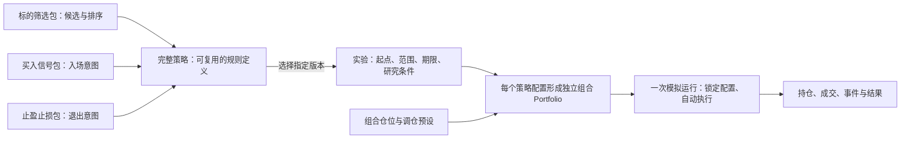
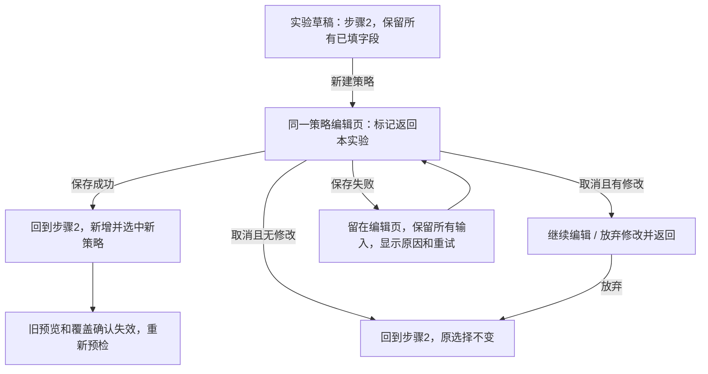

# 策略库与实验分离 · 交互模型

日期：2026-09-30 · 任务：[09](issues/09-strategy-library-interaction-model.md) · 负责人：Codex 主协调者。

**状态：修订 04 按用户反馈纠正实验入口归属，补齐“我的实验”界面。** 策略库只管理方法；实验列表、新建实验、选择和使用策略统一属于“我的实验”。修订03的大量包管理保留；本轮详见 M13/F14–F19。具体画板仍供审阅，本文和[静态线框故事板](strategy-library-wireframes/index.html)为任务09设计产物，没有新增应用保存或运行能力。

## 1. 设计目标与选择

用户先管理可复用的方法，再用这些方法研究一个时间段。主角仍是观察自动执行的策略观察者。保留现有四步创建、历史可知数据、每个组合独立本金和运行记录不可改写；补齐策略库、三类包组装、复制历史策略及实验内新建往返。

### M01 · 推荐的信息组织

| 方案 | 结构 | 取舍 |
| --- | --- | --- |
| **A · 完整策略优先（推荐）** | 策略区下并列“策略库 / 我的实验”；库内默认“完整策略”，另有三类包目录 | 研究者先找到可用于实验的策略，需要时再了解组成。三类包仍有独立可达入口。 |
| B · 三类包优先 | 进入策略库先见三个包目录，选完后生成完整策略 | 更适合经常开发包的人；普通实验选择多一道组装步骤，不利于已有策略复用。 |
| C · 策略与实验同一列表 | 一个列表按对象类型筛选 | 少一个入口，但难以一眼区分方法、草稿与运行记录，也不利于本次强调的独立管理。 |

建议选 A；组装使用**完整页面**，选择某个包时才打开覆盖式选择面板。相比全程弹窗，完整页面能同时看清三类职责、来源和保存去向；相比再增加一个向导，不需要逐步切页才能比较三类包。

### 整体认可的四项模型决定（继续遵守追加反馈）

1. 策略库默认“完整策略”，旁边有“标的筛选 / 买入信号 / 止盈止损”三个目录。
2. 完整策略每类选一个包；包可以封装多个条件。首轮没有任意 AND/OR、多包投票或原子条件编辑器。
3. 策略组装独立全页，包选择是覆盖式面板；实验内进入时携带明确的“返回实验”上下文。
4. 调仓与仓位预设保留在实验每个组合的配置里；修改已保存策略生成新版本，复制历史策略生成新身份。

## 2. 领域关系与归属

### M02 · 五个对象，不混用“组合”



筛选入围 → 检查买入信号 → 产生目标/订单意图 → 宿主校验资金和成交条件 → 实际成交。这些步骤不能合并成“入选即买入”。持仓再由退出包及调仓预设产生调整意图；退出触发也不等于已成交。

| 内容 | 归属 | 界面展示 |
| --- | --- | --- |
| 三类包、包版本、包内命名预设及公开配置 | 完整策略的版本 | 库列表显示三段摘要；策略详情/编辑显示全部有效值；与下行组合预设分开 |
| 筛选排序、多条件组合、技术形态计算 | 筛选包内部 | 规则摘要与数据要求，不新增排序条件搭建器 |
| 历史起点、时区、标的集合、期限、盲看/逐日揭示设置、数据快照 | 实验 | 第一步和最终确认；不存入完整策略 |
| 每组合本金、仓位分配与调仓预设、币种/费用/执行口径 | 实验中的组合配置及运行快照，不是第四类策略包 | 第二步选中策略后可改组合预设，第三步看目标，确认时固定有效配置；策略只提供推荐/兼容性信息 |
| 实际持仓、现金、成交、运行事件和结果 | 组合及模拟运行 | 工作台与结果；不复制到策略库 |
| 复制来源策略及其版本 | 新策略的来源 | 编辑页、详情页可读；与来源保持独立身份 |
| 派生实验来源、已看后续记录 | 新实验/运行的来源 | 沿用原桌面契约；复制或改名不能清除 |

“多个完整策略进入实验”表示独立组合比较。一个实验内多个组合使用同一研究区间，但不共享资金池。当前既有多选一次加入一个完整策略；比较同一策略的不同调仓配置，可从库复制成明确命名变体后选择，或分别建实验。首轮不增加隐式重复行或信号投票。

## 3. 信息架构与共同框架

### M03 · 导航树

```text
TradeReview 应用侧栏（保留现有顺序、宽度与“策略”入口）
└─ 策略
   ├─ 策略库
   │  ├─ 完整策略（默认） → 策略详情 → 历史版本
   │  │                  → 新建 / 编辑新版本 / 复制为新策略
   │  ├─ 标的筛选（包目录与只读说明）
   │  ├─ 买入信号（包目录与只读说明）
   │  └─ 止盈止损（包目录与只读说明）
   └─ 我的实验
      ├─ 草稿 → 继续四步创建
      └─ 待开始 / 运行中 / 暂停 / 完成 / 失败 → 重开实验
```

策略库不显示实验收益排名；实验列表不承担策略编辑。策略库列表、策略详情及历史版本均不提供“用于新实验”或“新建实验”。用户通过并列的“我的实验”tab进入实验列表，再创建实验并选择策略。切换tab只是导航，不创建草稿、不自动带入或使用某个策略。

### M04 · 页面与区域（LIB01–LIB07；新增LIB08/09见M13）

| 画板 | 内容与主次关系 | 主动作与返回 |
| --- | --- | --- |
| F01 策略库 · LIB01/02 | 应用侧栏；策略库/我的实验；四类目录；搜索；完整策略行显示名称、版本、三类组成、定义状态 | 主：新建策略→F19。行：查看详情 / 复制；没有创建或使用实验的动作 |
| F02 策略组装 · LIB03 | 实验来源；名称/用途；按筛选→买入→退出排列的三张槽位；右侧固定摘要及数据要求；底部动作 | 保存并返回实验 / 取消并返回实验；纯库来源另见F19，仅保存策略 / 取消回库 |
| F03 选择包 · LIB03 | 在 F02 右侧覆盖约 480px 面板；按当前类型过滤；命名预设与脚本包共用列表；说明、版本、数据依赖与兼容性 | 主：使用此包。次：取消/关闭；只有确认后替换槽位，关闭不清空旧包 |
| F04 历史版本/复制 · LIB02/03 | 策略详情有“当前版本 / 历史版本”；选定版本显示三类包、来源、被实验引用情况 | 复制为新策略 → F02；修改名称并替换一个包；旧版本只读 |
| F05 实验第二步 · LIB04 | 保留四步条与第一步设置摘要；完整策略复选列表；三类包短摘要；选中后可改组合预设；新建策略为清楚的次动作 | 主：生成组合预览。次：上一步；新建走 F02，返回仍是本页 |
| F06 实验配置追溯 · LIB05 | 只画配置详情及两个明确出口，工作台框架留给 11；显示本次锁定的策略/三类包/组合预设/来源 | 查看库中此版本 / 复制该版本为新策略 / 基于此配置新建实验；关闭回原实验 |
| F07 关键状态 · LIB02/03/04 | 空库、缺退出包、保存失败、返回实验后缺数据四个状态小样 | 分别提供新建、补包、重试、修改实验条件或移除；不把原因混为“无结果” |
| F08 旧整体包映射 · LIB03/05 | 原始定义只读、三类槽位待映射、新策略身份；完整之前禁用保存 | 逐类明确选择；取消回来源；成功只保存新策略 |
| F09 策略包详情 · LIB06 | 类型、名称/版本、用途、规则、命名预设/有效参数、数据及适用范围、版本来源；复用应用外框与详情样式 | 包选择面板内原位展开详情，返回原列表；查看不等于使用，关闭不丢草稿 |
| F10 大量包目录 · LIB07 | 三类包共用紧凑表格；搜索、标签/来源/状态筛选、排序、置顶优先；行内名称/版本、标签、使用策略数、开发/更新时间 | 名称进入 F12；独立置顶入口；整理顺序进入 F11；分页保留上下文 |
| F11 整理顺序 · LIB07 | 独立模式展示本类型的全部未归档包，置顶与普通两组；上下移动、拖动和移至指定位置 | 保存顺序回 F10 并切手动排序；取消恢复进入前列表；不在搜索结果中改全局顺序 |
| F12 目录包详情 · LIB06/07 | 全页说明和规则，右侧使用统计、开发/更新时间；标签/备注、版本、引用明细及管理入口 | 返回 F10 原查询/页码/焦点；查看引用再逐层返回；归档进入 F13 |
| F13 归档前确认 · LIB07 | 在 F12 上显示整个包身份及所有版本、引用影响、理由和可恢复说明 | 确认归档 / 取消回详情；本图是确认状态，静态链接不写入归档状态 |

画板里的示例包与策略均为设计样例，不表示系统已安装或具备对应数据。策略包目录可以浏览与查阅；本轮不设计脚本编辑、任意上传或包发布流程。

### M05 · 与任务 11 的交接契约

沿用稳定工作台提案 WD01/WD06：库、列表、创建、工作台共享侧栏、内容左起点、48px 顶部身份区及返回锚点；内容区各用合适结构。库的四个目录不挤进工作台工具条。48px 是待两票合并确认的目标，未视为批准尺寸。

在工作台离开到库或列表前暂停，保留实验、运行和组合身份、V/M/Mᵢ/R、图表模式/视野、面板偏好、结果筛选/滚动及返回来源、暴露记录。回来不自动播放，不重建运行。库详情可以提供“返回实验：〈名称〉”；若从编辑草稿进入，标签是“返回创建：选择策略”。来源无效时说明情况并回我的实验，不跳入另一实验。

查看已运行实验配置只读。进入库查看最新版本不会修改本次锁定版本；查看或复制历史版本也不能改变当前实验。F06 不替 11 决定播放条、图表尺寸或事件检查区。任务 11 独立推进；本稿只提交这些接口候选，不能宣称两票已完成合并认可。

共享身份包含：完整策略身份/版本、三类包身份/版本、实验身份、模拟运行身份、组合身份、T0/时区/实际区间。名称只用于显示，不能据同名恢复另一个对象。返回上下文分为以下类型，途中打开包详情、版本历史或选择面板只嵌套返回，不丢最外层来源：

| 入口/离开目标 | 显式返回 | 保留与禁止变化 |
| --- | --- | --- |
| 库列表 → 策略详情/新建 | 返回策略库 | 原目录、搜索、筛选、滚动；保存后先到该策略详情 |
| 策略库 → “我的实验”tab → 列表 | 切回策略库恢复库查询 | tab不创建实验、不预选策略；在列表点击新建实验后才进入第一步 |
| 实验列表 → 查看该实验配置/锁定策略 | 返回我的实验 | 原列表筛选、滚动和实验身份；不自动进入工作台 |
| 实验草稿步骤2 → 新建/复制策略 | 保存并返回实验 / 取消并返回实验 | J2 全字段及编辑步骤；保存成功并追加前原选择不变，失败停编辑页 |
| 工作台 → 查看锁定策略详情 | 返回观察 | 原运行/组合、V/M/Mᵢ、图表/视野、选择、面板；暂停，不执行新日 |
| 结果/比较 → 查看锁定策略详情 | 返回来源结果 / 返回来源比较 | 原运行/组合、R、范围、筛选、滚动和视野；不统一退到工作台首页 |
| 结果/比较 → 事件日 → 查策略配置 | 关闭配置回事件日；另有返回来源结果/比较 | 关闭详情仍为事件日 V；显式来源返回才恢复结果上下文，不以 R 覆盖事件日投影 |
| 工作台主动离开到策略库 | 返回实验：〈名称〉 | 先暂停并保存全部工作台上下文；库中浏览不改任何截止 |
| 工作台主动返回实验列表 | 在原实验行重开 | 列表恢复位置；重开恢复同一运行及上下文，保持暂停 |

普通取消创建实验沿用既有草稿保留规则，回“我的实验”列表；切换tab不删除草稿，也不借返回动作创建第二个实验。静态图只有语义入口，下游才验证鼠标、键盘和真实保存链路。

## 4. 两条完整旅程与复制路径

### J1 · 先整理策略，再开展实验


没有实验也能完成 A–E。保存成功回策略详情，显示“已保存”，不创建实验。随后切换“我的实验”，点击新建实验并在第二步主动选择策略；相同策略版本可再次用于另一时间段实验，结果属于各自运行。

### J2 · 实验内需要一个新策略



此处的“原字段”完整包含：实验身份/名称、起点日期时间及其时区、标的集合、期限、每组合本金、盲看/揭示设置、已选策略的身份和版本、每个组合的预设、派生来源/暴露记录。选择列表搜索/筛选/滚动和返回焦点也保留；为看见新策略，返回时用固定成功提示和“查看新策略”定位，不能悄悄清空用户筛选。

保存成功后**追加选择**，不替换原来已选的策略。若新策略在本次区间缺必要数据，仍显示刚保存的库记录，返回行标“已加入，需处理数据问题”，不能进入预览；可换区间/换策略/移除。普通选择列表中已知不可运行的其他策略禁用新增并显示原因，不靠失效复选框掩盖原因。定义可保存与本次实验可运行是两回事。

### J3 · 复制历史策略，只改退出方式

在库详情的历史版本选定“趋势回撤 v1” → 复制为新策略 → 编辑页预填三类包及其**原版本和有效配置**，显示“复制自趋势回撤 v1” → 名称为“趋势回撤 · 移动退出” → 将固定退出包替换为移动退出包 → 核对变更摘要“止盈止损：固定 → 移动” → 保存成新策略 v1。

来源策略、来源版本及旧实验不变。复制不带入时间、标的集合、本金、仓位/调仓选择、持仓、成交、结果或播放进度。可从旧实验的只读配置执行同一复制动作，成功后停在新策略详情，并提供返回原实验；不自动替换原实验或自动建新实验。要沿用旧实验条件，使用另一个明确的“基于此配置新建实验”，保留原有暴露来源。

**J3-L 旧整体包的例外路径（F08）**：打开旧运行的原始整体包说明 → 复制为新策略 → 顶部保留旧包摘要与来源，三个槽位均标“待映射” → 用户明确选择相应筛选、买入、退出包并核对区别 → 三类齐全且兼容后保存新身份。没有已知映射时不自动把同名包当成等价规则；缺退出定义不能从旧收益倒推。保存前始终禁用完成按钮，原旧策略与运行继续只读。

## 5. 组装、预设与版本

### M06 · 三类槽位的统一交互

每个槽位只选一个命名包，展示：职责名称、包名称/版本、一句话规则摘要、当前命名预设、“选择/更换”及“查看规则”。选择面板按类型限制，展示市场、数据、预热、兼容性和受信任脚本标记。

| 类型 | 目录中的设计示例 | 用户能理解的输出 |
| --- | --- | --- |
| 标的筛选 | 趋势形态筛选（脚本）；财务质量与规模筛选（数据规则包） | 哪些标的进入候选及排序，哪些规则不符，哪些因数据不足无法判断 |
| 买入信号 | 回撤确认（形态脚本）；规则型入场（命名规则包） | 已触发 / 未触发 / 无法判断；依据截止，不把全部候选变成持仓 |
| 止盈止损 | 固定止盈止损；移动止盈止损；脚本扩展退出 | 是否产生退出意图、原因和参考基准；成交由执行口径决定 |

先选包的命名预设。只有包明确公开的参数才在“预设详情”内出现，配单位、范围、当前有效值；不出现自由表达式或任意添加条件。包没有公开参数时只读。三类选择完成后摘要显示数据要求并集、适用市场交集和预热要求，不在无区间的策略编辑页假装完成历史数据预检。

槽位空缺、不兼容或公开参数非法时保留输入、定位原因；“保存策略”不可用且给出可读原因。首轮不引入可持久化的策略半成品：未保存是编辑状态，只有定义通过后才保存入库。离开含修改的编辑页提示“继续编辑 / 放弃修改”；普通策略浏览和无修改返回不弹提示。实验草稿的既有保存/恢复约定继续保留。

### M07 · 仓位、再平衡与退出的边界

完整策略仍只有用户要求的三类主体。每组合仓位/调仓选择留在实验第二步，采用命名预设，不成为第四个可脚本组装槽位。策略详情可说明兼容的组合预设，但实际选择、金额和执行口径属于实验快照。

沿用“随策略 · 每周 / 每月”等旧语义时，应显示真实推荐来源和固定有效预设，不能把“随策略”保存成会随库升级动态变化的值。新文案建议“组合预设：定期再平衡 / 初始持有”，详情显示其仓位规则、频率、现金目标。展示旧默认值时按原配置保留，不在本轮重新指定百分比。

“初始持有 · 不调仓”需明确为**不主动定期再平衡**，仍受所选止盈止损包约束；不能名为持有却静默禁用第三类包。若某预设真要禁用退出，必须另行定义显式兼容契约，当前不加入。

触发时点、日线无法判明高低先后、移动基准更新、跳空、退出与同日再平衡冲突、止损后重新入场均属于执行规则的实质差异，不能让“移动止损”四个字代替。建议由**版本化的执行预设**统一声明这些约束，并在包详情及实验确认页可读；不要再让用户搭建冲突编辑器。建议冲突优先保留退出意图、同一决策批次不自动重新买回，但这仅为后续引擎契约候选，未获确认，不写成计算事实。

正式可运行包必须提供完整契约；缺失则标为“执行规则未就绪”，阻止真实开始。设计样例只展示规则类别和待核对字段，不编造止盈止损数值、不承诺按触发价成交。任务 10 可用明确标注的合成状态走通交互，但不能声称验证了上述交易规则。

### M08 · 编辑、复制和锁定时机

| 动作 | 身份与版本 | 对已有实验的影响 |
| --- | --- | --- |
| 从空白保存 | 新策略身份 + v1；保存三类包确切版本及有效配置 | 无；库内保存不自动建实验 |
| 编辑已有策略 | 从指定版本起草，主动作“保存为新版本”；原版本不可变 | 不自动替换草稿或已确认实验中的版本 |
| 复制历史策略 | 新身份 + v1 + 来源策略/版本 | 原策略、旧运行不变；输入只复制定义 |
| 实验选择策略 | 草稿中的候选引用固定所选版本；显示版本标签，尚无运行 | 库有新版时提示“有新版本”，用户主动查看差异并换用才更新 |
| 第三步确认组合 → 第四步 | 固定可核对的准备配置；仍可返回上一步 | 更改草稿撤销受影响预览/覆盖确认，重新形成准备配置 |
| 第四步“进入回测工作台” | 重新校验包/数据可用性并建立本次锁定运行；停 T0“待开始”，持仓/成交为零 | 沿用当前 v2；进入失败保留配置及错误，不生成半次运行；成功后配置只读 |
| 首次下一日/播放 | 按锁定配置执行下一完整交易事件，推进可见日期 | 不重新取库中最新版本；失败保留最后完整状态与恢复入口 |
| 已运行后改配置 | 使用“基于此配置新建实验” | 原运行保持只读，派生来源与暴露记录保留 |

返回可编辑草稿只适用于尚未建立运行的实验；已进入工作台并建立锁定运行，即使没有成交或当前回看 T0，也不能据 V=T0 误判为草稿。旧 W01 使用“开始回测”文案，当前 v2 `ConfirmStep` 的同一入口为“进入回测工作台”；本稿沿用当前文案与 T0 待开始行为，不新增一次多余的开始确认。库版本更新/缺失发生在编辑期间时，保留输入，显示差异并允许另存为新策略，不静默覆盖其他会话修改。保存结果不确定时先核对已保存对象再重试，避免重复建策略或重复追加实验选择。

历史包版本已不可执行：旧实验结果与当时配置仍可读，继续运行明确受限；历史复制保留原包信息但标记缺失，必须主动选替代包并通过校验后才能保存为完整策略。旧实验如果只有旧版整体包或缺退出定义，照原记录只读展示；复制后的新策略需明确补齐三类映射，不能静默推断或回填旧运行。

## 6. 状态、恢复与可观察结果

### M09 · 状态表

| 情况 | 所在页面与可见反馈 | 下一步及保留内容 |
| --- | --- | --- |
| 策略库为空 | F01：“还没有完整策略”；新建策略、了解三类包 | 可进入组装，不要求先建实验 |
| 包目录为空/无搜索结果 | F03：区分尚无该类包和筛选无匹配；说明无法完成该槽位 | 清除筛选、选择其他已提供包；无包时返回保留编辑，不伪造内置包 |
| 缺一个包 | F02：对应槽位标“请选择止盈止损包”等 | 选择包；其他两类与名称保留，保存不可用但原因可聚焦 |
| 包类型/市场/接口不兼容 | F03/F02：具体冲突及关联包 | 替换不兼容包；确认前不覆盖原槽位，不提供“忽略继续” |
| 参数缺失/非法 | F02：错误贴近公开参数，并出现在提交摘要 | 更正参数，保留其他输入 |
| 定义有效、当前历史数据不足 | F05/预检：点名包、所缺数据/公布时间/预热范围 | 调整起点/集合、换策略、修复数据后重检；不能把未知算不满足 |
| 仅部分标的可评估 | F05/第三步：可评估样本及排除原因 | 仅在原契约允许部分研究时显式确认；改变区间、集合、版本、包配置或影响覆盖的预设后撤销确认 |
| 无候选 | 第三步：确实评估后为 0；目标现金 100% | 允许继续空仓观察，可回改设置；不等同缺数据 |
| 有候选但无买入信号 | 第三步/运行：入围数与触发数分列，显示等待信号 | 可继续，当前无买入目标/无成交，现金保持；不伪造持仓 |
| 触发但未成交 | 工作台事件：触发依据、执行约束、未成交原因 | 查看执行说明；不把计划数量计入持仓 |
| 编辑中离开 | F02：只在有未保存变更时提示 | 继续编辑 / 放弃修改并返回来源；不保存半成品 |
| 保存失败 | F02：明确未保存或结果待核对，保留所有输入 | 重试/检查已保存结果/取消；成功前实验选择保持原状 |
| 实验预检失败或开始失败 | 留在当前步骤/待开始；失败包、原因及重试 | 不产生虚假成交；不清空库中已成功保存的策略 |
| 源版本缺失/旧包不可执行 | F04/F06：显示历史定义和不可执行原因 | 旧结果可读；复制后修复，不能替旧运行自动换包 |
| 返回成功但当前筛选隐藏新策略 | F05 固定提示“已新增并选择…”及定位入口 | 原筛选不变；点定位暂时显示新策略并可恢复筛选 |
| 返回上下文过期/来源实验不可用 | 编辑页保存成功后说明无法回来源；新策略仍可查看 | 去策略详情或我的实验；不把新策略加入别的实验 |

### M10 · 键盘与文案

策略多选由复选框控制，查看详情不改变选择；选中样式同时有文字与勾选标记。表单按名称→用途→三个槽位→摘要→动作的顺序导航。包选择面板有标题和关闭入口，焦点限定在面板内：列表层 Escape 取消本次选择并返回原“更换”入口；详情层 Escape 先退回原列表，不取消待选项。键盘焦点可见。

覆盖面板不改变底层页面宽度/滚动位置；长包名允许正文换行，摘要与底部动作保持可达。错误不只靠颜色、禁用按钮 hover 或弹出的瞬时提示。实验返回后焦点先到成功/错误提示，后续可定位新策略行；取消回到原新建按钮。只读版本与可编辑草稿用明确文字区分。

### M11 · 策略包说明、细节与原处返回（本轮反馈）

完整策略详情可逐一进入三类组成包；三类包目录、组装槽位、选择列表和实验锁定配置均提供可聚焦的包名称或“说明与细节”入口。包详情按稳定身份、版本定位，不能只按名称查询最新包。

详情包含：类型与名称、版本/来源、职责与适用情景、规则摘要、输入/输出、命名预设、公开参数的有效值/单位/范围/来源、所需数据、支持市场与必要预热、兼容性和可执行状态。脚本包提供自然语言说明和扩展标识；不出现代码 IDE。退出包另显示触发/成交区别、移动基准更新以及相关执行边界。历史版本缺失时展示已有快照和缺失原因；不得静默换成最新值。阈值未定义、资料不全分别标明，不能以 0 或假设补齐。

**查看与选择分离。** 点击包名只读，不更换槽位、不改变待选项/实验勾选、不触发保存或升级。F03 → F09 → F03 始终保留原“当前包”和“待选包”；只有回列表后明确点击“使用此包”才应用选择。历史实验显示该运行锁定的有效配置，库默认值与草稿当前值明确区分。

| 来源 | 详情呈现与显式返回 | 必须保留 |
| --- | --- | --- |
| 三类包目录 | 应用框架内全页详情；“返回〈类型〉策略包” | 原目录、搜索、筛选、排序、分页、滚动、触发项焦点 |
| 完整策略详情 / 历史版本 | 只读覆盖面板；关闭回原策略及版本 | 来源策略身份/版本、所查包版本、详情滚动与最外层来源 |
| 组装页已选槽位 | 只读覆盖面板；“返回策略编辑” | 名称、用途、三类包、公开参数、未保存状态、实验返回上下文与页面滚动 |
| F03 包选择列表 | **同一面板内**切换详情，不叠第二个弹窗；“返回止盈止损包列表”等 | 列表搜索/筛选/排序/滚动、待选项、当前槽位、原选择及底层编辑草稿 |
| 实验第二步 → 完整策略 → 包详情 | 逐层返回包来源、原策略详情和原选择步骤 | 日期/集合/期限/本金/组合预设/全部已选策略、步骤、滚动及焦点 |
| 运行配置 / 结果 / 比较 → 包详情 | 先关包详情回原配置，再按 M05 返回观察/结果/比较 | 锁定版本、运行/组合身份、V/M/Mᵢ/R、图表视野、来源与暴露记录；继续暂停 |

面板顶部始终显示明确返回名称，长正文独立滚动，返回入口不随正文消失；底部可重复返回动作。浏览器返回与显式返回按相同层级退一层，前进回详情也不能重复应用包；详情层 Escape 只退本层。打开时焦点到详情标题，返回到原包链接；整层关闭才回最初触发控件。来源消失时说明原因并提供去策略库/我的实验的出口，不猜测另一个同名对象。

静态 F09 以“移动止盈止损 v1”说明面板形态，F03 的“说明与细节”和 F09 的两个返回链接可以切换画板。其余业务控件仍是示意，真实状态/焦点/浏览器历史契约由任务 10 验证；这两个文档链接不证明上述业务状态已经实现。

### M12 · 策略包数量增长后的查找与整理（修订03）

三类包目录共用紧凑列表，**一行一个包身份**，最新版本附在名称旁；历史版本放在详情，不让多个版本挤满目录。完整策略仍是实验的选择单元。库的目录顺序仅用于管理，不改变筛选包内部的标的排序或运行顺序。F10–F13 的数量、作者、日期、引用记录均为设计样例。

**查找。** 搜索名称、说明、标签及稳定包标识；同组标签多选按“任一”，不同筛选组按“同时满足”。筛选包括类型目录、标签、内置/脚本来源、未归档/已归档/全部；选择面板再加兼容性筛选。显示当前条件、匹配数与“清除筛选”，区分空目录、无匹配、加载/失败；不会因置顶而显示不匹配记录。默认未归档、最近更新降序、置顶优先；可切名称、首次开发时间、使用策略数和手动顺序，并选择方向。日期/数量并列时按名称、稳定身份排序；未知值置后，不作0。查询/排序改变回第1页，进入详情和返回保留原页及行锚点。设计画板用10条/页，正式原型也要验证多页，不靠一屏样例推断大量数据可用。

**标注与元数据。** 标签用短文字，可复用/多选；归档/兼容性/可执行性等系统状态单独展示，不作为可编辑标签。备注保存自由文本，在详情编辑并在列表给出标注提示。标签和备注属于包身份的库管理信息，不改变执行版本或实验快照；详细规则变更必须走新版本。开发者/来源、首次开发时间、最新版本发布时间分别展示；导入时间单独标注，不能拿导入时间冒充开发时间。无可靠原始信息显示“未提供”。列表“更新”排序指最新规则版本发布时间，置顶/标签/归档不会把它冲到最近更新第一行。信息区显示统计核对时间，失败/未加载显示“暂不可用”，不假装无人使用。

| 使用统计 | 口径与查看路径 |
| --- | --- |
| 使用策略数（目录主列） | 当前已保存完整策略的最新版本中引用此包任一版本的**不同策略身份数**；不计未保存草稿，同一策略不因多历史版本重复计数。该标签不表示某段实验已运行 |
| 当前查看版本的使用数 | 上述策略集合中引用所查看确切包版本的子集；例如包共12个策略使用，其中v3为8个，不能把12说成v3引用数 |
| 历史引用 | 旧完整策略版本数与已锁定实验数分别列出，不与当前使用策略数相加；实验按实验身份去重，多个组合只计一个实验 |
| 引用明细 | 当前策略列表展示策略身份/名称、当前策略版本及包版本；历史明细分别列版本/实验身份，可点入只读详情。往返保留包版本、引用页码和最外层库查询；从锁定实验查看仍遵从 M05/M11 |

**置顶与移动。** 置顶是个人库偏好，跨会话保存，不修改包定义和共享运行；三类目录各自维护。置顶优先开关默认开启：筛选后分置顶/普通两组，各组再按所选排序排列；关闭时按同一排序混排但保留置顶标记。置顶不绕过归档/兼容性过滤。使用数量排序不会覆盖已保存的手动顺序。

“整理顺序”进入独立模式，明确“当前只整理〈类型〉未归档包，暂不按原搜索/筛选展示”；原查询保存在返回上下文中。按置顶组/普通组各自的手动顺序展示，提供拖动、上移/下移及“移至第N位”（N是本组全部包位置，可跨页）。首尾方向禁用并说明；输入越界就地报错。组间移动通过明确置顶/取消置顶操作，新移入组默认置于组末尾。整理模式内置顶及位置变化均为草稿，**保存顺序**成功才一起生效，返回原查询并切到“手动顺序＋置顶优先”；**取消**放弃整理、恢复进入前排序，含改动时确认放弃。保存失败保留布局并可重试；并发增删/归档冲突说明差异，不覆盖他人包状态。普通列表单独置顶立即保存偏好，失败回滚并提示。手动顺序只是个人展示偏好，没有额外文件夹层级。

**归档与恢复。** 归档作用于**包身份及其全部版本**，移入“已归档”视图；可读说明、版本和引用，不能作为新槽位的新增选择。归档确认展示包名、版本范围、使用策略/历史引用计数及可选理由；统计不可用时明确未知，不能显示0。已有引用不删除、不替换，已锁定实验继续按原快照，已有完整策略仍可选入新实验，只要锁定版本本来可执行；归档不等于禁用或撤包。未保存草稿若在归档前已选入该包，提交时阻止把它作为新增引用并提示恢复或替换，保留所有输入。从已保存策略复制或编辑新版本可显式确认沿用归档版本，确认页标出归档状态，继续固定原版本；不能暗中换成最新或丢失槽位。

归档后的三个入口各自处理，不能共用“包不可选”来禁用整个策略：

| 入口 | 显示与动作 |
| --- | --- |
| F05 选择已有完整策略 | 直接选择已保存的完整策略版本，不必重走F03包目录；显示“含归档包，仍使用原版本”，定义/执行本来有效时可继续实验 |
| F02 编辑/复制已有策略 | 原槽位展示确切归档版本及状态，保存时显式确认沿用；可以更换包但不能自动清空旧槽位 |
| F03 新增包选择 / 尚未保存的新草稿 | 新增目录默认不列归档包；草稿在选入后发生归档则提交时说明并要求恢复或替换，输入保留 |

成功后详情标“已归档”，提示在原未归档列表中隐藏，显式返回恢复原筛选并定位相邻行；最后一页变空时回最近有效页并给出提示。失败留在确认态、保留理由，原引用不变。归档使各用户置顶/手动槽位失效；恢复后仍沿用原包身份和版本，放到普通组末尾、默认不置顶，使用数按当下重新核对。详情给出“恢复到策略库”，已归档筛选可检索。恢复不撤销既有实验快照。此轮不做永久删除、批量归档/跨页勾选、任意文件夹或团队权限；单包整理先完成闭环。

**J4 · 找包、查看与整理闭环。** 在多页目录搜索/筛选 → 进入指定版本详情 → 看规则、开发信息和当前/历史引用 → 回同一查询和行 → 置顶 → 进入整理模式移动位置 → 保存回原查询 → 详情归档确认 → 回目录出现状态提示 → 切已归档 → 查看并恢复 → 回普通组。取消、失败、统计未知、版本变化及搜索隐藏被操作项分别验证；任何一步都不改变编辑草稿、已有策略版本或运行截止。

F10→F12→F13→F12→F10 和 F10→F11→F10 的文档链接仅供审阅图示。任务10才实现业务操作；正式持久化阶段在隔离库检验标签/备注/归档和个人排序保存、返回、刷新重开，以及原引用和运行记录未变。

## 7. 桌面线框与参考边界

[静态故事板](strategy-library-wireframes/index.html)按 F01–F06 展示主结构；附 F07 关键状态、F08 旧包映射、F09 包详情及 F10–F13 大量包的目录/整理/详情/归档确认；修订04新增F14–F19我的实验与库内独立新建。画板顶部是文档导航，保存和运行按钮是意图示意。画板间链接用于阅读设计，不能当作任务 10 的业务原型验收。

- 参考：[现有应用框架](screenshots/creation-baseline-1440.jpg)、[旧选择页 1440](../strategy-desktop-ux-v2/screenshots/08/create-strategy-1440.png)；[用户问题截图](references/2026-09-30-round1-experiment-list.png)只证明缺口。
- 比较视口：1440×900、1280×800，100% 缩放；窄屏专项暂缓。
- 保留：深色 TradeReview 框架、约 200px 侧栏、蓝色选择/主动作、清晰复选框、文字层级与命名预设。
- 用户明确要求与现有网页风格兼容：后续优先复用现有主题色、字体、字号、侧栏、内容边距、边框圆角、按钮/表单/详情组件与 focus 状态；新增页不是独立品牌。详情面板与选择面板共用同一外框。1440/1280 匹配状态对照包含包详情首屏、长内容末尾及返回后状态；不能仅以“都是深色”判定通过。
- 新提案：并列策略库/实验入口、库内四目录、三槽位组装、约 480px 覆盖包选择面板。右侧摘要约 300px；主内容使用剩余宽度；内容长时内部滚动，固定动作条不覆盖输入。
- 线框的低装饰和较少样例为说明结构，不授权下游削减完整状态或真实数据密度；样例名称不是已经安装的生产策略。
- 尚待验证：任务 10 的视觉精度、真实操作/焦点/返回持久化与两档几何；任务 11 的工作台稳定布局。静态图不能证明这些行为已实现。

## 8. 走查映射与下游输入

| 需求/覆盖 | 模型与画板 | 走查/反例 |
| --- | --- | --- |
| SL01 / SL-C01 / LIB01 | M01/M03/M04，F01 | J1：无实验能进入库；没有收益/运行卡冒充策略 |
| SL02 / SL-C02 / LIB02/04 | M02/J1，F01/F05 | 同一 v1 用于两个区间，各自本金和结果独立 |
| SL03 / SL-C03–04 / LIB03/04 | J2/M08/M09，F02/F05/F07 | 保存追加选择；取消不改原字段；失败输入留存 |
| SL04 / SL-C05 / LIB03 | M06，F02/F03 | 形态脚本与财务规模包同一交互，无原子编辑器 |
| SL05 / SL-C06 / LIB03 | M02/M06/M09，F02 | 候选≠信号≠成交；无信号可空仓继续 |
| SL06 / SL-C07 / LIB03 | M06/M07，F03 | 固定/移动及脚本可见；触发不冒充成交价 |
| SL07 / SL-C08 / LIB03/04 | M06/M07/M09，F02/F07 | 完整性、兼容性与数据覆盖分开，仓位调仓不丢失 |
| SL08 / SL-C09 / LIB02/03 | J3/J3-L/M08，F04/F08 | 只换退出包，保存新身份；来源不改、无旧持仓；旧整体包明确映射三类前不可保存 |
| SL02/08 / SL-C10 / LIB05 | M05/M08，F06 | 库新版本不替换运行；复制策略与派生实验分开 |
| SL09 / SL-C11 | 全稿及任务09 | 用户整体认可并追加两项条件；新增细节未冒称完成真实试用；10仍受09/11及框架对齐约束 |
| SL11 / SL-C12 / LIB01–06 | M04/M10/第7节，F01–F09 | 当前网页风格兼容为硬性验收项；静态可读性与后续真实视觉验收分开 |
| SL10 / SL-C13 / LIB06 | M11/M05，F03/F09 | 目录/组装/选择/锁定实验均可查指定包版本；返回原处、查看不替换、历史值不自动更新 |
| SL12 / SL-C14 / LIB07 | M12/J4，F10/F12 | 大量包搜索/筛选/排序/分页/标签备注，查看后回原查询；空与无匹配分开 |
| SL13 / SL-C15 / LIB06/07 | M12，F10/F12 | 当前策略数按身份去重；包级/版本级/历史引用分开，开发/发布/导入不混用，未知不算0 |
| SL14 / SL-C16 / LIB07 | M12/J4，F10/F11 | 置顶不越过筛选；两组移动、跨页位置、保存/取消/失败、个人偏好与业务定义分离 |
| SL15 / SL-C17 / LIB06/07 | M12/J4，F12/F13 | 单包归档及恢复；新增与既有引用区分；历史和执行版本不变、原处返回、失败留存 |

与旧契约差异：选择对象从两张内置整体包卡变成库中完整策略；新增三类包编辑与版本/复制路径；补上无信号状态；“不调仓”不再隐含不退出。四步、五档期限（一周、一个月、三个月、半年、一年）、每组合独立本金、历史可知截止、V/M/Mᵢ/R、旧运行只读、派生暴露来源和桌面优先保持。

用户对整体模型的认可及新增条件已记录到[反馈 resolution](comments/strategy-visual-09/2026-09-30-feedback-resolution.md)。09 保持 open / prototype-feedback，新增规模管理画板的具体规则不冒充已获逐项批准；与 11 对齐共同框架并合法关闭两票后，任务 10 才据最终参考补齐准确截图/行号和验收负责人，制作可点击原型。真实脚本、数据库、规则执行仍由正式任务承接。

审查与两档静态渲染证据见[模型审阅记录](strategy-library-model-review.md)；预览及重启方式见[画板说明](strategy-library-wireframes/README.md)。

### 参考规格

- [策略库与实验规格](../../docs/specs/2026-09-30-strategy-library-and-experiments.md)：SL01–SL18、LD02–LD13、LT-A–LT-P。
- [稳定工作台提案](../../docs/specs/2026-09-30-strategy-stable-workbench-design.md)：WD01/WD04/WD06；[任务 11](issues/11-stable-workbench-interaction-model.md)。
- [原产品规格](../../docs/specs/2026-09-29-strategy-portfolio-backtesting.md)：S03、D03/D06/D08；[原桌面契约](../../docs/specs/2026-09-29-strategy-desktop-ux-design.md)：DD03/DD04/DD06/DD10/DD15。

## M13 · 实验入口归属与“我的实验”完整界面（修订04）

用户原话：“这里的新建实验是不是应该再我的实验tab下，新建实验这件事情不应该在策略里进行用于实验。应该在‘我的实验’中选择策略和使用策略，这里的交互里没有‘我的实验’界面”。该反馈取代旧F01/F04中“用于新实验”及J1直接从库建立实验的提案。

### 页面职责与画板

| ID / 画板 | 归属与内容 | 主动作与返回 |
| --- | --- | --- |
| LIB08 / F14 我的实验 | 与策略库并列的真实可达tab；实验名称、状态、研究区间、策略/组合数、更新时间；区分草稿、待开始、暂停、完成、失败；搜索/状态筛选。常规列表为主，空列表说明见页内设计注释 | 唯一通用“新建实验”入口→F15；草稿继续原步骤；待开始/暂停重开原运行；完成查看结果；失败查看原因。tab本身不新建 |
| LIB09 / F15 设置起点 | “我的实验”高亮；返回我的实验；四步条第1步；名称、起点/时区、集合、每组合本金、原五档期限、逐日揭示及数据范围 | 下一步→F16；返回列表保留草稿，不自动运行；不在本页组装三类包 |
| LIB09 / F16 选择策略（普通入口） | 第2步；实验区间摘要；搜索/筛选已有完整策略，名称、版本、三类包摘要、数据可用性；每选一个形成独立组合；次动作新建策略 | 新建策略→F02；选择已有策略→F17；缺包/不兼容不可选并显示原因；详情查看不自动选中；禁止假“刚保存”提示 |
| LIB09 / F17 预览组合 | 第3步；与F16同一份所选版本/区间/本金，目标预览和覆盖检查；候选/信号/目标与成交分开 | 上一步回F16；覆盖满足后继续F18；无候选可明确现金组合；缺必需数据不能确认 |
| LIB09 / F18 确认并进入 | 第4步；实验身份、研究区间、各独立本金、锁定策略/包版本、组合预设、数据/费用/首次执行及限制 | 上一步回F17；确认后进入任务11的待开始工作台，不自动推进或成交；本轮最终进入按钮为静态意图，不伪造运行完成 |
| LIB03 / F19 库内新建策略 | 策略库高亮；无实验来源；同三槽编辑结构 | 保存策略后停在新策略详情；取消回F01；不出现“保存并返回实验” |
| LIB03/04 / F02、F03、F09 | 明确是“我的实验 / 回撤对照实验 / 选择策略 / 新建策略”的上下文，共用策略编辑器但“我的实验”高亮 | 保存成功回F05（展示原策略+新增策略）；取消回F16，保持原选择；包详情→包列表→编辑页逐层返回 |
| LIB04 / F05 返回实验后态 | 第2步，专门展示就地新建成功并追加选择后的样例，不作为普通新实验默认界面 | 返回上一步/继续预览须沿用两条策略；静态画板不实现计算，路径不得链接到只有一条策略的预览样例而暗示状态保持 |

F01/F04删除实验CTA，保留新建/编辑/复制/查看/修复等策略管理动作。F06位于“我的实验”的配置追溯中，“基于此配置新建实验”属于实验派生，不移到策略库；回“我的实验”建立新草稿，来源与暴露标记保留，不影响原运行。

### 状态与返回约定

- 我的实验列表是常驻业务入口，不能用顶端“设计文档画板”导航替代。两业务tab可点击浏览样例；生产中保存各自查询/滚动，不携带隐式策略选择。
- 列表空态只解释“还没有实验”，提供新建实验；选择策略阶段若库为空才提示新建策略，不要求先离开实验创建流程。无匹配、加载失败分别给清除筛选/重试，不冒充空库。
- 新建实验建立一个独立草稿；返回列表或切tab按既有会话草稿规则保留，继续进入原步骤，不生成第二个实验。已运行实验仅重开原身份和已锁版本，保持暂停；已完成查看结果，失败先看原因，不默认重跑。
- 实验来源的新建策略保持原实验身份、区间/集合/本金、已选版本、组合预设和列表状态；保存成功追加新策略并令预检失效，取消原样返回；无来源的库编辑保存不触发实验行为。
- 第2步修改选择或返回第1步改区间/本金后，旧预览及覆盖确认失效；第4步提交前重新验证版本和数据。失败保留草稿、无重复运行；本轮不设计持久化或新执行引擎。
- 静态画板链接只展示预定义状态，不存储输入。F16→F17→F18使用一条“趋势回撤v1”的统一样例；F05是两策略的独立返回后态，不能串成一条伪造的状态链。

### 修订04视觉与验收契约

整页与跨页语义 owner：主协调者。画板实现：library_scale_boards，续作修正：finish_entry_boards（均为gpt-5.6-luna）；独立视觉复核：未参与画板实现的entry_visual_review。只改设计生成器与HTML，不改业务代码、数据库和任务11。参考：`screenshots/creation-baseline-1440.jpg`（实际1417×900，仅作风格参考）、旧创建图`.scratch/strategy-desktop-ux-v2/screenshots/08/create-strategy-1280.png`、修订03的F10两档图。保留200px侧栏、48px身份栏、40px业务tab、深蓝背景与紧凑控件；新内容沿用列表/四步创建层级。1440×900和1280×800浏览器检查首屏/长内容、固定返回与底部操作；桌面之外仍按原契约暂缓，不宣称移动端验收。

验收路径：F01确认无实验CTA→业务tab我的实验F14→新建F15→选策略F16→预览F17→确认F18→逐级返回；F16→新建F02→包F03→详情F09→逐级取消回F16；F01→库新建F19→取消回F01。真实保存/筛选/运行/焦点恢复仍由任务10与生产切片验证。

## M14 · 两类列表顶部工具栏与卡片效率评估（修订05）

来源：用户要求“我的实验/我的策略库，两部分都要保证顶部有搜索和筛选/排序功能”，并要求从专业 UI 视角检查卡片空间利用率和视觉效果、给出建议。本轮补齐静态工具栏设计，卡片布局保留现状，评估建议单独记录，未视为用户批准重构。

- LIB10 / F01：完整策略列表顶部按“搜索策略名称、用途或标识 → 定义状态：全部 → 排序：最近更新 ↓ → 条目数”排列。筛选与排序采用相同的有边框控件，不使用一段弱化文字代替筛选。默认时间倒序；候选排序为更新时间、创建时间、名称，方向明确；状态区分全部、定义完整、需修复。定义完整不意味着任意实验区间数据都满足。
- LIB10 / F14：我的实验顶部按“搜索实验名称或标识 → 状态：全部 → 排序：最近更新 ↓ → 条目数”排列。状态覆盖草稿、待开始、运行中、暂停、完成、失败；候选排序为更新时间、创建时间、研究起点、名称；未设置的研究起点置后。F10 三类包目录的原搜索/筛选/排序/置顶/自定义顺序契约保持，不把完整策略排序混成包顺序。
- 布局：保留标题及右上新建动作，工具栏在标题（F01含分类tab）下、卡片列表上。搜索宽度260–440px自适应；控件高度40px、间距10px；筛选/排序不可被宽搜索框挤出；条目数靠右。1440×900与1280×800检查，沿用200px侧栏、48px身份栏、40px业务tabs和既有色彩/字号。只新增工具栏局部样式，不影响编辑/包详情/四步流程及卡片高度。
- 行为契约交任务10：搜索、筛选、排序组合生效；更改查询回第一页；展示当前条件与匹配/总条目数，有已选条件才出现清除入口；空库、无匹配、加载失败分开；搜索/筛选不能改变策略版本或实验运行状态。两类列表各保留查询、方向、分页及滚动，查看详情/返回恢复来源位置，切业务tab不互相覆盖。真实输入、排序结果与返回状态本轮仍 NOT VERIFIED，静态控件不冒充功能实现。
- 卡片评估：直接比较现有F01/F14两档浏览器截图，分别记录实际高度、首屏完整条数、重复字段、信息位置与动作层级。保留完整策略三类包可比较的全宽结构；实验优先研究去重与紧凑布局。拟议尺寸与额外视图只作为建议，后续若采纳，再形成画板和独立视觉验收。

整页视觉/语义 owner：root；工具栏实现：finish_entry_boards（gpt-5.6-luna）；独立读图：entry_visual_review。参考为修订04的F01/F14两档截图与既有产品基线；修订05证据另存 `strategy-library-wireframes/screenshots/feedback5/`，不覆盖历史。无业务写入，数据库门槛 NOT APPLICABLE；功能筛选留给任务10。


## M15 · 全局元素规范与用户文案（修订06）

用户要求再次检查所有元素：面包屑间隔、输入和线框尺寸、标题与说明的字体颜色，以及不应出现在产品区域的调试内容。本轮在19张既有画板内统一规范，保留卡片结构与流程，未采纳修订05的卡片重构建议。

准确参考、授权差异、尺寸与颜色、元素ID、负责人及验收状态见[修订06契约](strategy-library-wireframes/STYLE-06-CONTRACT.md)。对应SL18 / LD13 / LT-P / LIB11 / UI06-01–05。

- 导航分段渲染，分隔符两侧统一8px间距；不混用空格与不换行空格。当前页突出、父级次要，长路径不挤压返回入口。
- 普通输入、搜索、筛选统一40px，按钮36px，同级表单列等宽；多行说明按内容扩展。边框1px、圆角6px；选中强调不引起尺寸跳变。卡片不强制等高。
- 页面标题22/30、分组标题16/24、卡片标题14/22、正文14/22、说明13/20、辅助标签12/18。统一主文字、次文字、辅助说明及链接色，状态色只表达状态，不通过缩字解决空间问题。
- 设计编号、任务编号、静态意图和实现提示移到默认收起的独立设计工具区；产品只说明当前对象、条件、结果与下一步。按钮采用直接动作，统一“实验信息”“数据揭示方式”等用语。
- 清理说明不能抹去有效边界：数据缺失及待预检、版本锁定、查看不选择、全包归档与历史引用、合成样本和费用/成交假设必须准确。未知参数明确未提供，不编造阈值；F05独立两策略后态不得错误跳入一策略确认流程。

根协调者负责整页及跨页语义；finish_entry_boards（gpt-5.6-luna）完成中间稿，随后中断交由finish_style06（gpt-5.6-luna / medium）接手，保持唯一代码owner；entry_visual_review独立读图。两档桌面全19板、长内容与断点、导航回退分别留证于 `strategy-library-wireframes/screenshots/feedback6/`。这轮仍是静态设计修订；真实输入保存、筛选、归档和运行不因此获得功能验收，09保持open。

后续与工作台共同接入以[V1与A融合契约](../../docs/specs/2026-09-30-strategy-workbench-v1-integrated-design.md)为准：共享应用导航状态和最终原站主题，F18确认成功才锁定同一运行并进入A待开始。当前不同样例不得硬跳转冒充接线；修订06的200px静态框架与本轮文字token单独验收，不证明未来54/200两状态融合通过。
