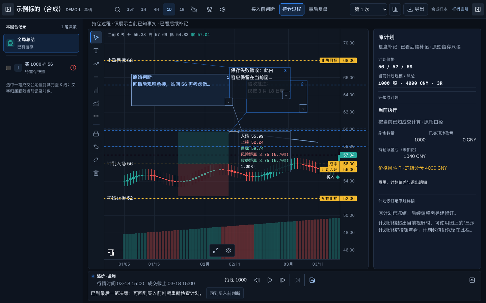

# 2026-10-10 复盘工作区视觉基线

按用户“将当前的视觉版本先沉淀一版，并提交至远端分支”保存。此版本冻结当前框架与已实现的控件行为，供后续视觉比较和回归使用。归档本身不代表全环境验收通过，也不扩大既有验收范围。

分支：`codex/drawing-control-fix-20261009`。开发起点：`0b0113773a54f716d45b30bfb8bc03d22b99a181`。归档提交号由 Git 历史确定；[源码清单](source-manifest.json)记录本版 34 个新增或修改的应用与测试文件 SHA-256。归档时已重新核对 [E141 冻结清单](reports/freeze-141.json)，32 个绑定文件全部相符。本轮只整理归档，没有新增 UI 修改或重跑全部验收。

## 固化范围

|部分|本版约定|
|---|---|
|整体框架|图表为主工作面；紧凑顶部工具行；左、右收缩入口贴对应侧；底部居中执行图标组；保持既定框架，不再重排栏位。|
|阶段与事实|S0/S1/S2 为同一工作区状态；行情与成交截止分别可见；原判断、当前补充和复盘补记保留来源。计划、实际成交及盈亏色沿用现有规则。|
|文字与价格锚点|默认先定图上价格/bar，再定位文字框，连线随指针预览；框和锚点可分别移动；选中不改变正文换行。正文默认 14px / 1.5；保留原有宽度与完整内容。|
|绘图过程|双点工具支持首点、动态预览、第二点确认，也保留按住拖放；Esc 按当前编辑、拖动或创建状态取消，不提交零长度对象。|
|选中与拖动|立即显示合法手柄，约 200ms 一次确认反馈，之后保持轮廓；8px 可见手柄，Text 移动柄细指针命中 24px、粗指针 44px。二维、价格单轴、时间单轴使用相应光标。|
|盈亏比与标签|新建默认 1:1；已有自定义比例保持原值。紧凑风险读数保留重要价格、比例和风险百分比，避让操作柄。|
|保存|选择、hover、动画和预览不写入持久化；最终操作进入历史；样板保存期间的离页动作等待保存，失败留页供重试。|

完整规则见[修复设计契约](design-contract.md)、[设计覆盖](DESIGN-COVERAGE.md)、[选中反馈规范](../../drawing-selection-feedback.md)和[工作区规范](../../review-workspace-draft-2026-10-06.md)。公共绘图修复位于 `app/components/chart/` 与 `app/lib/chart/`；紧凑样板主要位于 `app/components/review-design-preview/`，并通过 Recall 工作区的样板配置接入。样板紧凑样式不等于所有业务入口均已迁移。

## 画面对照

以下均为此前真实浏览器验收截图。代表状态属于各自证据编号，不是本轮新截图，也不是统一数据的候选 A/B。主画面为 1440×900 的 S1 合成样板，保留测试产生的批注与留存内容；它记录真实状态，不作为清理过的展示图。其他图片展示局部状态/边界，其所处历史版本与复用范围以验收登记为准。



|代表状态|实际画面|
|---|---|
|短箭头键盘选中|[E140 选中](evidence/140-root-short-key-selected.png)|
|Esc 解除选择|[E140 取消](evidence/140-root-short-key-escape.png)|
|多行文字末行与操作区|[E132 长文](evidence/132-desktop-selected-bottom.jpg)|
|价格锚点按住拖动中|[E133 中间帧](evidence/133-final-anchor-held-28-stage.png)|
|较长风险数值选中|[E142 读数](evidence/142-long-values-selected.png)|

## 验收与保留限制

- [控件验收登记](CONTROL-ACCEPTANCE.md)：66 行中 **64 PASS / 2 NOT VERIFIED / 0 FAIL**，范围为 12 族工具的创建、选择、移动、历史和共享条件；不是全页面、全设备、所有数值组合通过。
- [最终接受记录](reports/149-final-acceptance.md)及[原 11 项问题边界](reports/146-current-ticket-boundaries.md)保留历史失败、修复与复用依据。[独立视觉复核](reports/e119-e126-independent-visual-review.md)与功能动作结论分开。
- [最终全量单测日志](reports/root-149-full-unit.log)：`npm run test:unit -- --maxWorkers=1 --reporter=dot`，3229 PASS / 6 SKIP，325 个文件通过、3 个跳过，退出码 0。既有跳过不计通过。
- [类型检查](reports/root-141-typecheck.log)、[构建](reports/root-141-build.log)、[运行时检查](reports/root-141-runtime.log)已有退出码 0；[限定 lint](reports/root-141-scoped-lint.log)为 0 errors / 9 warnings。全仓 lint 仍有历史失败，见[范围说明](reports/lint-scope-triage.md)。
- 既有并行单测曾出现失败；[诊断](reports/root-148-trade-review-diagnosis.md)与最终串行结果分别保留，不声称任意并发均稳定。
- **仍未验证**：真实中文 IME、物理触控/软件键盘、操作系统原生光标逐帧。CSS cursor、模拟粗指针和桌面鼠标证据不能替代这些环境。

完整原始测试历史继续保留于本地 `.scratch/drawing-control-fix-20261009/`。此目录归档选择性证据，不附数据库、完整录像或数据库内容导出；日志副本只规范化行尾空白，原始日志留在本地。报告中标明“本地历史记录”的引用因此是追溯位置，不承诺远端附件可用。

## 预览与启动

[打开本地预览](http://127.0.0.1:3046/design/review)。归档时现有服务 HTTP 200；最近真实浏览器读取证据见 E149。此归档步骤没有重新执行交互验收。

在仓库根目录执行（Node.js ≥22.13，首次先 `npm ci`）：

```sh
mkdir -p .scratch/review-design-system-20261006
TRADEREVIEW_DB_PATH="$PWD/.scratch/review-design-system-20261006/acceptance.sqlite" npm run dev -- --hostname 127.0.0.1 --port 3046
```

样板只允许上述显式隔离库路径，使用合成标的和行情，首次访问创建示例内容；不要改指共享业务库。已有隔离库会保留用户操作后的状态，因此新环境不会自动出现截图中的全部测试对象。页面仅在开发环境提供。`?variant=baseline` 保留原样板布局入口，`?index=1` 为样板索引。

## 后续迭代规则

以本版源码与同状态截图为比较起点；改变布局、密度、文字尺寸或交互契约时记录差异与理由。公共样式推广需要另行限定受影响业务入口，验证真实图表、阶段/截止、持久化和视觉一致性。新回归应重开对应验收项，不能覆盖旧 FAIL 或把未验证项改为通过。
