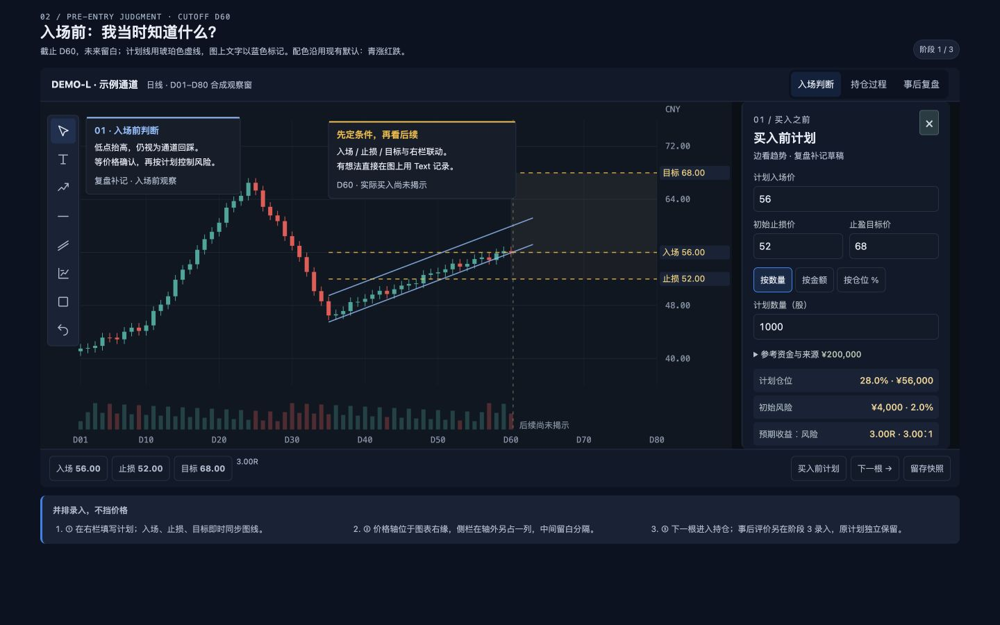
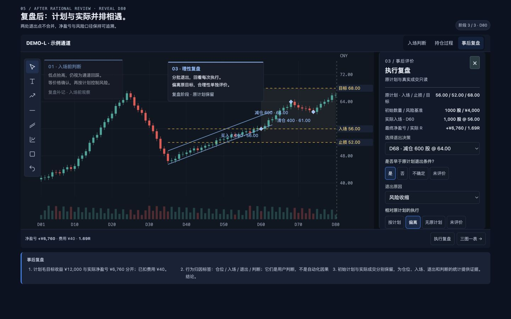
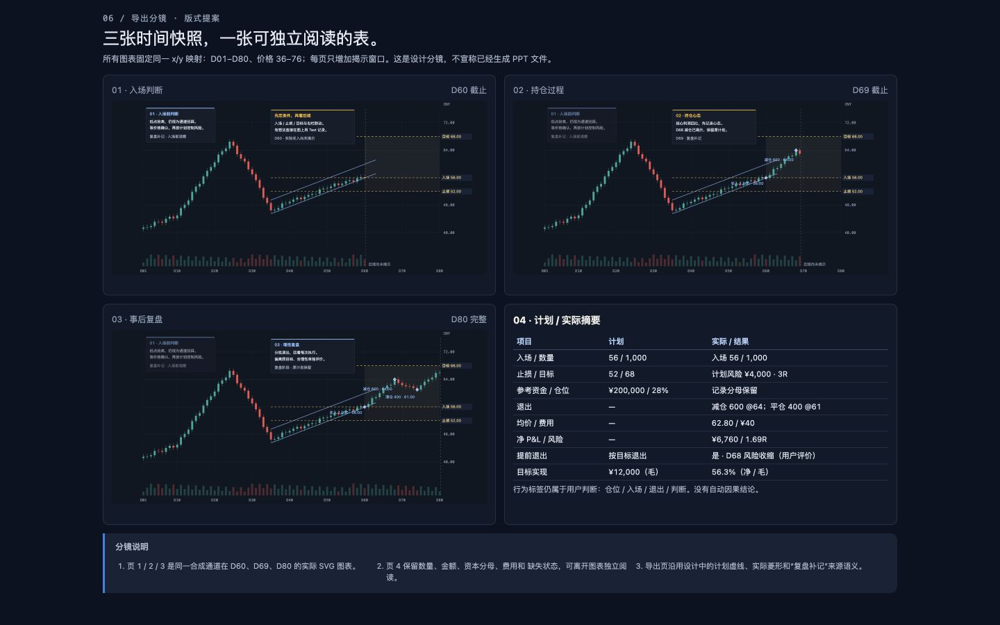

# TradeReview 主图复盘 · 视觉与元素规范

版本：1.0 · 日期：2026-09-25 · 状态：待开发定稿

用户已确认“买入前计划 / 持仓过程 / 事后执行评价”的拆分，以及主图、价格轴与右侧栏不重叠的布局。本规范沿用现有 TradeReview 样式体系，不引入新的产品主题。配套[需求规格](REQUIREMENTS.md)定义行为与数据；本文件定义外观、布局、元素与状态。

## 1. 设计依据与执行优先级

1. 已确认的阶段拆分与数据边界不可由视觉实现改变。
2. 颜色、字体、控件和图标复用现有应用规范；新增尺寸是本功能的布局约束。
3. 本文件的元素表、需求规格及验收条件是开发约束；图片展示默认样例，不能覆盖未知值、长文、冲突等状态规则。
4. demo 是自包含的设计演示：SVG 展示合成行情，输入保存在内存；数据库、完整绘图及 PPTX 需要后续开发。
5. 文档导航、“设计说明”以及画板编号不进入产品常驻工作区。产品继续使用原有应用壳和 Recall 入口。

## 2. 样式令牌

以下为现有代码的真实取值。产品应引用既有语义变量，而非在新组件内重复维护一套同色常量。

| 令牌 / 用途 | 值 | 使用规范 |
| --- | --- | --- |
| page | #0b1220 | 应用页面底色 |
| surface | #111a2b | 侧栏、页头、普通容器 |
| surface-elevated | #182337 | 分组摘要、较高层表面 |
| surface-soft | #182333 | 次级分区 |
| Recall 工作面 | #0b1018 | 图表工作区外层 |
| chart | #101722 | 行情绘图区 |
| input / secondary button | #111b29 | 表单与次级动作 |
| tooltip | #151e2b | 图上文字编辑和提示 |
| line / line-soft | #243145 / #1c2736 | 1px 分隔，不叠加厚边框 |
| text | #e7edf6 | 主文案、重要数据 |
| muted / faint | #adbbcf / #9cacc2 | 次级文案；未知值仍需可读 |
| blue / blue-soft | #2f80ed / rgba(47,128,237,.14) | 选中、焦点、主要操作；不表示盈亏 |
| link | #8cbdff | 链接、原判断辅助线 |
| gold | #f3ba2f | 计划价格虚线、计划指标、待确认提醒 |
| positive / negative | #26a69a / #ef5350 | 净盈亏正负，始终同时标示 + / − |
| 图表网格 / 轴边框 | #1c2634 / #273345 | 沿用行情图配置 |
| 轴文字 | #8392a7 | 与输入区标签区分 |
| focus | 2px blue，offset 2px | 所有键盘可操作控件 |

K 线配色使用用户已保存的方案：默认 teal-red 为上涨 #26a69a、下跌 #ef5350；green-red 为 #22c55e / #ef4444；blue-orange 为 #3b82f6 / #f97316。不得把参考图的红涨绿跌写死。demo 使用现有默认 teal-red，并在画面注明。现有成交量仍使用默认青/红，现有财务正负色也独立；本期不借此改造全应用配色。

保留 showGrid、showVolume、showExecutions、showAverageCost 与 colorScheme。成交标记可见条件为“已揭示且用户开启”，成本线还需成本有效。侧栏开关和阶段切换不得重置设置；图表设置继续经现有设置存储与保存入口，不另设 localStorage 权威副本。

## 3. 字体、尺寸与间距

| 项目 | 规范 | 继承 / 新增 |
| --- | --- | --- |
| 中文 / 界面字体 | 既有 Geist Sans，中文 PingFang SC / Microsoft YaHei 后备 | 继承 |
| 数字 / 价格 / R | Geist Mono 或既有等宽后备，tabular-nums | 继承 |
| 产品页标题 | 18px / 600，手机 16px | 继承 |
| 阶段和侧栏标题 | 16–18px / 600 | 复用层级 |
| 字段输入 / 主数据 | 14px，行高 1.4–1.5 | 继承 |
| 字段标签 / 辅助文案 | 最低 12px；不以缩小文字解决拥挤 | 继承 |
| 图上 Text | 默认 14px，保留用户的字号、颜色、背景和尺寸 | 继承 |
| Text 可用字号 | 12 / 14 / 16 / 18 / 24 / 32px，行高 1.5 | 继承 |
| 桌面按钮 / select | 高度至少 36px | 继承 |
| 触屏控件 | 高度与命中区域至少 44px；工具过多时折叠 | 继承 |
| 图标 | 线性 Lucide，主要绘图 19px，辅助动作 18px | 继承 |
| 控件圆角 | 6px，极小工具元素可沿用既有 4px | 继承 |
| 工作容器圆角 | 8px；导出对话框沿用 10px | 继承 |
| 间距级数 | 4 / 8 / 12 / 16 / 24px | 整理现有用法 |
| 右侧栏 | 默认 300px，可在 300–320px 范围适配 | 本次新增 |
| 价格轴到表单区 | 图表内部预留 84–108px 价格轴/标签区，再隔 14px 沟槽进入侧栏 | 本次新增 |

离线 demo 不下载字体，使用本机无衬线与等宽后备；产品使用应用已加载的 Geist 变量。demo 自包含 SVG 图标遵循现有线性风格；产品直接复用 Lucide 和已有 DrawingToolbar，不能复制 Unicode 字符作为正式图标。

## 4. 已确认画面

图 1：买入前计划。主图、价格轴、录入侧栏保持同屏。

图 2：事后执行评价。原计划只读，按退出决策逐次记录。

图 3：三阶段导出顺序与最后的结构化总结表。

## 5. 元素规格与行为映射

| ID | 图中位置 / 元素 | 尺寸与视觉 | 内容及动作 | 必须验证 |
| --- | --- | --- | --- | --- |
| E01 | 工作区顶栏 | 48px 起，深蓝 surface，1px 底线 | 标的、周期、来源/保存状态；不再显示大标题横幅 | 长标的省略但可查看全名；不挤掉主动作 |
| E02 | 顶栏右侧阶段导航 | 36px 按钮，蓝色选中态 | 买入前判断 / 持仓过程 / 事后复盘；当前位置可识别 | 键盘、触控可用；回看恢复对应双游标 |
| E03 | 主图左侧绘图工具 | 48px 工具区，36px 桌面按钮 | 选择、Text 优先；趋势/水平线/通道/盈亏比/更多/撤销 | title、aria-label、aria-pressed；更多不删旧功能 |
| E04 | K 线与成交量 | chart 底色，细网格 | 只绘制可知行情；保留原缩放和平移能力 | 不渲染透明未来 K，不用未来高低点定轴 |
| E05 | 右侧价格轴和标签 | 独立于表单，至少 14px 沟槽 | 入场、止损、目标跟随价格映射；点标签定位字段 | 轴/标签最右边界小于侧栏左边界；不因展开偏移价格语义 |
| E06 | 原计划线 | gold 虚线，带名称与数值 | 图形与价格输入共用同一计划对象 | 做空方向反转；无效/未知价格不画伪造线 |
| E07 | 实际成交标记 | 实心菱形＋买入/减仓/清仓文字 | 只读原始成交，点选定位决策 | 操作含义不只靠颜色；必须受成交游标和显示设置约束 |
| E08 | 图上 Text | 默认 14px，蓝色辅助描边/连接线 | T 后点图输入；有时间/价格或画布锚点 | 中文 IME、换行、拖动与编辑不推进 K 线；旧快照独立 |
| E09 | 右侧栏开关 | 底栏入口常驻、侧栏右上关闭 | 仅开关布局，主图始终可交互 | 关闭/再开不丢输入，不改变观察游标；焦点返回入口 |
| E10 | 买入前价格组 | 标签在上；入场单行、止损/目标双列 | 计划入场、初始止损、止盈目标 | 精确输入、单位、方向校验；不出现退出评价 |
| E11 | 计划规模组 | 数量/金额/仓位三段切换，一次一个主输入 | 切换按已有值换算；不偷偷归零 | 基数未知时不能计算比例；最小交易单位舍入提示 |
| E12 | 资金基数折叠项 | 次级 details，12px 摘要 | 金额、币种、时点、来源；手填显示参考资金 | 来源未知时显示未提供，不能当作真实账户净值 |
| E13 | 计划派生指标 | 紧凑行，标签左、等宽数值右 | 名义金额/仓位、初始风险/风险占比、预期 R | 3R 同时解释为收益:风险 3:1；缺项不写 0 |
| E14 | 持仓只读侧栏 | 同一布局，默认可收起 | 原计划、当前可知仓位和成交摘要 | 不包含最终评价；新计划调整创建修订 |
| E15 | 事后只读摘要 | 原计划/风险基准/实际建仓/结果 | 每项明确来源；完整成交可展开 | 与当前编辑的事前草稿区分，不能改写实际成交 |
| E16 | 退出决策选择 | 单选，显示日期＋动作＋数量＋价格 | 每次减仓/清仓拥有独立评价 | D68 与 D74 切换不串值；不把原因当成决策列表 |
| E17 | 是否提前退出 | 是/否/不确定；未评价为未填状态 | 对照被引用计划的退出条件 | 未到目标不自动等于提前；提前不自动等于错误 |
| E18 | 原因与执行符合度 | 原因枚举＋“其他”短说明；紧凑选择 | 原因、按计划/偏离/无原计划/未评价 | 保存引用计划版本、决策 ID、评价时间和证据 |
| E19 | 底部控制条 | 48px 起，必要时换行 | 逐根/播放/暂停/下一决策/留存；一行重要指标 | 输入焦点不触发回放；留存不是继续揭示的门槛 |
| E20 | 保存状态 | 顶栏次级状态，错误用现有 alert | 保存中/已保存/失败/冲突/待确认 | 状态来自真实请求；错误保留本地草稿 |
| E21 | 导出 | 沿用现有导出对话框与动作风格 | 三张阶段图＋可编辑数据表，16:9 | 不导出侧栏、工具、焦点框；缺阶段不伪造 |
| E22 | 记录/快照列表 | 原入口折叠展开 | 三阶段内仍可访问每次决策与多快照 | 阶段只是展示分组，不减少完整性要求 |

## 6. 布局、响应式与图表同步

- 桌面打开侧栏时使用实际布局列，不用绝对定位遮罩。侧栏可以独立滚动；图表纵向高度稳定。1440×900 为视觉验收基准，1280×800 为紧凑桌面验收。
- 产品沿用现有应用侧导航及窄屏折叠方式；本功能应按工作区可用宽度判断。当无法容纳约 640px 主绘图区、价格轴、14px 间隔和 300px 侧栏时，进入上下布局。按主绘图区、价格轴、沟槽、侧栏及实际内边距之和决定切换下限；绘图工具占用的区域也须计入。不得把 demo 的 1000px 视口近似值直接作为产品断点。
- 下置表单时，上部约 200–240px 趋势区保持可见，下部表单独立滚动。价格轴仍在趋势图内，不能横向滑出屏幕。触控工具只留选择/Text/更多，不用缩放缩小命中区域。
- 软件键盘出现后按实际可视区域重新分配上下两区。验收至少包含价格输入和下部退出原因输入；当前 demo 的桌面窄视口测试不替代真实手机键盘测试。
- 原有周期、时间范围、价格范围、用户图形样式和显示设置保留。开关侧栏触发图表容器 resize，不推进任一游标，也不调用 fitContent 重新跳到全量数据。
- 图上长文可折叠成摘要；编辑时仍不允许遮挡价格轴。批注位置随锚点/画布归一化规则恢复，不能通过硬编码截图坐标定位产品 Text。
- 导出使用快照保存的构图和独立输出尺寸；用户当前是否展开侧栏不改变导出时间/价格窗口。

## 7. 状态与可访问性

| 状态 | 表现 | 数据行为 |
| --- | --- | --- |
| 默认 | 12px 标签、14px 输入，单位明确 | 空值可留空，不阻断看图 |
| Hover | 边框沿用 #3b5374，文字提高到主文色 | 不写入数据 |
| Focus | 2px blue 焦点环 | Tab 顺序按视觉顺序；Esc 关闭面板后回到开关 |
| 选中 | blue-soft 背景＋blue 边框 | 不使用绿色暗示“选择正确” |
| 只读 | 普通数据文本与来源，不伪装可输入 | 事后不得修改原计划或成交 |
| 未知 | “待补充 / 未提供 / 未评价”＋缺项说明 | 数据为 null/缺失，不是 0、false 或否 |
| 无效 | 现有红色 error 样式＋字段级原因 | 草稿保留；无效数据不能保存为有效计划 |
| 保存中 | 次级状态文字，避免挡图 loading | 不阻断本地继续编辑 |
| 失败 / 冲突 | 沿用 alert/conflict 横条，提供重试/比较 | 不静默覆盖远端或丢弃输入 |
| 已看后续后补记 | 来源标签明确 | 不伪造成盲态事前记录 |

Enter、方向键、撤销、Text 编辑与 IME 组合按当前焦点解释。数字输入内的方向键不推进回放。图标须有可读名称；状态变化用适当 live region，不能只变颜色。表格支持键盘阅读，数值左侧标签不与颜色绑定。

## 8. 视觉验收清单

- [ ] 所有产品区域复用现有深蓝灰、蓝色交互主色及字体；无米白卡纸或草绿选中主题混入。
- [ ] 计划输入旁可见图线与价格轴，价格轴/标签与右栏无交叠。
- [ ] 工具与表单按钮满足桌面/触控命中尺寸；文字不因窄屏缩至不可读。
- [ ] 买入前、持仓、事后三个阶段字段隔离；原计划、成交、评价有清晰来源。
- [ ] 已保存的图表设置与 Text 样式不被阶段、侧栏、导出操作重置。
- [ ] 桌面 1440/1280 和窄屏约 390px 验收，长中文、资金基数展开、数字较长、空值、错误与键盘场景均不遮轴。
- [ ] 默认合成例与图 1–3 一致；非默认数据按规则工作，不能只匹配截图。

## 9. 现有实现证据

规范基线提交：b166d5626c72f2e0a4a7be98d89eb28bf1a036f3。以下链接是代码定位线索，不代表要求复制整块 CSS：

- [全局令牌与交互基线](SOURCES.md)：颜色、焦点、应用壳及后续响应式覆盖。
- [Recall 现有元素规范](SOURCES.md)：面板、按钮、指标、导出对话框和移动控件尺寸。
- [字体加载](SOURCES.md)：Geist Sans / Geist Mono 变量。
- [图表配置](SOURCES.md)：画布、坐标轴、配色和显示设置应用。
- [现有图表设置](SOURCES.md)：配色枚举和迁移边界；运行时设置权威仍在服务端。
- [绘图工具](SOURCES.md)：Lucide 图标、可访问名称和已有工具集合。
- [Text 几何](SOURCES.md)：文字尺寸与行高约束。
