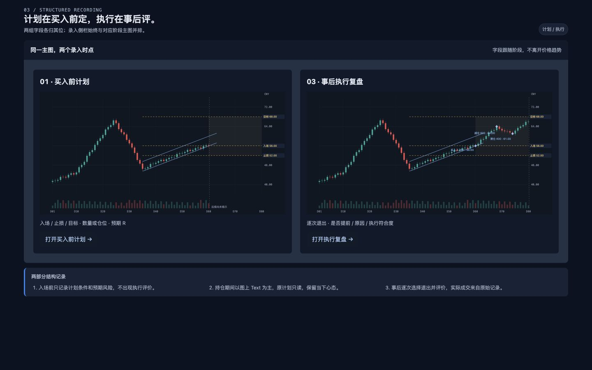

# 主图优先的三阶段复盘 · UI 与数据规格

日期：2026-09-25 · 版本：1.0 最终待开发规格 · 状态：ready-for-agent

决策：用户已确认按阶段拆分方案。本版本冻结为后续开发依据；本轮交付设计、规格和离线包，不启动产品实施。

本次交付为带图的最终需求规格、元素规范与视觉 demo。既有 TradeReview 视觉体系继续作为样式基线；用户确认的布局与阶段拆分作为交互基线。参考图仅用于提取元素与布局优点。

## Problem Statement

用户希望复盘时把注意力留在主图：用极少的操作逐渐揭示走势，有想法就用 Text 在图上留下判断。现有参考界面的多层标题、阶段大卡片、底部说明和心态区域占据空间，重复展示了本来应与行情对应的内容。

仅有画线和文字还不能支持可靠的复盘统计。计划入场、止损、目标、仓位，实际成交、分批退出、是否提前结束及原因之间缺少明确的数据关系，无法区分仓位偏差、入场偏差、退出偏差与判断变化。将这些字段全部堆成固定表单，又会打断看图。首版独立结构记录卡存在两个具体问题：录入止盈止损时无法同时查看走势；买入前计划与事后执行评价混在同一表单。覆盖式右抽屉还会挡住价格轴和价格标签。

复盘还需要变成可阅读的成果：三张逐渐揭示的阶段图展示判断演变，最后一张表完整呈现这笔交易的计划、执行与结果。图片不能成为数据的唯一载体。

## Solution

采用 **主图＋紧凑指标条＋按阶段嵌入的右侧栏**。主图承担行情、绘图、文字、实际成交点及计划价格线；数值输入在图表旁边完成。侧栏展开时参与左右布局，主图仍可见且可交互，不用关闭表单才能核对价格。价格轴保留在图表右边缘，处于侧栏左侧，中间留明确间隔。

三阶段为“入场前判断／持仓过程／事后复盘”，组织同一交易回合内的决策与快照，不取代既有逐笔记录。继续围绕已发生的真实成交进行回忆复盘，事前判断标明“复盘补记”。这里的“模拟开始前判断”解释为遮住后续走势来重建当时思路；本次不增加模拟下单。

结构记录拆成两个主要录入时点，中间阶段保留当下心态：

| 阶段 | 侧栏内容 | 主图与数据边界 |
| --- | --- | --- |
| 买入前判断 | 计划入场、止损、目标；规模输入；派生风险／预期 R；资金基数和来源按需展开 | 观察计划线和已知行情，不展示尚未揭示的买入事实、退出、最终盈亏或退出评价 |
| 持仓过程 | 只读原计划／当前已知仓位；图上 Text 记录心态与新判断 | 继续逐根揭示；需要改变计划时创建有时点的修订，不覆盖初始条件；不要求此时作最终执行评价 |
| 事后复盘 | 只读原计划和实际成交摘要；选择每次退出，录入是否提前、原因、符合度；查看结果指标 | 全部结果主动揭示后评价执行；不能通过此栏改写原始计划或真实成交 |

已确认采用方案 A：主图与阶段侧栏同屏。早期行内快改与底部表格只保留为探索记录，不是可任选的三条开发路线。桌面右栏约 300–320px，图表与价格轴占左侧剩余空间，保留 14px 分隔区；空间不足时采用上部趋势、下部独立滚动表单。

最终视觉沿用现有深蓝灰工作区、蓝色选中与焦点、Geist 字体体系和 Lucide 线性图标。计划用金色虚线；K 线继承用户图表设置，demo 使用现有默认的青涨红跌。元素、尺寸、状态及来源见[视觉与元素规范](2026-09-25-chart-first-review-ui-elements.md)。

图 1 · 买入前：价格与仓位录入始终参考主图。

图 2 · 事后：真实成交与原计划只读，按每次退出分别评价。

## User Stories

1. As a 复盘者, I want 一进入回合就看到主图与当前已知价格，在进入执行阶段后再看到真实入场点, so that 我能立即围绕实际操作回忆。
2. As a 复盘者, I want 顶部只保留证券、周期、阶段和必要动作, so that 标题和装饰不抢占图表。
3. As a 复盘者, I want 单击或按方向键只揭示下一根 K 线, so that 我可以按自己的思考速度复盘。
4. As a 复盘者, I want 在主图中暂停和继续回放, so that 记录想法时不必离开当前观察点。
5. As a 复盘者, I want 不写字、不留存快照也能继续揭示, so that 表单不会成为回放的门槛。
6. As a 复盘者, I want 后续 K 线、成交标记与最终盈亏同时遵守揭示边界, so that 结果不会提前影响判断。
7. As a 复盘者, I want 只看到当前已揭示成交形成的持仓, so that 未来退出不会提前改变仓位。
8. As a 复盘者, I want 一个紧凑绘图工具栏, so that 我能快速使用 Text、趋势线、水平线、通道和盈亏比工具。
9. As a 复盘者, I want 在图表点击位置直接写多行 Text, so that 想法与行情保持空间联系。
10. As a 复盘者, I want Text 可以关联时间价格或放在留白区, so that 具体操作说明与全局总结都好读。
11. As a 复盘者, I want 用中文输入时回放快捷键不触发, so that 输入不被意外打断。
12. As a 复盘者, I want 后续阶段继承标注且旧快照保持独立, so that 我能比较判断如何变化。
13. As a 复盘者, I want 单独查看入场前判断、持仓心态和事后评价, so that 三种视角不会混成一段事后解释。
14. As a 复盘者, I want 三阶段里仍能访问每次加仓、减仓和清仓决策, so that 复杂交易不会被三张图片压扁。
15. As a 复盘者, I want 在计划线上拖动入场、止损和目标并同步数值, so that 图形与数字不会各自记录一套。
16. As a 复盘者, I want 精确键入价格, so that 我不必依靠拖拽得到准确数值。
17. As a 复盘者, I want 以数量、金额或仓位比例输入计划规模, so that 我能使用当时最自然的仓位表达。
18. As a 复盘者, I want 清楚看到仓位比例使用的资金基数和时间, so that 不会误把手填本金当成真实账户净值。
19. As a 复盘者, I want 自动计算预期收益风险比、计划亏损额与风险占比, so that 我无需另用计算器。
20. As a 复盘者, I want 实际入场、退出、数量和费用从可信成交读取, so that 不必重复抄录且不会覆盖原始账单。
21. As a 复盘者, I want 部分退出按数量加权汇总, so that 实际盈亏与 R 倍数不会因分批成交失真。
22. As a 复盘者, I want 在事后复盘阶段逐次选择退出并轻量记录是否提前及原因, so that 最后的统计能区分主动保护、计划内分批止盈和情绪退出。
23. As a 复盘者, I want “未知／未评价”区别于“否”, so that 缺少记录不会被当成执行良好。
24. As a 复盘者, I want 保留初始计划并记录调整的时间与原因, so that 止损后移不会让原来的风险指标消失。
25. As a 复盘者, I want 缺失止损、费用或资金基数时看到具体缺项, so that 我知道哪些指标还不能计算。
26. As a 复盘者, I want 未平仓时分别看持仓浮盈亏与已实现部分, so that 暂时浮盈不会被当成完整回合收益。
27. As a 复盘者, I want 用少量标签标记仓位、入场、退出或判断方面的问题并关联图上证据, so that 未来可以抽取统计。
28. As a 复盘者, I want 这些标签明确是我的评价, so that 系统不会仅凭盈亏替我认定原因。
29. As a 复盘者, I want 草稿自动保存并显示真实保存状态, so that 我可以放心退出后继续。
30. As a 复盘者, I want 保存失败或冲突时仍保留本地输入, so that 网络问题不会丢掉刚写下的思考。
31. As a 复盘者, I want 每个快照同时保留图片、原始文字与可编辑图表状态, so that 以后能重新编辑、导出和查询。
32. As a 复盘者, I want 三张导出图使用可比较的观察窗口, so that 读者能看懂逐渐展现的行情而不是三次跳动的构图。
33. As a 复盘者, I want 导出时先展示三阶段图再展示最终数据表, so that 一笔交易可以像演示文稿一样讲清楚。
34. As a 复盘者, I want 导出的文字与表格仍可读取, so that 不需要从图片重新 OCR。
35. As a 复盘者, I want 缺失阶段的草稿也能导出但明确标记, so that 系统不会伪造一张“事前判断”。
36. As a 复盘者, I want 多决策明细可以作为附录, so that 精简四页叙事不丢失完整过程。
37. As a 分析者, I want 计划、决策、退出评价和指标有稳定标识及结构化字段, so that 未来能够按一致口径提取。
38. As a 分析者, I want 跨交易统计同时报告样本数、缺失量和币种口径, so that 结论不会由错误分母制造。
39. As a 分析者, I want 实盘与各个模拟运行分别统计, so that 不混淆不同来源的交易表现。
40. As a 使用小屏幕的复盘者, I want 侧栏下置为触控友好的折叠面板，并保留价格上下文, so that 表单不盖住图表且页面不横向溢出。
41. As a 复盘者, I want 编辑止盈止损时图表和价格轴始终同时可见, so that 不需要反复关闭表单核对行情。
42. As a 复盘者, I want 买入前只录入计划、事后才填写执行评价, so that 不同时间视角不会互相污染。
43. As a 复盘者, I want 右栏展开时与价格轴分处独立区域, so that 输入框不会挡住价格标签和当前 K 线。
44. As a 复盘者, I want 关闭侧栏或切换阶段后保留各自草稿, so that 整理布局不导致重新录入。

## Implementation Decisions

### 1. 设计范围和兼容边界

- 本轮新增 UI 草案与开发规格。既有交易、行情、导入、正式数据库和运行配置不变。未来实现扩展现有 Recall 工作区、绘图状态、服务端保存边界及导出清单，不创建另一套复盘系统。
- 三阶段是呈现层和快照选集。交易回合、交易决策、成交明细、决策快照仍是权威身份；阶段不能成为取代它们的三行大 JSON。
- “入场前判断”标题下标明“复盘补记”，成交游标停在首次买入之前；计划入场线可见，实际买入菱形进入执行阶段后才显示。若未来存在真实事前笔记，以独立来源证据标记，不能把事后补记回填成当时原始记录。
- 保留每个决策至少一份快照、清仓后一次完成回合的规则。三张演示图齐全不自动表示回合复盘完成。
- 既有 Markdown＋图片导出继续保留；新增演示导出是兼容扩展，不强制转换已有成果。

### 2. 主图布局与视觉层次

- 顶部采用单行紧凑栏，约 48px 起：左侧返回回合列表、证券／代码及周期，右侧三阶段导航；来源／保存状态与导出、更多操作以紧凑动作接入。移除大标题横幅及重复价格介绍。
- 空间不足时阶段导航自然换到第二行，不预留常驻第二条导航带。当前记录对象和可知截止使用紧凑状态；完整记录列表由明确入口展开，不常驻大卡片。
- 图内左侧复用约 48px 宽图标栏：选择、Text、趋势线、水平线、通道、盈亏比、更多工具、撤销；每项有名称、提示和键盘焦点。保留已支持的其他绘图工具于“更多”。
- 主图使用低对比网格、清晰时间和价格轴；原计划为琥珀虚线，原判断为蓝色线，实际成交为实心菱形并配买入／减仓／清仓文字。涨跌配色复用用户已保存的 colorScheme（默认 teal-red），显示图例；买卖/计划/盈亏的语义分别编码，不仅依靠颜色区分。
- 图上常驻文字优先一至两张短卡，长文可收成摘要再展开。编号与细连线指向时间价格，允许自由拖移，避让价格轴和当前 K 线。编辑器不会另要求一遍理由或心态。
- 底部一行约 48px：上一根、播放／暂停、下一根、已揭示游标、下一决策、留存快照；旁边紧凑显示计划／仓位／结果指标。完整历史藏于明确入口，主动展开不会完成复盘。
- 右侧栏是布局中的独立列，不使用覆盖主图的绝对定位抽屉或模态遮罩。主图缩到左列，价格轴及止盈止损标签保留在图表右边缘，与侧栏左边界留 12–16px 分隔；标签不得绘入输入区域。侧栏独立滚动，打开时不改变观察游标、时间窗口或价格范围。关闭恢复宽图，输入、图上 Text 和焦点恢复目标保留。
- 图表宽度不足时在图表容器内部平移，价格轴始终可见；不要仅等比缩小整张 SVG 导致 K 线和文字不可读。桌面目标主图绘图区至少约 640px（价格轴另占约 84–108px）、侧栏约 300–320px；容纳不了二者时切换上下布局。侧栏下置为页面内折叠面板：编辑期间顶部约 200–240px 的紧凑趋势区保留在可视区域，价格轴固定可见，下部字段独立滚动并提供当前／入场／止损／目标价格条；禁止用手机全屏弹层遮住主图。软件键盘出现时按可用视口重新分配两区高度，保持当前字段与趋势同时可见，必要时缩减非必要图注；此边界需在产品实现时用真实移动设备补验。
- 截图和导出排除绘图栏、选中框、录入侧栏和回放按钮，保留轴、批注、计划和已揭示成交；三阶段图片的构图不受当时侧栏开关影响。

### 3. 回放与阶段语义

- 单击“下一根”或方向键推进一根可用的完成 K 线；缺失行情保留缺口并说明，不伪造线条。按住键由系统重复事件逐根推进，输入框、Text 编辑、IME 组合期间不响应图表快捷键。
- 播放默认每秒一根，可暂停；新建／编辑 Text 或打开数字编辑器时暂停。留存快照是独立动作，不是继续播放的前置条件。
- 行情揭示游标与成交揭示游标独立。切周期或平移不推进成交边界，同一根 K 线中的多个决策按稳定顺序揭示；“下一决策”切换记录归属，普通逐根播放不自动改写 Text 归属。
- 当前运行代码对未收盘的当前周期 K 线采用隐藏策略，早期文档曾允许完整当日 K。此设计明确采用当前运行的更严格边界：成交事实可见，尚未完成的 K 线不伪装成已完成；图上可显示成交事实锚点和“本周期尚未完成”。样例 D60 表示已知完成收盘价的观察点；买入前视图的成交游标仍停在买入之前。行情可知截止与实际成交可知截止分别标明，不能仅凭当天日期相同就提前显示成交。若实际入场早于当根收盘，则按真实时间隐藏该未完成 K 线，不能用本示例推翻严格边界。
- 未揭示区没有淡化走势、未来成交提示、最终盈亏、未来日期详情或基于全量行情计算的高低点。价格自动缩放只依据已揭示行情；手动设定范围可保存，但不依据未来价格自动生成。
- 阶段一默认截至首次入场前可知观察点，首次实际买入尚未揭示；逐根／播放首次推进揭示到实际买入时，界面切入阶段二，冻结入场前观察游标并保留计划草稿；新阶段中的原计划只读。阶段切换不自动留存／宣称计划已确认，未留存者仍标草稿，也不改变 Text 的决策归属规则。阶段二也可由持仓决策进入；阶段三通过“展开结果”主动进入。用户回看阶段一恢复其快照与入场前的行情／成交双游标，不能把阶段三的最终指标带回阶段一。
- 原判断、计划及后续修订分别保存。后续文字可继承并继续编辑，旧快照仍保留原文；用户查看全量结果后新增的“入场前”说明应标记为“已查看后续后补记”，不声称盲态判断。

### 4. 数值录入和真实成交

- 计划字段默认只要求方向、计划入场、初始止损、目标与规模才能计算完整计划；允许分次填写和空值，缺字段不阻止看图。
- 买入前的价格标签／紧凑指标／“买入前计划”入口打开约 300–320px 的阶段侧栏，并将焦点放在相应价格字段。入场、止损、目标均可直接输入并同步图上计划线；仓位输入在其下，资金基数和来源为次级展开区。拖拽与输入编辑同一计划对象，派生值即时更新；无效方向或未知字段显示原因而不伪造零。
- 关闭右栏只改变布局，不丢失该阶段的计划草稿；切换持仓／复盘不会把待编辑数字自动覆盖为成交事实。初始计划一旦留存，后续阶段只读；如需纠错，应走保留旧版的显式更正流程。
- 持仓阶段优先图上 Text，侧栏提供只读计划和当前持仓，不出现提前退出、最终净盈亏或合理性评价输入。计划变化通过单独“记录计划调整”创建修订并写明当前时点；不是直接编辑初始计划。
- 规模提供数量／名义金额／仓位比例三个输入模式，一次只以一个模式为主输入，其余派生。数量单位明确为股或份；按证券最小交易单位舍入前提示，保留输入原值和实际使用数量。当前股票／ETF 以合约乘数 1 计算，不把衍生品名义金额和保证金混用。
- 仓位占比需要“资金基数金额、币种、时点、来源”。手填来源显示“参考资金”，可信快照才显示账户净值。未知时显示“未提供基数”，不把名义金额冒充仓位比例。
- 实际数量、价格、时间与费用来自原成交明细；按交易决策聚合展示并可展开来源。此面板补记的是计划和执行评价，不能通过“记录退出”制造订单、修改券商事实。
- 无实际成交来源时可保留复盘草稿，并明确“实际数据待关联”；不能无标签地把手填假设当实际成交。已记录事实修正继续走原数据管理流程。
- 事后复盘的侧栏先显示只读原计划和可信实际成交，再按退出决策选择器展示评价；各次退出的值分别保存，切换时不串用。退出评价采用紧凑控件：提前退出＝是／否／不确定；原因＝计划内分批、结构失效、风险收缩、情绪影响、资金需求、其他；执行符合度＝按计划／偏离／无原计划／未评价。选择其他允许简短补充，叙述仍通过图上 Text。
- “提前退出”指早于被引用计划所定义的退出条件，允许合理的主动退出，不等同于错误；不能仅凭未到目标价自动判定。OHLC 无法分辨同根先止盈后止损时标记顺序未知。
- 后移止损、调整目标、加减计划仓位创建计划修订，关联决策和观察游标；初始风险基准固定。原计划缺失时不要求用户捏造止损，可用有来源的固定风险预算替代并标明口径。

### 5. 指标口径与示例

下列为股票／ETF、单一初始建仓、无加仓、同币种示例。演示数据为合成数据，不构成交易建议或真实账户记录。

| 字段／指标 | 定义与示例 |
| --- | --- |
| 计划价格与数量 | 做多；入场 56.00，初始止损 52.00，目标 68.00，1,000 股 |
| 名义金额与仓位 | 56×1,000＝56,000 CNY；资金基数 200,000 CNY，仓位 28.0% |
| 初始计划风险 R₀ | (56−52)×1,000＝4,000 CNY；基数占比 2.0%，未计费用 |
| 预期收益风险比 | 目标收益／初始风险＝(68−56)/(56−52)＝3.00R；界面同时写“收益∶风险 3∶1”避免倒置 |
| 实际执行 | 买入 1,000@56；减仓 600@64；清仓 400@61；加权退出均价 62.80 |
| 已平仓回合净盈亏 | 毛盈亏 6,800，已知完整费用 40，净盈亏 +6,760 CNY |
| 实际 R 倍数 | 净盈亏／冻结的 R₀＝6,760/4,000＝+1.69R，不称实现后的新收益风险比 |
| 目标利润兑现比例 | 净盈亏／初始计划毛目标收益＝6,760/12,000＝56.3%；标明“净／毛口径”，不当作执行评分，可为负或大于 100% |
| 执行量偏差 | 实际初始数量／计划初始数量−1；本例 0%。计划数量缺失或为 0 不计算 |
| 入场偏差 | 做多实际均价−计划价；做空计划价−实际均价；正数为更不利，展示币种价格及基准 |

- 本规格固定 R₀ 为初始已留存计划的风险金额，实际建仓偏离单独显示，不在事后重算分母美化结果。若使用手填风险预算，标记“预算 R”，与价格推算 R 不静默混合。
- 做空按方向检查：止损＞入场＞目标；做多止损＜入场＜目标。分母为 0、负值、不可计算或币种不一致时 R 为空并说明，不用绝对值掩盖错误方向。数量为正，价格与费用使用十进制精度运算。
- 分批退出按实际成交量计算总盈亏与退出均价，费用只扣一次。未平仓只显示部分已实现净盈亏及持仓浮盈亏，不显示已平仓回合最终 R。费用缺失时毛盈亏可知，净盈亏与实际净 R 标记待核算。
- 部分已实现净额从既有账本毛盈亏派生：入场费用按已关闭数量／对应建仓数量分配，退出费用归对应关闭部分，剩余入场费用计入未平仓成本；多次建仓沿用移动平均成本并按费用池比例分配。末笔关闭吸收最小货币精度的舍入差，确保累计只扣一次且全平后净额一致。不能把尚未扣费的账本 realizedPnl 直接改名为净盈亏；底层兼容数字为零时仍须先核对 accuracy、costKnown、quantityKnown 等完整性标记。
- 有加仓时分别保存各建仓决策的计划风险。只有在加仓前已定义覆盖全回合的固定风险预算时才展示“全回合预算 R”；否则全回合 R 标为“多次建仓，基准待确认”，避免把完整盈亏除以第一笔的小风险。减仓后风险减少不倒改原风险预算。
- 同一次建仓决策的券商拆分成交仍算一次建仓。风险基准有独立稳定 ID、作用范围（建仓决策／整个回合）、引用计划版本、币种、计算方法与冻结时点；每个 R 指标显式引用它。纠正初始录入错误需新建更正修订并标记受影响成果待重新确认，保留旧版，不能静默替换已经导出的分母。
- 多个目标价需各有计划退出数量／比例；首版默认单目标，支持多目标时按计划数量加权收益。实际退出归属可对照某个目标或“计划外”，不能简单比较最终一笔价格。
- 跨币种原币分别统计；换算另存汇率、方向、时点、来源，不把最新汇率估算当历史真实现金结果。实盘与模拟运行严格隔离。

### 6. 结构化持久化与统计入口

- 服务端 SQLite 是复盘业务权威存储。沿用 Recall 保存入口与乐观版本校验，将计划、评价及导出选择与对应草稿／正式版本原子提交；浏览器状态只承载正在编辑的内容。
- 结构化字段必须可查询，不能只藏在 Text、图片或自由字符串里。使用带类型与约束的关系记录或由版本化文档事务维护的查询投影；明确唯一权威为已版本化 Recall 文档，查询投影可重建、不可独立编辑。
- 建议的查询实体如下；名称为领域职责，实际表名由实现确定：

| 实体 | 必要字段／关联 |
| --- | --- |
| 计划版本 | 稳定 ID、回合／决策 ID、录入阶段、来源、方向、价格口径、币种、入场／止损／目标、规模输入模式与数值、单位、资金基数／来源／时点、初始风险及计算方法、父版本、记录时间、观察截止 |
| 计划目标分配 | 计划版本 ID、目标序号、目标价、计划退出数量／比例；首版一行也有同一关系 |
| 风险基准 | 稳定 ID、作用范围及回合／建仓决策 ID、基准计划版本、金额／币种、价格推算或固定预算、冻结时点、更正前基准 ID |
| 决策执行关联 | 决策 ID、原成交稳定 ID、计划版本 ID；真实数量／价格／费用从原事实引用，保留证据版本 |
| 执行评价 | 决策 ID、录入阶段（事后复盘）、评价修订、被比较的计划版本／目标分配 ID、提前退出三态、符合度、原因枚举及可空备注、关联 Text 修订、评价来源和记录时间 |
| 评价标签关联 | 回合／决策 ID、标签 ID（仓位／入场／退出／判断及子项）、词典版本、评价修订、证据 Text／快照指针、人工评价者及记录时间；多对多关系 |
| 阶段快照引用 | 回合 ID、阶段、代表快照 ID、排序、观察截止、留存版本组合 ID；仅引用，不复制或删除决策身份 |
| 留存版本组合 | 稳定 ID、对应快照／全局成果 ID、Recall 修订、成交证据版本、计划版本集、风险基准 ID 集、评价／标签修订集、指标口径与数值版本、留存时间 |
| Text／绘图修订 | 稳定 ID、修订、原始内容、决策归属、时间价格锚点或归一化画布位置、尺寸样式、创建／修改时点、观察截止、是否看过后续 |
| 指标投影 | 回合／决策 ID、文档修订、成交版本、计划版本、指标口径版本、币种、数值或空值、缺失原因、计算时间 |

- 计划草稿和执行评价草稿拥有不同的领域归属及录入阶段；界面切换不将两组字段合并成一条表单状态，保存侧栏显示状态不更新业务计划版本。服务端仍按同一 Recall 文档修订原子保存，分栏不是另建两个互相竞争的权威存储。
- 区分实际发生时间、用户补记时间、当前观察截止；事后录入不能伪造事前证据。历史行情的数据版本、时区、复权方式与快照构图一起保存；查询原始成交价格与复权图价格前须按同口径映射，否则显示不可比较。
- 新数据约束同时用于请求验证和数据库写入：合法方向与币种、有限十进制数、正数量、有效关联、退出量不超过可归属持仓；草稿缺失合法但无效值不能被悄悄转为零。
- 原始成交与辅助流水保持只读引用；归组、计划修订和标签不会修改成交。成交重导导致回合边界变化时沿用稳定标识 reconciliation，保留孤立记录并要求重新关联，不凭序号覆盖。
- 导出和统计按冻结版本读取。完成后的草稿修改不覆盖正式结果；冲突返回明确结果并保留本地草稿，不最后写入者静默覆盖。保存状态区分保存中、已保存、失败及待重新确认。
- 每次留存快照时原子冻结其结构化版本组合，而非仅冻结图片／Text。最终汇总表取最近已留存全局成果或选定正式版本的组合；留存之后仅自动保存的计划／退出评价／标签修改不进入导出。尚无已留存汇总时明确缺失，不拿最新草稿填旧表；完成回合时全局捕获一并留存全部组合。
- 为未来分析提供按回合与决策查询的稳定字段；本期设计不承诺新建统计大屏。提前退出决策率＝明确“是”的退出决策数／明确“是＋否”的退出决策数，排除不确定和未评价；数量加权提前退出率＝明确“是”的退出数量／明确“是＋否”的退出数量。另列评价覆盖率、缺失数量和受影响回合占比，不能混用这些分母。
- “仓位／入场／退出／判断”标签是人工评价及证据指针。按标签比较实际 R 和计划偏差可辅助排查，但不自动断言因果，不把盈利等于好执行或亏损等于坏分析。

### 7. 三图一表导出

- 新增演示文稿形式，首选 PPTX、16∶9，默认四页：入场前判断、持仓过程、事后复盘、交易总结表。此轮交付导出画板，真正 PPTX 生成属于后续功能。
- 前三页各引用用户选择的已留存快照；默认首次入场前的判断快照、一个代表持仓决策、全局最终快照。无中间决策仍可手动留存持仓观察快照；缺失阶段显示缺失，不凭最终图反造早期判断。
- 纯持仓观察快照沿用当前真实决策或全局工作图的归属，附持仓阶段标签及观察截止，不生成虚构成交或交易决策，也不增加回合完成时必须覆盖的决策数。
- 默认选择可比较的同周期、同时间观察窗口；使用用户在早期明确设定的价格范围或已留存快照构图，禁止根据最终最高最低价倒推阶段一轴范围。无法同窗的历史快照保留原图，并显示范围差异；重新构图只能生成标为“导出重排”的副本，不覆盖原图。
- 图表图片保留原观察截止和标注。阶段新增说明可作为可编辑文字或演讲者备注；继承 Text 按稳定身份与修订去重，不用 OCR，也不按字符串相同合并独立判断。
- 第四页用可编辑表格列计划与实际：方向、入场／止损／目标、数量／名义金额／资金基数／仓位比例、初始风险、预期 R、每笔退出／加权均价、费用、净盈亏、实际 R、提前退出及原因、执行符合度、缺失说明。列宽不足分附页，不能缩成不可读小字。
- 三页图片加一页摘要是默认叙事；每次交易决策仍保留完整快照与数据。可选附录列出全部加减仓、附加快照与口径说明，不以四页限制丢弃数据。
- 只读取已留存内容，存在未留存修改时提示“导出不含当前未留存编辑”；允许导出草稿并标明进行中及缺失项，不自动完成复盘。导出失败不改变数据。
- 导出时冻结文档、成交与指标版本；PPTX 内文字和数据表可编辑，图表作为高分辨率图片，不能承诺 K 线在 PowerPoint 中可逐点编辑。文件可离线打开，不引用应用内部图片 URL。

### 8. 结构字段与保存契约

草稿允许未填写；能否计算每个指标由其依赖项决定。记录、留存或进入后续阶段不要求捏造缺失计划。全部数值以可验证的十进制表示，禁止 NaN/Infinity；计算结果带单位、币种及口径版本。

| 数据组 / 字段 | 类型 / 可空规则 | 校验与来源 |
| --- | --- | --- |
| direction / currency | 枚举与币种代码；草稿可缺 | 沿用回合身份；指标要求方向与币种可比较 |
| entry / initialStop / target | 正价格十进制或 null | 精度按证券报价单位；多头 stop < entry < target，空头反向；错误不取绝对值掩盖 |
| sizeInputMode / sizeInputValue | quantity / amount / ratio；值可空 | 主输入只有一个；数量/金额 > 0，仓位比例 > 0；超过 100% 明确标记“超过参考资金”，不能静默截断或由此创建杠杆模型 |
| resolvedQuantity / quantityUnit | 十进制数量 / 股或份 | 保留主输入与舍入后数量；按证券最小单位给出提示，实际成交不受此字段修改 |
| capitalAmount / capitalCurrency | 正金额 / 币种，可空 | 缺失时比例与风险占比不可计算；保留名义金额 |
| capitalAsOf / capitalSource | 时点 / 手填参考资金或可信快照引用 | 不将手填本金标为真实账户净值；来源未知明确显示 |
| riskBaselineRef | 稳定 ID，可缺 | 关联冻结的计划版本、金额、币种、作用范围、计算法与冻结时间 |
| executionRef / decisionRef | 稳定成交与决策 ID | 只读事实引用；单个退出不能归入另一个回合 |
| earlyExit | yes / no / uncertain / null | null 对应“未评价”；uncertain 对应“不确定”，不得归为 no |
| exitReason / otherReason | 枚举或 null / 可空短文字 | 计划内分批、结构失效、风险收缩、情绪影响、资金需求、其他；选择其他需解释；与提前三态分别存储 |
| adherence | as-planned / deviated / no-plan / null | “无原计划”不是“按计划”；未评价为 null |
| comparedPlanRef / targetRef | 计划版本 / 目标分配 ID，可空 | 评价无原计划时允许无比较对象；不能拿最新修改版替代历史被比较版本 |
| recordedPhase / recordedAt | 阶段枚举 / 记录时间 | 计划与事后评价分开归属；记录时间不等于原成交时间 |
| knowledgeCutoff / hasSeenFuture | 行情与成交游标 / 布尔或可追溯记录 | 事后补记和已看后续补记不得冒充原始盲态证据 |
| source / evidenceRefs | 来源枚举 / Text、快照与成交引用列表 | 可追溯评价来源；不能只有一张截图 |

保存请求沿用版本化 Recall 文档入口，并携带当前预期修订、回合/决策身份、计划/评价草稿与关联引用。成功返回新的修订与真实保存状态；校验失败返回字段级原因；版本冲突保留本地输入并提供比较/重试，不自动覆盖。计划、评价、快照版本组合和查询投影在同一业务提交边界保持一致。重开从服务端权威状态恢复，不依赖 demo 的内存实现。

本期提供单目标计划界面，保留目标分配关系以便扩展；多目标编辑器和新的账户杠杆模型不在本期。已存在的多次实际建仓/退出必须正确关联与统计，不能因为计划界面简单而丢掉事实。

### 9. 现有样式与组件的继承

- 使用既有页面、表面、边框、文字、交互色与焦点变量；不复制 demo 的展示外壳为第二套应用布局。
- 复用绘图工具、Text、图表、快照、保存状态与导出入口；新侧栏的布局状态和计划/评价领域状态分别管理。
- 保留用户的图表显示设置、配色和 Text 样式。侧栏 resize 不重置周期、窗口或游标。未开启的成交标记不因阶段切换强行显示，事实仍可从只读侧栏查看。
- 手机工具区折叠至选择/Text/更多，保持 44px 命中区域；不使用 CSS 缩放把按钮缩小。具体元素规范和视觉验收以配套规范为准。

## Testing Decisions

主验收边界为用户可观察的完整 Recall 流程：进入回合 → 买入前边看图边填写计划 → 留存与逐根揭示 → 持仓图上 Text → 事后逐笔评价执行 → 留存与关闭重开 → 三图一表导出。优先复用工作区集成、现有 Recall API／仓储和导出 manifest 的契约，避免为每个小控件创建测试接口。

用户已确认阶段拆分方案。以下测试边界是开发验收约束：复用工作区完整用户路径作为主切面，补充数值纯函数与存储/导出契约；不把设计确认误写成产品测试已经通过。

| 验收面 | 可观察行为与反例 |
| --- | --- |
| 用户路径 | 真实浏览器完成买入前侧栏、持仓 Text、事后评价侧栏、留存、重开与导出；绘图工具和返回动作不阻断回放 |
| 防提前揭示 | 下一根只增加一根；隐藏区无未来 K、成交、最终指标；日／小时切换与同 K 多决策不推进成交游标；原阶段仍可恢复 |
| 记录效率 | 在图表焦点按 T 后点击一次能编辑；数字标签一次点击打开侧栏对应字段；一次点击或方向键推进；编辑价格时图表及价格轴同时可见，关闭侧栏恢复完整主图且草稿保留。记录实际步骤，不虚报效率提升百分比 |
| 阶段隔离 | 买入前无实际买入、退出评价和最终盈亏；持仓为原计划只读和当下 Text；事后按所选退出决策分别保存提前与原因，返回初始阶段不显示事后评价，留存初始计划不会被后续输入改写 |
| 不遮挡布局 | 桌面打开计划／评价侧栏，测量价格轴和标签最大右边界小于侧栏左边界，K 线与输入同时可见；关闭／重开保留内容与观察窗口；窄屏上下分区、下方字段独立滚动，编辑时趋势与价格轴可见，并无文档级横向溢出；产品实现额外验证软件键盘展开后两者仍可见 |
| 中文与键盘 | IME 输入、Enter 换行、提交、Escape、撤销和回放快捷键互不冲突；图标有名称、焦点可见 |
| 数值与缺失 | 样例净盈亏 6,760、实际 1.69R；做空方向、零风险、未知费用、币种不一、比例基数缺失、分批退出、加仓风险基准、数量舍入与费用重复扣除 |
| 数据耐久性 | 草稿重开恢复；快照图文同版；数据投影可查询；并发旧修订不能覆盖；写入失败和重导关联变化保留旧正式版 |
| 导出 | 四页顺序正确、图片符合阶段截止、第四页数据表可读且可编辑、Text 不丢失／不重复、缺阶段不伪造、离线图片可读 |
| 多笔决策 | 同一次拆分成交归一个决策；加仓、减仓、清仓分别有快照；四页选集不改变完整性规则 |
| 风格继承 | 深蓝灰与蓝色交互主色保持一致；复用 Geist/Lucide；用户配色、网格/量能/成交显示、Text 样式在侧栏与阶段切换后保留 |
| 视觉 | 1440×900、1280×800 与约 390px 窄屏，主图占比、图上卡片遮挡、价格轴与侧栏间距、长中文、数值对齐和页面横向溢出 |

金融计算补充纯输入输出契约测试，数据库补充原子提交与版本冲突集成测试；它们是上述主路径难以穷尽的必要补充，不镜像内部组件实现。复用已有回放边界、Recall 工作区集成、Text canvas、自动保存、服务端仓储与导出测试先例。

产品实施的写入验收必须使用显式隔离数据库与独立端口，核对真实业务库未变。本轮设计原型仅用合成行情和内存状态，不调用业务 API；验收范围为画板布局、演示交互、数值一致性与规格完整性，不代替未来产品验收。

## Out of Scope

- 本轮直接实现或部署生产复盘工作区、修改业务数据库、导入实际账户数据、推送／合并代码。
- 模拟下单、重新择时训练、自动交易或收益预测。
- 自动判断交易优劣、用单笔结果推断因果、自动生成心态或捏造事前记录。
- 新建统计大屏、跨账户资金绩效体系或自动推荐最佳仓位；本期定义可查询的数据基础与口径。
- 新增行情供应商、重建行情平台、改变复权与交易时段标准。
- 衍生品保证金／复杂合约、自动重算资金曲线、公众号发布和一键内容改写。
- 本轮生成真实交易的 PPTX 文件；本轮交付其四页视觉草案与后续导出契约。

## Further Notes

- [最终视觉 demo 入口](../designs/2026-09-25-chart-first-review/index.html)包含探索记录、已确认工作台、按阶段嵌入的计划与评价侧栏、持仓过程、事后复盘、导出画板与交互状态说明；同目录 PNG 为可直接查看的设计图。
- [本地任务](../../.scratch/chart-first-review-design/issues/01-chart-first-review.md)已用 ready-for-agent 标记，表示规格已定稿可供后续开发领取，不表示本轮已经实施产品功能。
- 领域术语沿用 [CONTEXT](../../CONTEXT.md) 和[交易空间指标术语](2026-09-19-trading-room-domain.md)。基线为[既有复盘工作区规格](2026-09-19-review-workspace.md)；本次新增结构化交易计划、阶段选集、演示导出，保留原成交／决策／快照边界。
- 当前实现证据：Recall 类型已有独立行情／成交游标和版本化文档；SQLite 已有草稿／正式版本；旧计划以自由文本与手填风险为主；当前 Recall 没有完整结构化价格和仓位计划；现有导出是 Markdown／图片清单，非 PPTX。详见本次[验收记录](../../.scratch/chart-first-review-design/verification-v1.0.md)。
- 对旧文档与当前代码不一致的“未收盘 K 线”行为，本规格选择现行严格揭示规则，具体说明已在实施决策第 3 节记录；不把历史文档误当当前运行证据。

- v2 依据用户对首版结构记录卡的四点修正：录入需同时看行情；买入前计划与事后执行评价分开；字段减少后用快捷侧栏；价格轴和侧栏错开。此修订替代 v1 浮卡及独立大表单建议。

图 3 · 导出目标：同窗三阶段图，最后是完整数据汇总表。

图 4 · 字段按录入时点归属，不再使用脱离主图的混合表单。

### 开发交接边界

- v1.0 是用户确认拆分方案后的最终待开发规格；早期草案和比较方案不再作为替代路线。
- 交付包包含本规格、元素规范、可离线视觉 demo、全部最终 PNG、开发任务和验收记录。包内 README 说明入口、启动和限制，manifest 记录文件校验值。
- demo 已演示：阶段切换、逐根揭示、价格/仓位联动、图上 Text、侧栏开关与内存草稿、按退出决策独立评价。
- 产品待实现：真实数据库保存与冲突恢复、完整图形编辑与价格线拖拽、业务级精度与最小单位处理、历史数据迁移/查询投影、实际 PPTX 导出及真实移动键盘验收。
- 导出分镜是固定合成留存样例，不能作为当前未留存编辑的动态导出结果；开发必须按已留存版本组合生成图表和表格。
