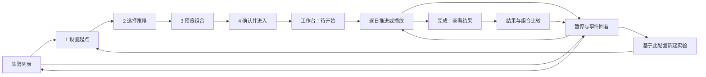

# 策略桌面端视觉与交互设计方案

日期：2026-09-29 · 版本：桌面 UX v2 · 状态：设计方案，供审阅。

用户本轮明确要求：将现有评审意见生成设计方案，**窄屏暂不修改**。已确认约束是策略观察者角色、A 分步创建、兼容现有 TradeReview 风格、原型先于正式开发。本文把其余评审意见收敛为一套可验证方案；具体新布局及交互是本稿提出的设计决定，不伪记为用户已逐项批准。本轮只交付规格与本地任务，不修改原型或业务代码。

## Problem Statement

用户已经能够从历史时点选择策略并创建独立组合，但当前工作台难以持续回答四个问题：正在观察哪个组合、查看哪一天、组合发生了什么变化、下一步做什么。

组合切换位于持仓侧栏，却控制多个区域；日期推进与回看分散；主图突出单只标的，组合收益反馈较弱。配置和演示说明占用较多视觉空间，策略理由与成交变化字体反而偏小。正常事件与异常使用相似颜色，开始/暂停/结束的按钮语义不连贯。修改配置还可能失去原运行进度。

结果和多组合比较尚未形成与运行过程连通的桌面体验。本方案将这些页面纳入设计范围，同时保留合成原型与真实回测能力的明确边界。

## Solution

保留 A 的四步引导，以“组合”为工作台的全局观察对象，以“当前查看日”为统一时间上下文。用户在同一视野中看到组合摘要、曲线、持仓与调仓原因；结束后进入结果和比较，再从结果返回具体事件。编辑已运行配置采用派生新实验，保留原运行。

### 需求与页面范围

| 需求 ID | 设计目标 | 页面/元素 |
| --- | --- | --- |
| UX01 | 当前组合身份明确，独立资金不混用 | 实验列表、全局组合页签、资金说明 |
| UX02 | 组合变化成为工作台首屏重点 | 资产摘要、默认净值图、标的联动 |
| UX03 | 时间推进、回看和已看后续边界统一 | 时间控制条、T0 分界、事件导航 |
| UX04 | 修改与离开不误丢原进度，逐日揭示语义真实 | 配置详情、派生实验、展开终点提示 |
| UX05 | 运行结束有结果出口，结果可回到过程 | 结果页、比较页、事件回看 |
| UX06 | 创建步骤与主次操作一致 | 四步引导、确认页、状态按钮 |
| UX07 | 完整策略包容易选择、阅读和比较 | 多选卡片、策略详情、调仓预设 |
| UX08 | 入选、规则不符和未知数据清楚分开 | 组合预览、分组计数、规则证据 |
| UX09 | 颜色、字体、密度和控件与 TradeReview 一致 | 全部桌面页面 |
| UX10 | 产品信息与演示说明分层 | 原型标识、数据质量说明、演示工具 |

本次设计范围为桌面 1440×900、1280×800，浏览器缩放 100%。其他宽度沿用当前行为，本稿不安排窄屏画板、布局改造或窄屏专项验收，也不将该排除理解为允许删除现有响应式能力。

### 用户动线

图中的返回/恢复不重新执行已发生模拟成交；所有跳转受后文时间和信息可见性契约约束。

## User Stories

1. 作为策略观察者，我希望沿用熟悉的 TradeReview 导航与控件，以便不重新学习应用框架。
2. 作为策略观察者，我希望从实验列表看见起点、组合数、已展开日期和状态，以便选中正确实验继续研究。
3. 作为策略观察者，我希望通过四个清楚的步骤创建实验，以便每一步只处理当前需要决定的信息。
4. 作为策略观察者，我希望选择历史日期、时间和时区，以便站在指定时点研究。
5. 作为策略观察者，我希望看到最后可用完整日线和周线，以便理解盘中或休市日的实际数据边界。
6. 作为策略观察者，我希望知道标的集合的来源与样本限制，以便不把复盘集合误认作全市场历史证券池。
7. 作为策略观察者，我希望选择五档期限并看到计划结束日，以便定义研究区间。
8. 作为策略观察者，我希望输入每个组合独立使用的本金，以便公平比较并避免资金共享误解。
9. 作为策略观察者，我希望默认逐日揭示未来，以便创建组合时看不到后续结果。
10. 作为策略观察者，我希望一眼理解策略包的用途和核心规则，以便快速选择研究对象。
11. 作为策略观察者，我希望多选完整策略包，以便创建多个独立组合。
12. 作为策略观察者，我希望查看完整公式、数据依赖和版本，以便了解策略含义。
13. 作为策略观察者，我希望只在已选策略上调整命名调仓预设，以便确认哪些设置会生效。
14. 作为策略观察者，我希望缺数据的策略就近说明不可选原因，以便选择可用策略或调整范围。
15. 作为策略观察者，我希望清楚区分入选、规则不符和数据不足，以便正确理解筛选结论。
16. 作为策略观察者，我希望查看单个标的当时的规则值与数据可知时间，以便验证入选依据。
17. 作为策略观察者，我希望预览目标权重、预计金额和现金，以便理解组合如何开始。
18. 作为策略观察者，我希望未成交时实际持仓明确为零，以便不把计划当作成交。
19. 作为策略观察者，我希望无候选时仍可创建全现金组合，以便观察策略不交易时的结果。
20. 作为策略观察者，我希望部分覆盖需要明确确认，以便知道实验只使用可评估的集合。
21. 作为策略观察者，我希望最后一步确认起点、本金、策略和首次执行时机，以便准确进入工作台。
22. 作为策略观察者，我希望全局组合页签明确当前观察对象，以便主图、持仓和事件不会串用。
23. 作为策略观察者，我希望切换组合保持同一查看日，以便比较同日差异。
24. 作为策略观察者，我希望首先看到组合总资产和收益变化，以便快速理解策略表现。
25. 作为策略观察者，我希望在净值图与标的 K 线之间切换，以便从整体表现深入到单只标的。
26. 作为策略观察者，我希望点击持仓能查看对应标的图表，以便减少重复选择。
27. 作为策略观察者，我希望推进一天后看到新图形和对应持仓变化，以便确认时间确实前进。
28. 作为策略观察者，我希望播放速度只改变观看速度，以便不同速度不会改变模拟结果。
29. 作为策略观察者，我希望看见起点分界与最新展开位置，以便区分起点前背景和本次运行。
30. 作为策略观察者，我希望在一个控制区完成回看和返回最新，以便不在图表上下寻找操作。
31. 作为策略观察者，我希望快速跳转已知调仓事件，以便定位策略变化原因。
32. 作为策略观察者，我希望回看只显示当时可知的行情、持仓、统计与事件，以便不混入之后的信息。
33. 作为策略观察者，我希望已看后续记录不会因回看或重开消失，以便准确理解当前是否仍是首次盲看。
34. 作为策略观察者，我希望快速展开终点前知道会展示全部剩余行情，以便主动选择观看方式。
35. 作为策略观察者，我希望普通调仓与异常有不同的视觉表达，以便把注意力放在真正需要处理的问题上。
36. 作为策略观察者，我希望事件先展示原因与结果，按需展开旧、目标和实际权重，以便理解调仓而不被明细淹没。
37. 作为策略观察者，我希望查看部分成交和未成交原因，以便区分策略意图与执行结果。
38. 作为策略观察者，我希望阶段结果仅覆盖已展开区间，以便提前分析而不自动揭示未来。
39. 作为策略观察者，我希望完成后有明确的结果入口，以便继续完成研究任务。
40. 作为策略观察者，我希望查看净值、回撤、仓位走势与损益构成，以便综合评估策略。
41. 作为策略观察者，我希望比较多个组合的共同区间和口径差异，以便避免不公平排名。
42. 作为策略观察者，我希望未知和不可计算的指标说明原因，以便不把缺失误读为零。
43. 作为策略观察者，我希望从结果中的事件回到对应日期，再返回原结果位置，以便连贯解释表现。
44. 作为策略观察者，我希望查看运行配置不会修改实验，以便安全核对条件。
45. 作为策略观察者，我希望基于已有配置派生新实验并保留原运行，以便比较改动效果。
46. 作为策略观察者，我希望离开后重开恢复组合、日期、图表和进度，以便继续研究。
47. 作为策略观察者，我希望中断或失败保留最后完整状态并提供下一步，以便避免重复成交或误以为成功。
48. 作为策略观察者，我希望用键盘完成选择、推进、回看和关闭详情，以便高效操作桌面应用。
49. 作为原型评审者，我希望明确区分演示、内存保留和真实保存，以便不会误判开发进度。
50. 作为原型评审者，我希望此次改版集中在桌面端，以便先确认主要使用场景。

## Implementation Decisions

以下决定约束下一轮桌面设计与原型行为，不直接规定生产文件结构、数据库表或 API。数据复用、策略插件与真实回测要求继续由产品规格负责。

### DD01 · 术语与运行边界

- **策略实验**：同一起点和研究环境下的一组比较配置及模拟运行；实验中的组合各自拥有独立本金和账本。
- **策略包**：封装选股、目标仓位与可选命名调仓预设的完整规则，具有版本和数据依赖。
- **组合**：一个策略包与预设生成的 Portfolio；界面主称“组合”，不混用账户、真实持仓或人工下单。
- **模拟运行**：一次配置锁定后的模拟过程；修改已运行配置派生新实验，不改写原模拟运行。
- 研究快照、证券池、数据可知时间、已平仓回合净盈亏、持仓浮盈亏沿用项目术语。
- 原型只使用合成数据；共享底层数据是正式产品约束。现有行情覆盖状态不能当作“历史可知、财报齐全、无前视偏差”的证明。

### DD02 · 桌面布局与元素契约

沿用应用现有侧栏宽度、品牌、图标、背景与导航顺序；策略是当前项。主内容左右留白约 24px，区域间距 12–16px。以下尺寸为本方案目标，供后续匹配视口直接验收，并非现有画面已批准尺寸。

| elementID | 区域 | 默认布局与行为 |
| --- | --- | --- |
| E01 | 页面标题栏 | 约 40px；左侧标题/返回列表，右侧原型标识、查看配置和次级操作；不重复放两个大返回按钮 |
| E02 | 全局组合页签 | 约 36px；2 个组合直接平铺，更多时允许局部横滚及全部组合菜单；名称可完整查看，保持稳定顺序 |
| E03 | 组合摘要 | 约 64px；四项横排：总资产、累计收益、组合当日收益、现金比例；显示的是当前查看日投影 |
| E04 | 时间控制条 | 约 48px；状态、当前查看日/已展开至、推进、播放、速度及回看同一区域；低频终点展开入口置于次级动作 |
| E05 | 主图区 | 左侧弹性列；净值/K线切换与图表标题常驻；1440 下绘图区高约 360px，1280 下不低于 320px |
| E06 | 持仓与事件侧栏 | 桌面宽约 320px，必要时可到 296px；主区与侧栏间距 16px；不因事件增多拉长主图 |
| E07 | 调仓详情 | 右侧可关闭详情抽屉，约 420–480px；覆盖侧栏，不移动时间控制和主图边界；有明确事件日期、关闭和回到来源 |
| E08 | 结果/比较区域 | 沿用标题栏与组合身份；指标→曲线→归因/明细；只出现一个主图表区，避免并排挤入多张 K 线 |
| E09 | 四步创建 | 步骤条与主表单；底部一主一次操作，顶部一处返回列表；进度和提交错误就近显示 |
| E10 | 策略选择卡 | 复选框、名称/用途、规则摘要、目标仓位、调仓预设、详情入口；选中轻蓝底与边框 |
| E11 | 组合预览 | 左侧候选分组与证据表；右侧目标权重/现金；全局组合页签、独立本金和首次执行时机明确 |
| E12 | 状态与演示说明 | 常驻简短原型标识；详情和场景工具折叠；业务缺失/错误就近显示，不能被折叠的开发说明代替 |

首屏必须容纳 E01–E05 的主要内容和 E06 的持仓摘要。侧栏列表限高局部滚动并有可见滚动提示；抽屉内明细可滚动，键盘焦点不被遮住。该要求分别在 1440×900、1280×800 检查，不以只在更大屏幕可见代替。

### DD03 · 创建步骤与操作文案

| 步骤 | 内容 | 主动作 | 次动作/返回 |
| --- | --- | --- | --- |
| 1 设置起点 | 日期时间/时区、标的集合、每组合本金、五档期限；逐日揭示说明；数据可用性摘要 | 继续选择策略 | 顶部返回实验列表 |
| 2 选择策略 | 完整包多选、规则详情、命名预设 | 生成组合预览 | 上一步 |
| 3 预览组合 | 分组候选、依据、目标与实际、独立本金、覆盖确认 | 确认组合 | 上一步；历史信息旁提供编辑入口 |
| 4 确认并进入 | 起点、计划结束日、组合数、各自本金、策略/预设、首次执行时机、已知限制 | 进入回测工作台 | 上一步 |

步骤完成用勾号和较弱颜色，当前步骤用蓝色与文字强调，未到步骤灰色且不可直接跳过。返回已走步骤保留输入；修改草稿撤销受影响预览和覆盖确认，不能留下旧金额/旧候选。步骤四定位为最终确认，不再次展开全部规则。

进入工作台时停在起点，状态为“待开始”；不产生交易。主动作“推进下一交易日”，次动作“自动播放”。无已运行草稿的返回只保留内存输入，原型页面刷新重置有明确标识。

### DD04 · 策略卡片与历史预览

策略卡默认展示一句话用途、2–3 条核心逻辑摘要、目标仓位、调仓频率。标题“选择策略包”，以明确复选框多选；规则正文和详情按钮不改变选中状态。未选中时预设只读展示默认值；选中后可编辑。缺必要数据的卡片禁用选择，原因不使用 tooltip 作为唯一入口。取消选择可暂存草稿预设，但不生成该组合。

详情展示完整条件、单位、严格阈值、版本、所需数据、调仓与执行时机；不拆出任意条件构建器。原型每周/每月的合成交易日模板必须标注演示，不能冒充真实周历/月历策略。

预览按“入选 / 规则不符 / 数据不足”分组，默认展示入选。行字段为标的、主要理由、目标权重、预计金额，展开后给出完整规则值与数据可知时间。数据不足不能算规则失败；示例覆盖必须写“演示样本”，不能把 5 条样例计数伪装成已筛完 126 个真实标的。

右侧集中展示目标持仓和现金分配，并标注“尚未成交，实际持仓为 0；下一交易日开盘执行初始目标”。无候选时目标现金 100%，允许继续。部分覆盖需要显式确认；更改起点、集合或覆盖场景撤销旧确认，并在确认页和运行配置保留范围说明。

### DD05 · 组合总览与图表联动

默认主视图改为**组合净值**。这是相对旧原型默认 K 线的本稿变更，待视觉验证与用户反馈；不是追溯修改旧接受记录。第一次进入显示净值起点 1 和空持仓提示，不伪造多日走势；切换 K 线可查看起点前已知背景。

点击持仓行：暂停播放，保持日期，切换到对应标的 K 线并突出所选行。返回组合净值保持同一日期。切换组合保持查看日与图表模式，同时关闭旧组合事件详情、清除旧事件/持仓选中态；K 线标的若不属于该组合，仍可保留观察但清楚标注“当前组合未持有”，不得显示错误持仓关联。净值图、摘要和侧栏的组合身份必须在同次交互中一致更新。

组合页签采用稳定身份，不把名称当唯一标识。一个实验允许多个策略组合，首轮验证至少两组；不把当前原型只有两个包变成插件数量上限。

### DD06 · 统一时间与信息可见性

时间模型保留独立的**当前查看日 V**与**已展开至 M**，V 不晚于 M。策略始终仅使用其决策时点已可知数据。当前画面行情截止和成交/估值截止均由 V 的阶段确定，不能因后台已计算更晚而把其数据混入画面。

每个组合另有最后完整日 Mᵢ，正常同步时与 M 一致；失败组合被排除而其他组合继续后，M 为会话已展开的最远日期。若 V 晚于所选组合 Mᵢ，摘要/持仓明确显示“此日不可用，最后完整日…”，曲线在 Mᵢ 截断，不用旧值冒充 V；提供“查看最后完整日”显式把 V 定位至 Mᵢ。共同有效比较区间截至所比较组合 Mᵢ 的最小值。

起点 T0：行情只到 T0 前已知的最后完整 bar，实际持仓/成交为零。推进至交易日收盘后：显示该日完整行情、该日已执行模拟成交与收盘估值；下一日计划是计划，不能显示下一日成交价格或事后结果。

| 初态/动作 | V / M 与播放 | 可见/不可见信息 | 视野与后续操作 |
| --- | --- | --- | --- |
| 待开始→推进下一交易日 | V=M 同步推进一个完整交易日，暂停 | 当日 bar、已执行成交、当日持仓/资产；后续仍隐藏 | 净值新点或 K 线新 bar 必须进入可视区 |
| 自动播放/暂停 | 每次完整日同步推进 V/M；暂停停在最近完整日 | 所有区域使用同一日投影 | 速度只改变播放节奏；离开工作台暂停 |
| 指定已知日期回看 | 停播，V 改变，M 保持 | 只显示 V 当时的图形、统计、持仓与已发生事件 | 主状态“回看中”；主操作“返回最新日期” |
| 返回最新日期 | V=M，不重算、不自动播放 | 恢复 M 投影 | 若已完成，显示完成出口；否则可继续推进 |
| 上一/下一已知事件 | 仅在已展开区间选择事件，停播并定位 V | 事件导航只暴露不晚于 M 的日期/类型；事件详情和主图严格投影至 V | 没有已知下一事件就禁用，不能暗算未来事件用于提示 |
| 点击事件 | 停播，V=事件日期，M 不变，展开详情 | 事件原因、计划/实际和当时行情 | 当日多笔事件保持选择的事件身份；可选择具体交易再定位标的 |
| 切组合/图表模式/标的/详情开合 | V/M 不变 | 同一天的对应组合/标的内容 | 不触发重新成交或未来揭示 |
| 从结果进入事件回看 | 停播，V=事件日期，保留 M 与来源 | 只显示当时内容，已看后续提示保留 | 保留来源结果页的区间、筛选和滚动位置 |
| 返回列表/重开 | 离开停播；重开恢复 V/M、组合、图表和选择 | 不丢暴露记录，不伪装首次盲看 | 同会话内存恢复；刷新边界见 DD10 |
| 缩放窗口/图表手动平移 | V/M 不变 | 未展开数据不参与坐标轴、高低值和 tooltip | resize 保持用户视野；显式推进/跳转优先将目标点带入可视区 |

回看态优先于“运行已完成”作为主状态：例如“回看中 · 当前 6/17；运行已完成至 6/21”。已看后续提示只显示日期和来源，不透露 V 之后的收益数值。图表中标 T0 虚线，最新揭示点短暂描边；若 T0 在视野外，标题仍展示起点。事件标记仅使用当前可见截止内已发生事件，不改变 K 线涨跌配色。

事件列表、数量、图上标记与详情均截止 V；“下一已知事件”是唯一导航例外，可引用当前组合已经展开且不晚于 Mᵢ 的日期/类型，不预显收益、权重或成交细节。未展开事件不可被计数或提示。进入日期输入、参数编辑、配置详情或派生草稿时暂停播放，退出不自动续播；只切播放速度可保持播放，速度选择不改变当前日期。

### DD07 · 逐日揭示与快速展开

当前桌面设计先固定为“逐日揭示”，移除只改变文字的盲看二态开关。用户需要直接看结果时使用明确的“展开剩余行情”操作，从而保留原需求的逐日观察与快速结果两种路径。

点击后出现就近确认层：“将展示从当前进度到计划结束日的行情与结果，之后回看会保留已看后续标记。”主动作“展开并查看结果”，次动作“取消”。每次动作都能在执行前看到后果，不依赖永久关闭提示的复选框。取消保持所有状态。

展开过程中显示已完成日数与“停止展开”，停止停在最后完整日；演示即使很快完成也不能用假进度冒充真实计算。完成后进入结果页。中断/失败只记录实际成功展开的边界，不能预先把计划终点写成已看终点。逐日、播放和快速展开的公开结果必须一致。

暴露记录包含最远已展开日期、来源（逐日/播放/快速展开/结果跳转）与时间；回看、返回、复制配置不得静默消除。派生实验显示“来源实验已查看至…”，不声称使用者遗忘了已经看过的行情。

### DD08 · 持仓与事件解释

侧栏上部展示当前持仓：标的、实际权重、市值，数量与价格放第二行/详情。当前无仓位时分别说明“尚未建仓”或“策略未选出候选，保持现金”。资产摘要取同一日、同一组合的计算结果，不能独立拼接显示。

事件默认展示日期、类型标签（建仓/再平衡/减仓/未执行）、原因摘要及变化概览。普通事件中性底；仅数据缺失、未成交等需要注意的内容使用警示色。点击后先定位日期，再展开详情，分为：触发原因→当时可知依据→旧/目标/实际权重→成交与未成交→费用及估值口径。

详情不提供逐笔审批或人工下单。关闭详情停留在当前查看日；有“返回来源结果”时恢复来源界面，但不删除已看后续记录。长列表通过分页或限高列表控制密度，不能持续拉长主图。

### DD09 · 结果与多组合比较

运行未完成时可查看“阶段结果”，仅使用已展开区间；T0 无交易区间时入口说明尚无可分析区间。回看早期日时，默认阶段结果截止 V，不能隐式跳到 M；若主动选择查看已展开全部区间，明确标出该区间。

完成时主动作“查看回测结果”，次动作“比较组合”（至少两个组合可用）。原播放区域收敛成完成状态与结果出口，避免一排灰色失效按钮。结果页内保留“返回过程回看”。

结果信息顺序：

1. 区间、完整/阶段/部分标识、数据范围与模拟口径。
2. 累计收益、最大回撤、期末总资产、调仓次数；未知显示不可用及原因。
3. 主图区页签“净值 / 回撤 / 仓位”；仓位包含标的与现金实际占比，不只期末饼图。
4. 损益构成、标的贡献、费用与滑点、换手；已平仓回合净盈亏和持仓浮盈亏分别展示。
5. 调仓与成交明细，可定位过程中的具体事件。

比较使用同一时间轴和归一化净值。顶部矩阵展示起点、区间、每组合本金、集合/数据版本、策略/预设、币种与执行口径；差异高亮并解释。完整且同期同口径组合才可比较完整区间指标；部分或失败组合不进入完整期排名，不以缩短区间却保留一年标签的方式凑齐。

同步比较默认共同有效区间，不删除失败组合列，只标注其状态；明确选择单组合更晚区间时标注非同步比较并记录已看边界。曲线最多同时突出 4 条，其余通过同一比较集合的图例开关查看，不限制实验组合数量。颜色固定对应组合，另用名称/线型区分，不复用收益正负色表达策略身份。

每个结果视图有明确截止 R，不能晚于对应组合 Mᵢ（同步比较不晚于共同有效截止）。进入结果保存过程页的 V、组合和图表上下文；标题明确“结果截至 R”，不沿用“当前查看 V”误导用户。主动查看比原 V 更晚的已展开结果时记录结果查看来源；返回过程恢复原 V。若从结果点事件回看，则定位事件日，同时保留“返回来源结果”恢复结果区间/筛选的入口。

可选基准仅在同区间、同币种和可信数据可用时显示；否则明确无可比较基准。禁止合成“跑赢基准”结论。比较页面默认按策略选择顺序列出，不自动推荐收益最高者。

### DD10 · 配置、列表与恢复

运行配置从工作台以只读详情打开，包含策略版本、预设、本金、起点、范围、数据/执行口径。入口“基于此配置新建实验”复制为新草稿，标注来源；原实验保持运行结果与查看位置，用户可取消新草稿后返回原实验。

新草稿复用配置，不复用旧候选、旧成交或新起点下无效的覆盖确认；不提供看似修改原实验、实际清空运行的隐式覆盖路径。单纯切图、查看详情、选择日期或改变展示精度不创建新实验。

下一轮内存原型至少支持原实验与派生实验并存并可切换，不再以单一全局对象覆盖演示原实验。列表列出名称/来源、起点、组合数、运行状态、已展开日期；主操作由状态决定：继续编辑、进入工作台、继续观察、查看结果。

原型同会话返回/重开保留配置、V/M、组合、图表模式/标的、详情选择、曝光记录与视野；刷新仍按“仅内存”边界清空。正式产品的数据库保存、刷新恢复由产品规格要求另行实现与真实验证，不能把内存演示称为自动保存。

### DD11 · 数据中断、失败与取消

数据不足/执行失败默认暂停同步观察，显示受影响组合、失败日、原因与最后完整日；当日部分计算不能作为成功持仓。提供“查看原因”“重试”“返回实验列表”。重试从安全边界继续，不能重复已完成成交。

如果用户选择排除失败组合并继续其他组合，需明确展示运行范围变化和失败组合的截止日；比较恢复共同有效区间，不能把落后组合的最后值延伸到未来。原型可用折叠演示工具触发这些状态，但必须标注模拟异常。

正式保存失败的产品状态应保留最近已保存位置与当前本地草稿，提供重试/另存；当前内存原型不得显示真实保存成功。错误演示只验证用户能理解并恢复操作，不证明持久化可靠。快速展开取消、返回列表和打开编辑派生入口都先停止播放/展开，稳定在完整日。

### DD12 · 指标口径与显示

沿用产品规格的净资产与净值定义：总资产为现金加持仓可信市值；净值为总资产除以初始资金；无外部资金流时累计收益为净值减 1。组合当日收益金额为相邻有效日总资产变化，比率以前一日总资产为分母，首日以初始资金为分母。

界面必须称“组合当日收益”，不复用交易室已有的“当日盈亏率”“交易成本收益率”“本金参考收益率”公式和名称。回看时上述指标全部按 V 计算，最大回撤只使用该区间已知历史峰值。细项费用、贡献和现金须与同一账本对账，无法归因的部分明确列出，不编造调仓带来的因果收益。

金额默认两位小数并带币种，收益率两位小数带正负号，净值四位小数，权重一位小数；数量遵循标的/演示口径，详细精度在明细中查看。显示舍入不参与计算；不把未知显示为 0。T0 总资产等于本金、累计收益为 0、净值为 1，组合当日收益显示“— · 尚未开始”，不伪造尚未发生交易日的收益。零已平仓回合的胜率显示“不可计算”。年化/Sharpe 等扩展指标延续产品规格的样本限制，不作为本次首屏内容。

### DD13 · 视觉与控件规范

- 复用现有背景、面板、边框、蓝色主动作、字体和图标体系；控件圆角约 6px，面板约 8px，不新增独立品牌或大面积渐变。
- 标题约 20–22px，正文约 14px，规则摘要/原因约 12–13px；11px 仅用于低频版本和辅助元信息，关键原因不再使用 10px。数字等宽、金额右对齐。
- 蓝色表达主动作和当前选择；普通数据中性色；收益变化沿用项目已有涨跌映射并显示正负号；黄色仅用于注意事项，红色用于错误。状态始终有文字或图标，不只靠颜色。
- 主按钮与输入框桌面高度至少 36px。每个操作区域只设一个主动作；回看、完成和错误时按状态替换，不同时强调“下一日”和“返回最新”。
- tabs 使用页签语义，策略多选使用复选框；有实际二态行为才使用开关。按钮焦点样式清楚，图标操作有可读名称，禁用原因就近可读。
- 键盘支持 Tab/Shift+Tab、Enter/Space 激活、Escape 关闭弹层并回到触发处；焦点在输入框、下拉或中文输入法编辑中时不得触发播放快捷操作。关闭详情不自动恢复播放。

### DD14 · 原型说明与业务信息分层

全局保留“交互原型 · 合成数据 · 刷新重置”标识。数据算法限制、零费用、小数股、合成日历等放入可发现的“演示范围”；场景切换收进“原型演示工具”。涉及当前决定的缺字段、部分覆盖、可知截止与独立本金仍就近显示。

主界面使用“起始时点”“计划结束日”“每个组合独立计算”“已展开至”等语言。需要精确说明时在详情中保留 T0、日线/周线截止与研究快照术语。不能靠删掉限制来让合成原型看起来已接入真实产品。

### DD15 · 模块与接口边界

设计划分为实验列表/创建、策略包详情、运行工作台、事件详情、结果/比较五个用户可感知模块，统一读取同一个实验会话投影并通过公开动作更新。动作包括推进、播放/暂停、回看、返回最新、选择组合/标的、展开终点、派生草稿与恢复会话。

投影至少携带实验与组合身份、运行状态、V/M/各组合 Mᵢ、结果截止 R 与返回上下文、行情/执行截止、资产与持仓、当前可见事件、数据质量、暴露来源、来源实验与可用操作。子视图不得各自推进时钟、独立计算互相矛盾的收益，或直接访问全量未来数据。

优先复用既有应用框架、真实图表、行情公共入口与测试工具；本稿不引入新的供应商或存储体系，不定义新数据库 schema/生产 API。跨模块的唯一会话行为入口是后续实现约束，当前无需为了写规格抽取或改造模块。

### DD16 · 与既有默认方案的关系

| 既有约定/表现 | 本稿桌面方案 | 生效边界 |
| --- | --- | --- |
| A 四步引导、现有风格 | 保留；文案/层级收敛 | 用户已确认的骨架继续有效 |
| 默认标的 K 线 | 默认组合净值，K线作为联动视角 | 新提案，后续原型验收后确认 |
| 盲看开关仅改变说明 | 固定逐日揭示，明确快速展开动作 | 新提案，保留用户选择观看方式的能力 |
| 修改配置清空旧运行 | 派生新实验，旧运行只读保留 | 与原产品规格“保留原运行”方向一致 |
| 单个内存实验 | 支持来源与派生实验并存 | 仍为内存演示，刷新边界不变 |
| 终点只禁用按钮 | 结果/比较入口和返回过程闭环 | 尚未实现的后续设计范围 |
| 原先包含 390px 等窄屏验收 | 本轮只验收两档桌面视口 | 用户本轮明确排除；历史窄屏记录保留 |

本文获确认后作为对应桌面原型的新契约；在此之前旧版本接受记录保留为历史事实，不批量改写为新设计已经通过。真实数据、策略插件、交易口径和生产持久化要求未因界面收敛被删除。

## Testing Decisions

### TD01 · 一个主行为入口

优先以现有策略原型页面的**完整桌面用户旅程**作为最高层验收入口，贯通创建→多组合运行→调仓回看→结果比较→返回重开/派生实验。视觉在同一旅程的关键状态截图对照，不能用 DOM 按钮存在替代。

后续确需自动化时，沿统一实验会话公开动作测试外部结果，不为每个组件/helper 增加新的测试入口。图表与视觉仍需真实浏览器。当前只生成设计文档，不为可丢弃原型预先编写成套单元测试，不运行生产回测测试并伪记为本方案验收。

用户已在本轮测试边界核对中明确选择“按完整桌面旅程验收（推荐）”：创建→多组合运行→调仓回看→结果比较→返回重开，并独立进行 TradeReview 风格对照；窄屏和真实回测引擎不在本轮验收范围。该确认只确认验收边界，不代表新布局、具体控件或方案全文已获批准。阶段实施可先接受最小运行旅程，再扩展结果，但最终不能省去完整旅程。

### TD02 · 场景与反例

| 场景 ID | 用户可观察验收 | 关键反例 |
| --- | --- | --- |
| T01 创建闭环 | 双策略、各自本金和预设→分组预览→确认→工作台待开始 | 任一组合偷偷共享现金；进入即成交；假覆盖计数 |
| T02 草稿与数据边界 | 盘中/休市起点、五档期限、必需数据缺失、部分覆盖撤销、无候选现金 | 未来周线/财报入选；缺失算排除；无候选伪造仓位 |
| T03 最小真实图表旅程 | T0 净值起点→切K线→下一日新增真实bar→首次持仓→调仓事件→回看→恢复最新→返回列表重开 | 只改日期不揭示图形；重复成交；重开串组合 |
| T04 全局组合联动 | 同日切两组合，净值/持仓/事件/摘要正确跟随，标的关联明确 | 日期被改变；图表属于另一组合；合计本金冒充单组合 |
| T05 双截止与前视 | 展开后回看早期，曲线/轴/持仓/统计/事件列表按查看日过滤；已知事件导航仅预示已展开日期/类型；最远已看提示保留 | tooltip、最大回撤、从未展开的事件提示泄露后续；已知导航提前展示成交细节 |
| T06 时间/视野 | 播放暂停、不同速度、长区间超过初始窗口、手动平移、resize、事件跳转 | 新bar在屏外；resize重置视野或推进；下一事件暗算未来 |
| T07 快速展开 | 执行前说明→取消无变化；执行→停止保留完整日；最终公开结果与逐日一致 | 取消仍推进；失败却标记已看到终点；虚假进度 |
| T08 配置派生 | 查看原配置→派生并编辑→取消/创建→原实验仍可重开且账本/视野不变 | 修改一个输入就清掉旧运行；新草稿继承旧成交 |
| T09 结果闭环 | 阶段/完整结果、净值/回撤/仓位、贡献与明细→事件回看→返回原结果；结果截止R明确，返回过程恢复原V | 阶段结果泄漏完整期；只做静态终点卡；来源位置丢失 |
| T10 比较边界 | 双组合共同区间、费用/数据差异、部分/失败组合、零交易/未知指标 | 部分区间参加完整期排名；无基准伪造超额；零回合胜率0% |
| T11 异常恢复 | 数据/执行中断→最后完整日→重试或排除组合继续；切回落后组合显示该日不可用且可显式定位Mᵢ；错误演示标识清楚 | 重复成交；半日状态标成功；旧持仓延伸成未来估值；内存演示冒充数据库保存 |
| T12 桌面视觉与键盘 | 1440×900、1280×800 的创建、T0、调仓、回看、完成、结果/比较、抽屉；键盘操作和焦点恢复 | 主图/日期/推进不在首屏；重要原因过小；正常事件满屏黄；只凭测试数声称视觉通过 |

先独立接受 T03 的纵向旅程，再扩展依赖它的结果与多组合场景；全部桌面范围最终由 T01–T12 覆盖，不能用局部通过关闭整方案。

### TD03 · 现有先例与验收层次

- 既有回放控件测试覆盖终点禁用和下一成交入口；可复用其语义查询/用户动作习惯，但回调触发不能证明实际图表推进。
- 既有历史持仓图测试覆盖日期选择、键盘定位、空/缺失数据和指标切换；可复用对用户可见输出的断言方式。
- 当前策略原型已有真实图表的 T0、首次成交、调仓、回看和内存重开证据，可作为回归起点；它们不证明本稿的新布局已经实现。
- 正式回测的领域可核算、幂等及 SQLite 保存重开沿用原产品规格，在真正接入时用隔离数据库验证；本稿不增加另一套低层测试缝隙。
- 功能/时间状态、真实浏览器完整路径、同状态视觉对照分别记录；独立于实现者的审查者直接比较渲染与参考。鼠标与键盘证据分开，不新增窄屏或触屏验收。

### TD04 · 本轮文档验证

本轮只核对需求映射、术语、状态不变量、链接、任务依赖及范围冲突。UI/图表/持久化的实现验证均为 NOT VERIFIED；本轮运行服务、业务数据库写入和产品测试为 NOT APPLICABLE，因为没有产品代码修改。不得把文档通过改写为功能通过。

## Out of Scope

- 窄屏/手机/平板布局改造、响应式断点重设计、触屏专项、窄屏专项验收；用户说“暂不需要”，不意味着永久取消。
- 本轮修改原型代码、搭建生产页面、接入真实行情/财报、实现撮合/回测引擎、策略插件运行时或数据库迁移。
- 真实保存/刷新恢复已经完成的声明；内存演示不能替代正式持久化要求。
- 人工逐笔审批/下单、实盘交易、杠杆/卖空、条件搭建器、参数寻优和策略市场。
- 自动选出“最优策略”、宣称合成收益有效、因果解释再平衡超额收益。
- 全应用换肤、改动其他业务模块、删除原交易数据、远程 issue 发布、提交/推送/合并。

## Further Notes

### 来源与优先级

- [产品规格 v1](2026-09-29-strategy-portfolio-backtesting.md)：数据复用、R01–R06、术语、交易与统计口径仍有效。
- [本轮设计评审](../../.scratch/strategy-portfolio-backtesting/design-review-2026-09-29.md)：D01–D10 为本稿输入；D11 窄屏明确排除。
- [TradeReview 视觉基线](../../.scratch/strategy-portfolio-backtesting/screenshots/creation-baseline-1440.jpg)、[当前桌面工作台](../../.scratch/strategy-portfolio-backtesting/screenshots/design-review-running-1440.jpg)：用于风格延续与差异核对，不是新布局的批准画板。
- [领域词汇](../../CONTEXT.md)、[交易室指标术语](2026-09-19-trading-room-domain.md)、[行情模块边界 ADR](../adr/0006-market-data-module-boundary.md)：避免重命名既有指标或重复建设数据入口。
- [本地设计规格票](../../.scratch/strategy-portfolio-backtesting/issues/08-desktop-ux-design-spec.md)：已标 ready-for-agent；含后续设计确认与验收清单。

最新用户范围约束优先于旧稿窄屏计划。本文针对桌面 UX 的新默认值在获确认后替代对应旧默认值；原产品数据/计算/保存要求及旧原型证据不被静默删除。

### 后续设计顺序

1. 以 E01–E07 完成工作台的五种关键状态：待开始、首次建仓、调仓、历史回看、完成；先验证最小真实图表旅程。
2. 收敛四步创建、策略选择与候选证据，验证派生实验不会破坏原运行。
3. 连接结果、比较与返回过程，覆盖完整/部分/失败区间与错误恢复。

本稿是统一设计输入，不提前关闭工作台、比较或最终交接的 HITL 决策票。原型技术验收、用户设计确认和正式功能验收分别记录。实际派发前按项目流程补齐准确元素/画板/owner/旅程/证据的覆盖矩阵；不将文档发布等同于已授权生产开发。

### 后续实施授权 · 2026-09-29

在设计方案及任务拆分后，用户明确要求：“使用多个Luna6 max进行开发，使用Astra Light进行验收”。据此开始按本设计实施桌面交互原型，实际执行模型为 `gpt-6-luna / max`，独立验收模型为 `gpt-6-astra / low`（可用工具没有 Light 枚举，已向用户说明）。

上文“本轮只生成文档/不修改原型代码”描述文档生成阶段；后续实施以 `.scratch/strategy-desktop-ux-v2/TICKET-PLAN.md` 和正式任务为准。功能设计范围不变：合成数据、内存原型、两档桌面；窄屏、真实数据/回测引擎/策略插件运行时和生产持久化继续排除。此授权不替代功能、状态、真实图表及独立视觉验收，也不授权提交远端。
