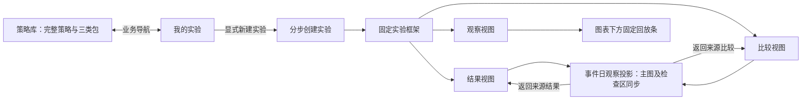

# 策略工作台：TradingView 风格借鉴与稳定布局方案

日期：2026-09-30 · 来源：用户当前工作台截图与 TradingView 参考截图 · 当前状态：A 已选；第三轮交互修复及第四轮原站风格对齐通过各自桌面原型验收。任务11仍为 open / integration-pending。

当前跨页设计以[策略工作台迭代V1融合契约](2026-09-30-strategy-workbench-v1-integrated-design.md) IF01–10为准，局部尺寸和动作以[A第三轮契约](../../.scratch/strategy-portfolio-backtesting/workbench-design/REPAIR-03-CONTRACT.md)及[第四轮契约](../../.scratch/strategy-portfolio-backtesting/workbench-design/STYLE-04-CONTRACT.md)为准。本文保留初始提案及历次决定；下文拟定尺寸、图标方案及当时未验收状态不能覆盖最新修订。融合后的实际导航、创建到工作台接线及视觉尚待验证。

本轮只比较并沉淀设计、发布本地任务。用户明确希望按钮控件更接近成熟图表工具，简化并固定布局，减少页面切换时的明显抖动。以下视觉尺寸与交互组织是供下一轮模型验证的方案，不把本次要求生成方案当作用户已逐项认可。上一轮策略库、三类策略包与历史复制需求一并保留。

## Problem Statement

当前回测工作台的主要操作分布于标题操作区、组合选择、四张指标卡、时间条、进度恢复区、图表切换及事件区。用户切换工作台、结果和比较时，需要重新寻找控件；不同长度的状态、说明和异常内容容易与主图争夺空间。用户希望观察对象和操作位置更稳定，让注意力持续落在图表与策略行为上。

图 1 是待开始的组合净值工作台，图 2 是单标的回放界面，业务状态和截图尺度不同。本轮比较的是信息组织和控件语言，不以两个不同内容的画面做像素相等判断。截图可证明可见层级，无法单独证明运行时抖动的原因、频次或位移，后续必须实测。

### 两张图的可见差异

| 维度 | 当前工作台（图 1） | TradingView 参考（图 2） | 设计吸收方向 |
| --- | --- | --- | --- |
| 首屏重心 | 大标题、组合区、四张独立卡和多行操作在图表上方 | 紧凑顶栏，图表为主体，回放条贴近图表底部 | 压缩图表外的常驻层级，保留核心指标与操作 |
| 按钮语言 | 文字按钮较宽，边框/底色重复，下一日蓝按钮强调较强 | 红框内播放/单步以小图标为主，日期与速度用短文本和分隔线 | 常用回放采用固定槽位的图标工具按钮，复杂动作保留短文字 |
| 控件分组 | 推进、速度、结果、比较、回看挤在同一长条；恢复另起一行 | 图表工具、回放、区间选择分组，职能边界清晰 | 分开“改变运行进度”“选择观察视图”“查询详情” |
| 面板语言 | 多个带边框、圆角及大内边距的卡片叠加 | 连续工作区、细分隔线和工具轨道较突出 | 减少卡片嵌套，用固定分区与分隔线组织 |
| 指标密度 | 四张指标卡与右侧资产明细重复表达部分数据 | 标的与 OHLC 以紧凑行呈现 | 保留四项指标，改成一条摘要带；细项放检查区 |
| 辅助信息 | 原型标签、恢复入口和演示工具占有明显独立空间 | 回放区域内部控件更集中 | 原型标识持续可见，低频演示工具收进菜单；真实错误保持可见 |
| 空状态 | 尚未开始、无持仓、无事件各占较大面板 | 主图仍占核心，底部空面板有明确边界 | 空/加载/失败在既有区域内替换内容，保留区域几何 |
| 色彩与装饰 | 深蓝背景、蓝色主动作、黄色原型标识 | 深色工具栏搭配浅色图表，存在买卖双色按钮 | 借鉴层级与控件密度；保留 TradeReview 色彩、收益口径和身份色 |

图 2 的浏览器地址栏、书签栏、绘图工具全集、买卖下单控件及品牌标识不是本次产品功能要求。仅凭静态截图也不能宣称参考产品的所有页面切换均不抖动。

## Solution

将工作台组织为一个**固定框架内切换观察视图**的桌面空间：上方稳定显示实验/策略身份与观察模式，中间保留主图和右侧检查区，图表底部常驻回放工具条。待开始、运行、暂停、回看、完成和故障只改变对应区域的内容及可用操作，不增删整行来挤动主图。

### 需求与区域

| ID | 目标 | 语义区域 |
| --- | --- | --- |
| SW01 | 工作台、结果、比较共享外层框架，跨页面导航维持位置连续性 | WB01 框架/身份栏 |
| SW02 | 图表优先，四项摘要紧凑呈现，减少嵌套卡片 | WB02 摘要带、WB03 图表区 |
| SW03 | 播放、暂停、下一日、速度、回看在固定位置，按钮更简洁一致 | WB04 回放条 |
| SW04 | 观察模式、组合选择与推进动作分组，低频动作可发现 | WB01、WB03、WB04、WB08 详情/菜单 |
| SW05 | 各状态不因文本长度、错误或控件显隐改变主图边界 | WB05 状态位、WB06 检查区 |
| SW06 | 切视图保持组合身份、时间截止、返回来源及已看后续记录 | WB01–WB06 |
| SW07 | 结果和比较仍有完整信息与事件往返，使用稳定内容区域 | WB03、WB06、WB07 明细区 |
| SW08 | 与策略库/三类包的新创建动线衔接，配置查看不重建运行 | WB01、WB08 |
| SW09 | 键盘、焦点、禁用原因和文字可读性与简洁控件并存 | 全部区域 |
| SW10 | 用同状态视觉、连续切换和几何/视野证据分别验证 | 全部区域 |

下图只表达关系，不是已批准像素画板：

## User Stories

1. 作为策略观察者，我希望打开任一实验都看到相同的身份栏，以便知道当前研究对象。
2. 作为策略观察者，我希望待开始、播放和暂停时主图位置一致，以便持续关注走势。
3. 作为策略观察者，我希望用紧凑图标播放、暂停和推进一天，以便减少控件占用。
4. 作为策略观察者，我希望播放和暂停使用同一按钮位置，以便连续操作时不移动寻找。
5. 作为策略观察者，我希望下一日按钮与播放按钮职责明确，以便不意外自动展开后续。
6. 作为策略观察者，我希望速度变化只影响呈现节奏，以便实验结果保持一致。
7. 作为策略观察者，我希望图标有中文可读名称和提示，以便理解操作而不猜测符号。
8. 作为策略观察者，我希望禁用按钮保留位置并解释原因，以便理解为什么当前不能使用。
9. 作为策略观察者，我希望结果和比较入口与推进分组，以便区分查看结果和产生新进度。
10. 作为策略观察者，我希望四项核心指标始终在固定摘要带，以便快速核对当前查看日。
11. 作为策略观察者，我希望金额变化和较长日期不会撑开布局，以便图表不随内容移动。
12. 作为策略观察者，我希望切换组合时同一天的主图、摘要、持仓和事件一起更新，以便不混用组合数据。
13. 作为策略观察者，我希望组合较多时在固定区域选择，以便组合数量不会挤走图表。
14. 作为策略观察者，我希望净值与标的 K 线在同一主图区切换，以便保留观察重心。
15. 作为策略观察者，我希望回看和返回最新动作位置稳定，以便安全检查历史。
16. 作为策略观察者，我希望结果明确显示截止日期，以便不把结果范围误认为当前回看日。
17. 作为策略观察者，我希望从结果点事件再返回时保留区间、筛选和滚动位置，以便继续分析。
18. 作为策略观察者，我希望比较仍显示失败组合和共同有效区间，以便不会被简化界面误导。
19. 作为策略观察者，我希望错误出现在固定状态位并有详细原因，以便既能发现问题又不丢失主图。
20. 作为策略观察者，我希望重试、排除失败组合和返回列表仍可达，以便界面变紧凑后仍能恢复操作。
21. 作为策略观察者，我希望空持仓、无事件和加载中保留区域大小，以便等待时画面不跳动。
22. 作为策略观察者，我希望主动展开明细时只发生一次明确布局变化，以便知道改变来自自己的操作。
23. 作为策略观察者，我希望返回观察视图恢复图表模式和视野，以便不用重新定位。
24. 作为策略观察者，我希望前进后新增 bar/成交可见，以便固定布局不会让播放停在旧视野之外。
25. 作为策略观察者，我希望在库、实验列表、创建和工作台间切换时应用导航与标题区域稳定，以便保持方向感。
26. 作为策略观察者，我希望查看三类策略包及运行配置使用详情区域，以便不重建正在观察的实验。
27. 作为策略观察者，我希望输入或使用中文输入法时播放快捷键不生效，以便不会意外看到未来。
28. 作为策略观察者，我希望关闭详情后焦点返回入口且不会自动恢复播放，以便操作可预测。
29. 作为原型评审者，我希望紧凑界面仍明确显示合成数据和刷新重置，以便知道当前能力边界。
30. 作为原型评审者，我希望看到同视口的关键状态对照与连续操作证据，以便判断布局是否稳定。
31. 作为研究者，我希望旧实验和原始交易不因视觉改版改变，以便历史结果和数据继续可信。

## Implementation Decisions

### WD01 · 固定框架与授权边界

沿用 TradeReview 应用导航、深色主题、字体和图标体系。在工作台、结果、比较内保持同一框架及观察对象，只替换工作区投影。实验列表、策略库与四步创建仍按各自任务展示合适内容，但共享导航宽度、顶部身份区高度、内容左起点与返回位置；不为了几何相同给列表强塞图表。

用户授权的是简化控件与减少切换抖动。本稿提出图表下方回放条、连续面板和紧凑摘要作为候选；与上一版上置时间条/卡片规范冲突处以本稿供新模型验证，未实现前不改写旧验收结论。默认主图仍为组合净值，保留标的 K 线入口，不因为参考图是蜡烛图就更换默认业务对象。

### WD02 · 布局目标与密度

以下表格为初始提案留档。当前A身份/模式行48px、图头44px，其余准确预算见第三轮契约及融合契约IF06；不能按本表旧36px值回退。导航展开200px/收起54px的全应用共享规则见IF05，路由不得自行切换。

方案使用剩余视口高度布置主工作区，页面不因运行阶段切换新增外层纵向滚动。以下为拟定 CSS 目标值，后续交互模型可依据两档桌面评审调整并记录差异；不是从截图像素推算出的既有尺寸。

| 区域 | 拟定常驻尺寸/规则 | 内容与布局不变量 |
| --- | --- | --- |
| WB01 身份与观察模式 | 顶部身份栏 48px；组合/观察模式行 36px | 实验名、策略/组合、工作台/结果/比较固定槽位；长名截断但可完整查看，多组合局部滚动/菜单，不换行 |
| WB02 摘要带 | 48px，四列，细分隔线 | 总资产、累计收益、组合当日收益、现金比例；同一上下文同步更新，不再使用四张大卡 |
| WB03 主图区 | 工具头 36px，绘图区弹性；1440×900 下至少 360px，1280×800 下至少 320px | 净值/K 线或结果/比较曲线在同一图表矩形内切换；坐标轴与图表内容一并保留空间 |
| WB04 回放条 | 图表下方固定 44px，工具组居中 | 不随结果表格滚动，不覆盖横轴；固定日期、播放、单步、速度和返回最新槽位 |
| WB05 状态位 | 固定 28px；短状态单行 | 当前查看日/结果截止、已展开至、只读/失败/已看后续；详细原因进入检查区，不插入整块横幅 |
| WB06 右侧检查区 | 两档桌面默认同为 320px，内部滚动 | 持仓/事件/指标详情使用稳定页签与区域；事件详情替换该区内容，不推宽/推低主图。结果进入事件时整个工作区同时切到事件日观察投影，不能仅换右栏 |
| WB07 明细区 | 默认折叠，仅留固定入口；主动展开后分区高度保留 | 详细成交、比较口径矩阵及完整指标在区内滚动；展开不能压破主图最小高度，必要时切换检查区详细视图 |
| WB08 配置/菜单 | 锚定浮层或模态详情，不参与外层排版 | 配置只读、来源、三类包、演示工具；关闭恢复入口焦点与原工作区 |

两档桌面为 1440×900、1280×800，100% 缩放。在同一视口下右侧宽度、工具条高度及主图区矩形跨运行状态一致。应用导航主动展开/折叠或用户主动展开明细允许一次可解释重排；动画不得令图表反复定轴或重置查看位置。当前实验的面板偏好在视图间保留。

### WD03 · 按钮与控件语言

以下为初始控件探索。第三轮已将关键回放、图表切换及模式改为可见中文文字，图标仅辅助；后续采用IF07及UR03–08，不恢复仅图标的主操作。

- 回放采用单线图标和分隔符，不为每个按钮加大面积描边卡片。工具按钮点击区默认 36×36px，图标约 18px，间距 4–8px；延续上一版至少 36px 的点击区，不借紧凑之名缩小可点击目标。
- 播放/暂停共享一个固定按钮，下一日独立一个按钮；“日”表达推进粒度，“1x”表达播放速度，二者不能混同。日期选择使用固定宽度，内部显示完整日期或可展开的完整文本。
- 常用短文字如“回看”“返回最新”保留语义，低频“展开剩余行情”“基于此配置新建实验”进入明确命名的更多菜单；展开未来的提示和取消能力不删除。“下一已知事件”留在检查区固定槽位，只定位已展开范围内的事件并显示可知日期/类型，不借按钮提示泄漏未来。
- 工作台/结果/比较用一致页签；净值/K 线是图表局部模式选择。页签选中、按钮按下、运行中和禁用必须有不同语义，不能都靠蓝色填充表达。
- 蓝色保留主动作与选择态；日常工具使用中性背景、hover 和 focus。黄色表达真实注意事项，原型标识改用低强调文字但持续可见。收益涨跌色与组合身份色沿用现有规则。
- 常用字约 13–14px；关键状态、截止、错误原因至少 12px；标题约 18–20px，数字等宽。精度仍沿用已有资产/收益/净值定义，长数值不能只缩成不可读小字。
- 图标均有中文可读名称，hover 和键盘 focus 可发现提示；禁用原因通过可聚焦的说明入口/固定状态位可读，不只依赖 disabled 按钮的 hover。Tab、Enter/Space、Escape 和焦点恢复按既有约定保留。

### WD04 · 状态与布局转移

视觉模式与运行状态分别记录。改变布局或展示模式不能隐式推进行情/执行截止。完整时间规则继续使用当前查看 V、已展开 M、各组合 Mᵢ、结果截止 R 和既有来源/暴露记录。

| 起始/动作 | 内容与动作变化 | 必须保持 |
| --- | --- | --- |
| 待开始 → 下一日 | 使用既有日事件流程，主图揭示新 bar 与对应成交；结果按可用性启用 | 所有框架尺寸、按钮槽位；不因“尚未开始”消失而上移主图 |
| 播放 ↔ 暂停 | 同槽图标/名称变化，停在完整日边界 | 图表尺寸、工具条位置、速度；不能重复执行成交 |
| 回看早期 → 返回最新 | V 回到最新可见进度；过去投影不可展示未来成交/轴极值 | 框架不换行，M/Mᵢ 不回退；“返回最新”有独立固定槽位，不占下一日的位置 |
| 观察 → 阶段结果/比较 | 显示结果截至 R，保存来源 V、组合、图表和筛选上下文 | 框架矩形；不因打开结果自动跑到终点；比较仍受共同有效截止约束 |
| 结果/比较 → 事件 → 返回来源 | 停播并进入事件日观察投影，V=事件日，主图/摘要/持仓/事件同步；独立保存来源 R/范围/筛选/滚动/视野。关闭详情仍停在事件日，只有“返回来源结果/比较”恢复来源上下文 | M/Mᵢ及已看后续来源不变，来源返回入口常驻；不能只换右栏、恢复标题或用来源R渲染事件日图表 |
| 组合/净值/K线切换 | 同日投影更新，图表模式各自恢复合理视野 | 不改变业务截止，不借旧组合状态延伸失败组合 |
| 数据/执行失败 | 固定状态位显著提示，检查区列原因、失败日、最后完整日及恢复动作 | 图表保留最后完整投影；不插入横幅推走图表，不隐去关键错误 |
| 重试/排除失败组合/展开取消 | 沿既有安全边界，显示实际影响范围 | 几何和身份稳定；不得重复成交或把部分数据标记完整 |
| 配置/菜单/详情打开再关闭 | 根据既有规则暂停；配置只读，编辑走派生草稿 | 关闭不自动播放；视野与焦点恢复；不重建运行 |
| 返回列表/策略库 → 重开 | 退出前暂停，在相同应用框架内展示列表/库；重开恢复实验 | 原配置、V/M/Mᵢ/R、图表模式、视野、面板偏好和暴露记录（原型仅会话内） |

结果/比较视图中回放条保留槽位，推进控件禁用并说明“返回观察后推进”；使用固定“返回观察”入口，不能在同一个图标下悄悄改成另一种推进逻辑。查看更晚结果仍需既有显式动作和暴露记录，不因页签化而静默揭示未来。

### WD05 · 消除非预期位移的方法约束

状态文字、金额和按钮的长短不决定外层行高；状态、禁用项、加载和空数据拥有预留位置。超长策略名称和多组合使用截断/完整详情及局部滚动，不能撑高工具条。错误细节在固定检查区内滚动，关键摘要保持可见；不将全部错误折叠到用户看不见的菜单。

页面加载或切视图的占位内容匹配最终区域大小。只有身份一致且旧图全部行情/执行信息不晚于新截止时，才可短暂保留旧图；回到早期 V 或切换组合不满足条件时，使用同尺寸中性占位，不能暂留未来或其他组合的图形。标题、摘要、轴、tooltip、持仓、事件和图表作为一致投影切换，不能出现新标题配旧内容。避免外层滚动条出现/消失改变主区宽度；列表与数据表的必要滚动在各自内容区处理。不用纯视觉动画掩盖状态重置。

同一业务图表返回时保留用户缩放和时间范围；用户主动下一日/定位事件时，目标 bar/成交仍必须进入可见范围。窗口 resize 和面板主动调整只重算尺寸，不推进任何截止或拿未来极值定轴。净值与 K 线可有不同纵轴，返回各自模式恢复相应视野，不要求两种图共用不合理的价格轴。

### WD06 · 结果、详情与策略库衔接

结果和比较在固定框架中保留净值、回撤、仓位、损益构成、费用、事件明细、口径差异和部分区间说明。紧凑首屏只调整信息层级，不删除既有指标与恢复路径。比较最多同时突出四条曲线、更多组合可达、失败组合保留身份、共同截止和显式单组更晚区间继续有效。

策略库与实验的新模型先明确导航与返回身份。工作台配置详情显示实验锁定的完整策略及筛选/买入/止盈止损包版本；查阅库中最新版本不能改写旧运行。复制策略与派生实验保持各自语义，返回库/列表不能意外覆盖原实验。

### WD07 · 与既有方案的替代与保留

| 旧桌面 v2 设计 | 本提案 | 保留的业务约束 |
| --- | --- | --- |
| 四项独立摘要卡 | 一条固定摘要带 | 四项内容、按 V/R 的归属与精度 |
| 图表上方长时间条 | 图表下方紧凑回放条 + 固定状态位 | 推进、播放、速度、回看、返回最新、展开未来及取消 |
| 结果/比较独立呈现 | 共享框架内切换观察模式 | R、共同区间、来源返回、筛选与曝光语义 |
| 恢复与说明占独立行 | 固定状态位 + 检查区/详情 | 所有异常原因、重试、排除、返回及能力边界 |
| 多层卡片 | 连续分区与细分隔 | 默认净值、标的图、持仓与事件可达 |
| 420–480px 覆盖式事件抽屉 | 拟改为 320px 检查区内详情；由11验证完整内容的可读性后确认 | 触发原因→可知依据→旧/目标/实际权重→成交与未成交→费用，关闭停在事件日，返回来源单独动作；不得因窄化删字段 |

本稿优先处理布局/控件；策略组成与库的权威增补仍为同日策略库规格，数据与执行仍由产品规格约束。新布局尚未验证，原桌面 v2 技术 PASS 仅适用于原版本/范围；不把用户这轮反馈标记为既有工作台已认可。

## Testing Decisions

### WT01 · 最高层入口与既有先例

沿用完整桌面用户旅程作为主测试入口：策略库/实验创建 → 待开始 → 下一日/播放 → 暂停/回看 → 结果/比较 → 事件 → 返回来源 → 列表重开。通过统一实验会话的公开行为核对身份和状态，不为每个工具按钮新增内部测试缝。

既有先例为桌面 v2 的完整浏览器旅程、来源返回/比较回归和同状态截图审查；自动化先例为现有 focused review 页面流程与真实图表回放测试。布局改版不改真实数据引擎口径；涉及核心写入的正式实现仍使用真实隔离 SQLite 保存、返回、刷新验证。

2026-09-30 已按 to-spec 发出测试边界核对：在完整旅程上增加跨状态位置与视野检查。未收到用户回答时记为本稿建议，不伪记为确认；不阻止本轮交付设计文档。

### WT02 · 稳定布局的可测条件

1. 在 1440×900 与 1280×800、相同缩放/DPR/应用导航展开状态下，记录 WB01–WB06 和主图绘图区的边界。每个状态对比必须使用同一实验、组合与相近文本密度。
2. 待开始、播放、暂停、回看、完成、数据失败、单/多组合、结果与比较转换时，框架固定区域的 x/y/宽/高变化目标不超过 1 CSS px（子像素舍入容差）。日期/数字/禁用说明变长不能新增行。正文内容的正常变化不计作框架位移。
3. 图表模式变化、进入结果和返回观察分别记录可见时间范围。无推进动作时业务截止不得变化；返回同一图表恢复原视野，主动推进/事件定位则目标必须可见。
4. 录制完整连续切换，检查中间帧的空白闪现、控件搬位、图表塌陷后回弹。最终两张截图几何相等不能单独证明过程稳定；浏览器布局偏移指标可作辅助，不能替代实际交互中的位置采样。
5. 明确区分允许的主动重排：用户调整窗口、展开应用导航/明细、从图表工作区进入列表。前两者稳定后复测；跨内容类型只要求应用框架锚点稳定，不要求列表内容与主图完全相同。
6. 图表不因状态说明或异常而被挤出首屏，两档最小绘图区高度保持；固定工具条不覆盖横轴/事件，长表格在自己的区域滚动。

这些是待验证的设计目标，不是本轮性能测量结果。若模型无法同时满足尺寸与信息可达性，先修订分区并记录用户反馈，不缩小关键文字或删除内容凑数。

### WT03 · 独立验收与反例

| 场景 | 可观察预期 | 反例与证据 |
| --- | --- | --- |
| WT-A 常用操作 | 播放/暂停同槽；下一日仍独立；速度/粒度明确 | 标签变宽挤动按钮；录像 + 几何记录 |
| WT-B 全状态 | 待开始、运行、回看、末尾、加载/空/失败的外框稳定 | 提示出现把主图推下；两档匹配截图 + 连续操作 |
| WT-C 结果往返 | R/共同截止正确，点事件停播且整个工作区投影至事件V、M/Mᵢ不变；关闭停留事件日，返回来源恢复R/筛选/滚动/视野 | 仅换右栏、继续展示截至R的未来图形，或把 R 写成 V；浏览器状态、过渡帧与可见图形 |
| WT-D 长文本/多组合 | 长名、六个组合、大金额、长错误都可达且不换外层行 | 缩成 10px 或把错误裁没；匹配状态视觉 |
| WT-E 真正回放 | 超初始视野后继续推进能看见新 bar/成交；回看不漏未来，切组合与回早期日的过渡帧也身份/截止一致 | 只有游标数字变化、未来极值改变过去纵轴，或为防闪动暂留未来/错误组合旧图；真实图表旅程与过渡帧 |
| WT-F 键盘 | 焦点/提示可达，输入与 IME 守卫有效，关闭不自动播放 | 图标无名称、禁用原因只靠 hover；鼠标/键盘分别留证 |
| WT-G 退出与恢复 | 列表/库/派生路径暂停且保留原实验，原型如实说明刷新边界 | UI 变简洁却误标真实保存；状态走查与后续隔离库验证 |

功能、状态安全和独立视觉分别给结论。独立视觉审查者必须直接查看匹配状态的参考与渲染图；只读 CSS、DOM 检查、测试通过和 worker 自述不能证明视觉。物理 IME/触屏与自动化合成事件分开，不冒充已测。

## Out of Scope

- 本轮产品代码、可点击原型实现、真实回测、生产数据库与脚本宿主建设。
- 照搬 TradingView 品牌、浅色图表、买卖下单、绘图全集、社区或交易终端功能。
- 将策略观察者改成人工下单角色，或以图表主导为由删除组合净值、状态安全和结果分析。
- 窄屏改版/专项验收；保留旧响应式能力，当前先验证两档桌面。
- 直接宣布抖动根因已定位、全部页面完全零位移或所有新尺寸已批准。
- 远端推送、合并和发布。

## Further Notes

### 参考与可追溯性

- [图 1 当前工作台](../../.scratch/strategy-portfolio-backtesting/references/2026-09-30-round1-workbench-current.png)：2460×1498 像素，待开始/T0/单组合/净值；是问题依据，不是新设计目标。
- [图 2 TradingView 参考](../../.scratch/strategy-portfolio-backtesting/references/2026-09-30-round1-tradingview-reference.png)：2864×1662 像素；重点为图表下方红框内日期、播放、单步与速度控件及连续分区。截图含浏览器界面，CSS 视口、DPR、缩放未知，不能按图片像素冻结断点。
- 用户原话：“尤其是按钮控件的风格”；“尽量简化和固定化布局，不要切换页面时抖动太大”；“先比较两者的设计风格差异，吸收可优化的部分，并沉淀为设计方案”。
- [策略库增补](2026-09-30-strategy-library-and-experiments.md)、[产品规格](2026-09-29-strategy-portfolio-backtesting.md)、[桌面 v2 规格](2026-09-29-strategy-desktop-ux-design.md)、[领域术语](2026-09-19-trading-room-domain.md)。
- [v2 原技术验收](../../.scratch/strategy-desktop-ux-v2/FINAL-ACCEPTANCE.md)：旧范围证据保留，新设计不自动继承 PASS。

### 下一步

[11 — 稳定工作台交互模型](../../.scratch/strategy-portfolio-backtesting/issues/11-stable-workbench-interaction-model.md)的A局部修复已按第三/四轮接受，09与11共同设计现归入[融合契约](2026-09-30-strategy-workbench-v1-integrated-design.md)。05 工作台原型须承接10的创建路径及11布局，06结果比较延续同一框架，07统一交接。融合后的实际导航、状态接线与视觉仍未接受；正式实现遵循先最小真实图表旅程、再扩展的门槛。

### 2026-09-30 第二轮决定：选 A，修订控件与动线

用户已明确选择 A 的固定主图和右侧详情方向，同时要求独立 UI 评审 K 线间隔、图标按钮和用户动线。见[决定记录](../../.scratch/strategy-portfolio-backtesting/comments/strategy-visual-11/2026-09-30-a-selection-and-clarity-review.md)及[评审 UR01–08](../../.scratch/strategy-portfolio-backtesting/workbench-design/REVIEW-02.md)。A 的选择不代表现有控件、K 线效果及所有尺寸已经批准。

后续模型须先明确净值/标的OHLC的对象与轴、合理bar密度和视野，再核对推进/回看/返回最新的可见含义；模式、图表、右侧标签必须匹配。原型场景和 V/M/R 诊断收至演示工具，业务界面保留清楚的查看日/已运行日/结果截止。没有事件时不把一次性揭示未来作为默认下一步。保留固定框架、既有时间安全和事件来源返回要求。

当时评审中提出的文字映射与间距数值是待验证建议；当时11为open / acceptance-failed，修订尚未实施。这一历史FAIL保留；后续修复与当前状态见第三/四轮及融合记录，不能用上一轮有限PASS抵消问题。

### 第三轮授权：先修复 A 的 UR01–08

用户“确认先修复上述问题”授权在独立工作台原型中落实本轮修订，准确尺寸、动作、时间边界与所有权见 [REPAIR-03-CONTRACT](../../.scratch/strategy-portfolio-backtesting/workbench-design/REPAIR-03-CONTRACT.md)。真实图表组件承载独立合成 OHLC，净值仍为合成样本；这项授权不扩展到生产回测、业务数据库或 09 共享导航整合。最小真实 K 线推进已由协调者实际操作后接受，跨图与完整控件修复另行验收。

当前结论以 [第三轮验收记录](../../.scratch/strategy-portfolio-backtesting/workbench-design/REPAIR-03-ACCEPTANCE.md)为准，第二轮 FAIL 留作历史，不能由新代码存在推定问题已关闭。A 方向已选，B/C 仅留作归档的历史候选，当前工具不提供切换；首次用户任务研究和物理触屏验证仍须独立记录。

### 第三轮修复交付说明（2026-09-30）

A 方案 UR01–08 已在独立工作台原型中完成桌面修复，详见[修复记录](../../.scratch/strategy-portfolio-backtesting/comments/strategy-visual-11/2026-09-30-a-repair-resolution.md)与[验收记录](../../.scratch/strategy-portfolio-backtesting/workbench-design/REPAIR-03-ACCEPTANCE.md)。本轮使用真实 Lightweight Charts、固定图表/回放/检查区、可读控件名称和来源返回状态；1440×900 与 1280×800 的连续帧证据保存在 `repair-03-evidence/`。独立视觉复核通过桌面修复范围，最终持仓/现金汇总与末尾日期也已完成补充独立复核。

当前预览只提供 A 场景。B/C 是此前评审阶段的历史候选，已从业务可选路径中移除；不能把它们理解为当前原型可切换的开发工具场景，也不能据此推断正式产品已经实现。任务 11 仍为 open / integration-pending，09 共享导航、正式实现、隔离持久化和首次用户任务研究继续按下游任务验收。

### 第四轮原站风格对齐（2026-09-30）

用户要求“再做一轮风格的修复，与原有的网页风格一致”。按[STYLE-04-CONTRACT](../../.scratch/strategy-portfolio-backtesting/workbench-design/STYLE-04-CONTRACT.md)统一原站颜色、Geist字体、BookOpenCheck品牌和主次动作，图表采用原站背景/网格/涨跌与蓝金线色。保留A固定分区、文字动作、12px初始K线间距及全部时间/来源状态。

协调者真实浏览器旅程、状态/布局以及未参与实现者的直接视觉复核分别通过，证据见[第四轮验收](../../.scratch/strategy-portfolio-backtesting/workbench-design/STYLE-04-ACCEPTANCE.md)。原站历史截图实际1417×900且缩放未知，因此只比较组件语言，不宣称像素相同。11保持open / integration-pending；本次没有生产应用或数据库变更。
