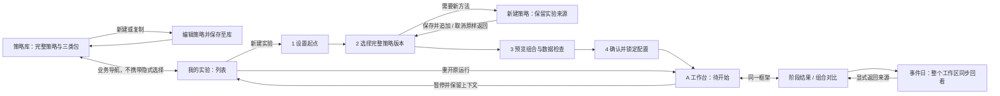

# 策略工作台迭代V1：策略库、实验与 A 工作台融合设计

日期：2026-09-30。依据本任务用户要求“这里的设计内容与‘策略工作台迭代V1’当前的设计进行融合”。这是两条设计线的共同接入契约；本轮交付设计整合，不代表两个预览已经共享数据或生产功能完成。

## 1. 设计来源与取舍

融合后的完整产品动线是：**管理可复用策略 → 在“我的实验”创建研究 → 进入 A 工作台逐日观察 → 查看阶段结果、对比与事件 → 返回原实验或策略定义**。

| 来源 | 保留为共同基线的内容 | 当前证据边界 |
| --- | --- | --- |
| “策略工作台迭代V1”：[策略库规格](2026-09-30-strategy-library-and-experiments.md)、[模型 M01–M15](../../.scratch/strategy-portfolio-backtesting/strategy-library-interaction-model.md) | 三类包、完整策略、历史复制、包规模管理、双列表查询、“我的实验”入口和四步创建、来源返回；M15/SL18/LD13/LT-P已反向引用本共同契约 | F01–F19 是静态画板；不能据其链接宣称真实保存/筛选/运行已接通 |
| V1 当前[修订06契约](../../.scratch/strategy-portfolio-backtesting/strategy-library-wireframes/STYLE-06-CONTRACT.md) | 面包屑、表单尺寸、文字层级、用户文案、演示信息移出产品流 | 正在独立修订；该轮最终验收仍由原任务记录，本文件不提前替它签署通过 |
| 本任务 [A 第三轮契约](../../.scratch/strategy-portfolio-backtesting/workbench-design/REPAIR-03-CONTRACT.md)、[验收](../../.scratch/strategy-portfolio-backtesting/workbench-design/REPAIR-03-ACCEPTANCE.md) | 固定布局、清晰文字操作、真实 K 线及自然间距、回放/回看分组、结果/事件返回、时间安全 | 独立合成内存原型已验收；未与策略库创建共享状态 |
| 本任务 [A 第四轮契约](../../.scratch/strategy-portfolio-backtesting/workbench-design/STYLE-04-CONTRACT.md)、[验收](../../.scratch/strategy-portfolio-backtesting/workbench-design/STYLE-04-ACCEPTANCE.md) | 原站主题、Geist 字体、品牌、主次按钮、图表颜色 | A 桌面范围已通过；不自动证明融合后的展开导航和跨页布局通过 |

优先级：用户最新反馈 → 本融合契约的跨页决定 → 各自最新局部契约 → 历史提案。历史画板、FAIL 和 PASS 保留。A/B/C 不再重新选型；库中直达“用于新实验”、只用图标表达回放、场景选择器占主流程等旧提案不再作为下游依据。未采纳的卡片密度建议仍是建议。

## 2. 统一信息架构与用户动线

**IF01 / LIB01–10、WB01：页面职责。** 策略库只管理方法，默认完整策略，保留标的筛选、买入信号、止盈止损三类目录。我的实验管理草稿及运行记录，是通用新建实验入口；策略详情没有“用于新实验”。四步创建属于我的实验；在第二步临时新建策略仍保留实验来源。工作台是某次实验内部，不是与策略库、我的实验并列的第三种业务对象。工作台里的“回放观察 / 阶段结果 / 组合对比”是该实验的局部模式。

列表、包详情、组装、四步创建继续采用 V1 的任务布局；观察、结果、对比采用 A 的固定图表框架。包选择仍是约480px覆盖面板，工作台组合/事件详情仍为320px检查区，两者用途不同，不合并成同一个宽度。

**IF02 / LIB08–09、WB01–05：进入与重开。**

| 入口状态与动作 | 目标 | 必须看到/保持 |
| --- | --- | --- |
| 草稿→继续编辑 | 原创建步骤 | 原日期、期限、集合、本金、已选版本和组合预设；不生成第二个草稿 |
| 第4步→确认并进入 | 同一实验的新运行，A待开始 | 锁定所选完整策略及包版本；默认组合净值；初始净值1、现金为独立本金、持仓和成交为0；不自动推进 |
| 确认失败或结果不确定 | 留在第4步 | 保留草稿；明确失败或核对状态；避免重复提交产生两次运行 |
| 待开始/暂停→打开 | 同一运行的观察上下文 | 原组合、查看日、已运行进度、图表模式/视野、面板，保持暂停 |
| 运行中→离开列表再重开 | 同一运行，暂停 | 本模型离开前停播；不在隐藏页面继续推进 |
| 完成→查看结果 | 同一运行的结果 | 显式结果截止；回看从现有进度选择日期，不伪装成新的盲看 |
| 失败→查看原因 | 同一运行的失败投影 | 最后完整日、失败组合与恢复动作；不自动重跑、不把缺数据记为零结果 |

现有 F18 的“趋势回撤 v1 / 一周期”样例与 A 的“动量轮动 / 长区间”样例不是同一个实验。后续接线必须从确认数据建立工作台身份、日期、本金和版本；不能用跳转到固定 A 样例冒充创建成功。F05 两策略成功后态也不能落到 F17 单策略样例。

第4步提交前显示“确认后将锁定”，提交成功进入工作台后才显示“已锁定”；待开始运行不再是可编辑草稿。确认时重新校验版本、数据与参数，首次播放只推进已锁定运行，不补做隐式锁定，也不增加第二层开始确认。

## 3. 身份、版本与返回契约

**IF03 / LIB03–05、WB01/08：唯一身份链。** 三类包版本组成完整策略版本；实验选择完整策略版本，为每个所选配置生成独立本金的 Portfolio；确认后生成运行锁定快照。名称只用于显示。不得凭名称关联策略、组合或运行，也不把筛选入围等同买入成交。

锁定信息至少含实验/运行/组合标识、完整策略与三类包标识及版本、有效参数、组合仓位与调仓预设、本金、T0/时区/期限/实际区间、数据快照和执行费用口径。第一次进入工作台就完成锁定；不能拖到首次播放才锁定。库中新版、标签、置顶、排序或归档均不改写历史运行。

**IF04 / LIB03/06–10、WB08：返回是恢复来源，而非跳转首页。** 所有去详情/编辑的入口携带来源对象、来源页面和局部状态；嵌套包详情只退一层。来源失效时显示原因并回我的实验/策略库的合适入口，不能猜测另一实验。

显式返回、浏览器返回和Escape遵循同一来源层级；Escape只关闭当前可关闭层并恢复入口焦点，有未保存输入时沿用草稿保留/离开确认规则，不越层丢弃内容或自动播放。

| 来源→动作→返回 | 应保留的上下文 | 禁止副作用 |
| --- | --- | --- |
| 库→详情/历史/包目录→返回 | 目录、搜索、筛选、排序、分页、滚动和焦点 | 查看不选择、不升级版本、不创建实验 |
| 库内新建/复制→保存 | 新策略详情，保留来源版本 | 只入库，不自动给实验追加选择；不复制持仓、成交或收益 |
| 实验第二步→新建→保存 | 原草稿全部字段、已选策略；追加新策略并重新预检 | 不替换原选择；取消原样返回；失败保留编辑内容 |
| 工作台→查看配置→关闭 | 原模式、组合、日期、视野和入口焦点，保持暂停 | 不重建运行，不切库中最新版 |
| 配置→查看锁定版本/包详情→返回 | 原只读配置及最外层工作台来源 | 库详情返回不能统一回观察首页 |
| 结果/比较→事件→配置→关闭 | 回到该事件日的整个观察投影 | 关闭配置/事件详情不自动回结果；显式“返回阶段结果/组合对比”才恢复来源 |
| 工作台→库/我的实验→重开 | 原运行、组合、V/M/Mᵢ/R、图表/视野、面板、筛选/滚动、事件来源及已看后续记录 | 离开先暂停，重开不自动播放或重置为T0 |

配置里两个动作分开：“复制该版本为新策略”只复制定义；“基于此配置新建实验”建立新实验草稿，保留派生及已看后续来源，重新预检，原运行保持不变。实验派生归入我的实验，不恢复库内新建实验CTA。

## 4. 共同视觉语言与固定框架

**IF05 / LIB11、WB01：应用导航只有一份状态。** 统一使用原站“策略”应用入口；删除 A 导航占位里的独立“工作台”业务根概念。展开200px、收起54px是同一应用导航的两种状态，用户主动切换；切页面不自动改变宽度。继承应用已选状态，新会话使用应用默认值，不由各页面另定默认。两个现有预览分别采用200/54px，这轮保留其历史参考；融合后的两种导航状态都要重新验收，不能复制各自截图便宣称跨页不跳动。

全局顶部身份/面包屑区共同为48px，内容左边界由同一导航宽度决定，返回动作在共同顶部区域。策略库、列表、创建保留40px业务tab区；工作台以“策略 / 我的实验 / 实验名”和明确的返回我的实验、策略库入口表达业务归属，不在 A 上方再叠40px业务tab或多一层标题。工作台内部三个模式使用原 A 身份行。跨内容类型切换不要求图表矩形出现在列表里；观察/结果/比较内部则必须保持原 A 几何。

**IF06 / LIB11、WB01–08：单一主题与控件。**

| 语义 | 融合目标 | 原设计处理 |
| --- | --- | --- |
| 主题 | 原站背景#0b1220；表面#111a2b/#182337；边框#243145，细分隔#1c2736 | 以原站源码及A第四轮准确值为准，不并存两套近似深蓝主题 |
| 文字/字体 | 主#e7edf6、次#adbbcf、辅助#9cacc2；Geist及中文回退，数字Geist Mono | V1修订06的近似文字色/字体栈列入后续共享token替换；其当轮验收仍独立 |
| 主次动作 | 主蓝#2f80ed；次动作暗色边框；6–7px圆角；最小36px命中区 | 保留V1主次层级和A可读动词，不回退为猜图标；禁用原因有可读位置 |
| 输入/查询 | 一般输入、搜索、筛选40px，14px字/20px行高、水平12px内边距；多行最小80px | A紧凑回放选择器保留36px；不同密度有明确用途，不全局拉高回放条 |
| 文字层级 | 列表/编辑页标题22/30、章节16/24、正文14/22、辅助13/20、元数据12/18；A紧凑正文13–14px、次级≥12px | 不以统一为由扩大工作台标题或缩小关键字段；长文本滚动/省略并可完整查阅 |
| 面包屑 | 独立项与分隔符，gap8px；当前项强调；长路径可读 | 同步V1修订06，不用空格或nbsp撑间距 |
| 图表 | 背景#101722；涨#26a69a/跌#ef5350；净值蓝、第二曲线金#f3ba2f | 保留A真实K线约12px初始间距及轴范围安全；净值与独立OHLC各有业务身份 |

A 固定预算保留：顶部48、实验身份48、摘要48、上下文38、图头44、回放44、状态28、检查区320px；1440×900绘图区至少360px高，1280×800至少320px。列表编辑沿用V1内容滚动，工作台详情内部滚动。展开导航后空间不足必须验证并解决，不以缩小文字/控件或移除字段抵消。

**IF07 / LIB11、WB01/04–08：对外文案一套。** 业务tab显示“策略库 / 我的实验”；局部模式显示“回放观察 / 阶段结果 / 组合对比”；右栏“组合详情：概览 / 调仓记录 / 统计指标”。“正在查看”“已运行至”“共同截止”取代V/M/Mᵢ/R；三类包保持业务名称，不出现槽位、状态机、Fxx/Mxx、任务编号或“静态意图”。设计预览及合成数据边界保留为低强调标识，演示场景、重置及诊断放默认收起的设计工具。版本锁定、数据缺失、费用及执行限制不能作为debug被删掉。

## 5. 运行与观察的安全边界

**IF08 / WB02–08：时间模型和整个工作区同时更新。** 技术文档沿用V当前查看日、M已运行行情、Mᵢ组合完整执行截止、R结果截止；这些不向普通用户暴露为缩写。每个投影受行情和成交各自截止限制；图、摘要、轴、tooltip、持仓和事件都必须同步，不能短暂显示另一个组合或未来快照。

| 动作 | 截止与目标 | 视野/来源规则 |
| --- | --- | --- |
| 单步/播放 | 推进新的完整日，成功时V/M及相应Mᵢ一致；首次实际成交取决于信号和执行条件 | 新K/目标成交真实可见，连续越过初始窗口；暂停不推进 |
| 回看过去/切图/切组合 | 回看V≤已有进度，M/Mᵢ不倒退；切图/布局不推进 | 只加载所看投影可知数据；普通刷新/resize保留视野；主动定位使目标可见 |
| 返回最新 | 返回已有M；失败组仍受自己的Mᵢ约束 | 不等同展开剩余，也不保证末尾可继续推进 |
| 阶段结果/组合对比 | R不越过允许范围；共同截止C=min(R, M, 所有纳入比较组合的Mᵢ)，并使用共同有效区间；失败组合保留身份和原因，不静默排除 | 保存观察模式/日期/视野；回放及速度禁用并说明返回观察；显式排除失败组才重算比较范围；不自动运行至终点 |
| 结果/比较进入事件 | V=事件日，M/Mᵢ不变；整个工作区投影该日 | 保存来源模式、R、筛选/滚动/视野；关闭详情停在事件日，显式返回恢复来源 |
| 展开剩余 | 仅此明确展开动作推进原运行M和可成功执行的Mᵢ，取消不变 | 保留已看后续及来源，不以“下一已知事件”代替展开确认 |
| 派生实验/重看早期 | 派生建立新草稿；回看只改变V；两者均不推进原运行M/Mᵢ | 保留已看后续及来源；返回、复制、刷新或重开不能伪装为首次盲看 |
| 失败/重试/来源加载 | 保持最后完整快照，显示原因；未知不作0 | 同尺寸中性占位防串身份/漏未来；重试不得重复成交 |

文字/表单输入和中文IME期间禁止回放快捷键，编辑暂停；鼠标、键盘、模拟触摸和物理触摸证据分别记录。事件详情完整保留原因、可知依据、旧/目标/实际权重、成交/未成交与费用。没有下一已知事件显示说明，不能借此按钮透露未来或自动展开行情。

## 6. 保留的管理能力与非目标

**IF09 / LIB01–10：V1管理设计完整保留。** 三类包的搜索/标签/来源/状态筛选、显式排序、分页、引用口径、开发/发布时间、备注、个人置顶与手动顺序、归档及恢复按M12和LT-K–M执行。完整策略/实验两个列表各自保留搜索/筛选/排序与返回位置，互不覆盖。复制历史策略后修改生成新身份；编辑生成新版本；归档不是删除，不丢已有引用；脚本封装在包里，不增加原子条件编辑器或脚本上传页。

卡片去重/紧凑化建议未因本次融合自动批准。不新增实盘下单、不移植TradingView整套工具、不接真实回测引擎、不将两个样例页面的硬跳转当业务接线、不在本轮操作数据库。窄屏及物理触控仍在原约定之外。

## 7. 统一验收入口与后续任务

**IF10 / 全部：下一阶段从同一“我的实验”入口验收一条实际链。**

1. 空/已有库→管理或复制策略→我的实验→四步创建；第二步就地新建成功/取消/失败都保持来源。
2. 确认→锁定同一份策略、包及组合配置→A待开始→下一日显示真实新K，并按信号与执行条件继续推进至首次实际成交（无信号时保持现金）→暂停→列表→重开原运行。不承诺T0下一日必成交。这条最小旅程由协调者先验收，才扩大依赖该状态的结果/比较接线。
3. 结果/比较→事件日→配置→包历史→逐层返回→来源结果/比较；确认整个投影及返回视野一致。
4. 两档桌面1440×900、1280×800，100%/DPR1；54/200导航、1300断点两侧、长路径、六组合、长名、大金额、空态/失败/弹窗均独立比图。内部模式非预期位移≤1px；主动导航折叠与内容类型切换单独记录。
5. 原型仅会话内存时明确刷新边界；生产保存需显式隔离数据库，核验保存→返回→刷新重读与失败/取消，不以原型回调代替。

本轮设计映射与文档审查见[融合覆盖表](../../.scratch/strategy-portfolio-backtesting/v1-integration/DESIGN-COVERAGE.md)。09/11保持各自open状态；本轮解决共同设计契约，不代替新增画板接受或首次用户研究。10继续等待09/11按既有流程完成各自范围，再承担创建到工作台的接线；05/06承接观察/比较验证，生产实现仍归总票。不得新建一套与这些任务重叠的实施队列。

共同框架、整页视觉和完整状态链由集成协调者root负责；V1负责人维护09/10及库/创建画板，本任务维护11和A工作台设计。实现任务遵循Luna有界派发及独立视觉审查；范围、参考和所有权先进入覆盖表。

## 8. 本轮交付与阅读入口

- [融合记录、来源版本与审查](../../.scratch/strategy-portfolio-backtesting/v1-integration/README.md)。
- V1静态设计入口：[我的实验](http://127.0.0.1:3062/#f14)、[策略库](http://127.0.0.1:3062/#f01)。
- A独立原型：[待开始](http://127.0.0.1:3051/?variant=A&scenario=T0)、[完成后的工作台](http://127.0.0.1:3051/?variant=A&scenario=complete)。

这些链接供查看各自设计；当前没有一个已验证的统一业务预览。本轮未改原型代码，不将旧的独立视觉证据冒充融合后的端到端或视觉验收。
