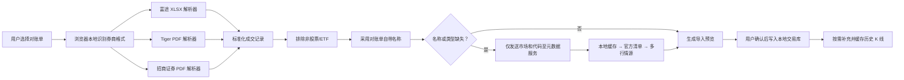

# 多券商对账单导入与证券名称自动补全设计

日期：2026-07-29
状态：已确认

## 目标

扩展 TradeReviewer 的统一导入入口，使其能够自动识别并解析：

- 富途 XLSX；
- Tiger 活动报表 PDF；
- 招商证券对账单 PDF。

导入过程只保留股票和 ETF。证券名称与资产类型由对账单内容、本地缓存、官方证券清单和无需 API Key 的公开行情源自动补全，不再要求用户填写股票名称。

本期不导入基金、外汇、可转债、逆回购、资金划转、分红、利息、申购和配号等记录。

## 设计原则

1. 原始对账单和成交明细只在浏览器本地解析，不上传服务器。
2. 服务端元数据接口只接收标准化后的市场和证券代码。
3. 券商解析器统一输出现有交易领域模型，后续交易配对、复盘和交易库不区分来源券商。
4. 优先复用对账单名称和本地缓存，避免重复联网。
5. 证券名称不能由用户手填，也不能用代码冒充。
6. 外部数据源失败时自动切换下一来源，不能反复请求同一失败端点。
7. 行情同步继续使用本地缓存优先、按缺口更新的现有机制。

## 总体架构



### 隐私边界

- PDF/XLSX 文件读取、文本抽取、表格重建和成交标准化都在浏览器完成。
- 元数据服务的请求只包含 `market` 与 `symbol`，例如 `HK:700` 或 `US:NVDA`。
- 导入确认前不写入交易库。

## 文件识别和解析器契约

导入入口接受 `.xlsx`、`.xls` 和 `.pdf`，根据文件内容而不是文件名识别格式。

解析器应实现统一契约：

```ts
type BrokerStatementParser = {
  detect(input: StatementInput): Promise<DetectionResult>;
  parse(input: StatementInput): Promise<StatementParseResult>;
};
```

标准化结果包含：

- 有效成交记录；
- 待解析证券集合；
- 排除记录及分类原因；
- 解析诊断；
- 来源文件指纹；
- 券商、账户与时间精度信息。

格式不匹配、必要表格缺失或 PDF 文本结构变化时，应返回可解释的诊断，不尝试按其他券商字段强行解析。

## 富途 XLSX

继续读取“证券-交易流水”工作表，并扩展现有解析器：

- 接受代码列未携带名称的证券记录；
- 不再生成需要用户手填的阻断状态；
- 保留账户、市场、币种、方向、数量、价格、费用和成交时间；
- 证券与 ETF 进入候选集合，其他品类进入排除统计。

## Tiger PDF

读取活动报表中的“股票”表格，支持：

- 普通买入和卖出；
- 做多开仓和平仓；
- 做空开仓和平仓；
- 港股和美股；
- 表格内名称、代码、市场、交易所、方向、数量、价格、费用、成交时间、交收日期和币种。

方向映射：

- 做多开仓、平仓空头：`buy`；
- 卖出、平仓多头、做空开仓：`sell`。

现有交易配对逻辑允许负持仓，因此能够形成独立的做空交易回合。

样本 PDF 中同一逻辑成交会连续重复展示。解析器只在满足以下条件时合并：

- 两行连续；
- 第二行缺少重复的证券名称或代码；
- 市场、方向、数量、价格、费用、成交时间、交收日期和币种完全相同。

不能仅按成交字段做全局去重，以免删除用户真实发生的相同成交。

手续费为同一行各项佣金和税费的绝对值总和。

## 招商证券 PDF

读取“流水明细”中的表格字段：

- 发生日期；
- 市场；
- 币种；
- 证券账号；
- 证券代码；
- 证券名称；
- 业务标志；
- 发生数量；
- 成交均价；
- 成交金额；
- 佣金、印花税和其他费。

仅将“证券买入”和“证券卖出”送入股票/ETF 候选集合。其余业务标志先按业务类型排除。

可转债即使业务标志为证券买卖，也必须通过资产类型识别排除。资产类型判断依次使用：

1. 官方清单或元数据源返回的类型；
2. 行情源返回的证券类型；
3. 经测试固定的交易所代码规则与名称特征。

招商证券样本只提供成交日期，不提供成交时刻：

- `executedAt` 保存可排序的本地交易日期；
- 额外记录时间精度为 `date-only`；
- 同一天成交按照原始对账单行序排列；
- UI 明确显示“对账单未提供成交时间”，不得伪造精确时刻。

## 数值、标识与去重

- 数量、价格、费用和金额统一使用十进制定点字符串。
- 标准模型中的数量保存为正数，买卖方向单独保存。
- 证券代码先按市场标准化，再生成 `market:symbol` 标识。
- 每笔成交 ID 由券商、文件指纹、表格/页码、来源行序和规范化成交内容共同生成。
- 同一份文件重复导入、或不同文件包含重叠区间时，交易库依靠稳定成交标识和重复出现次数进行合并。
- 不能只用时间、代码、数量和价格做无条件全局去重，因为用户可能真实产生两笔完全相同的成交。

## 股票和 ETF 过滤

允许进入交易库：

- 普通股票；
- ETF。

自动排除：

- 基金；
- 外汇；
- 可转债及其他债券；
- 逆回购；
- 资金划转；
- 分红和利息；
- IPO、新股/新债申购、配号和中签流水；
- 其他无法确认属于股票或 ETF 的资产。

无法确认资产类型的标的必须先经过元数据服务解析，不能只凭“证券买卖”业务标志导入。

## 证券名称与资产类型补全

研究细节见：

`docs/research/no-key-instrument-metadata.md`

### 查询顺序

#### A 股

1. 本地元数据缓存；
2. 对账单自带名称与类型证据；
3. 腾讯单证券行情；
4. 东方财富单证券快照；
5. 新浪单证券行情。

#### 港股

1. 本地元数据缓存；
2. 对账单自带名称与类型证据；
3. HKEX Full List of Securities；
4. 腾讯；
5. 东方财富；
6. 新浪。

#### 美股

1. 本地元数据缓存；
2. 对账单自带名称与类型证据；
3. Nasdaq Trader Symbol Directory；
4. 腾讯；
5. SEC 公司代码表；
6. 新浪。

Yahoo 不进入名称补全的关键链路。现有 Yahoo K 线适配器可继续作为行情备用源。

### 标准化返回

```ts
type ResolvedInstrument = {
  market: "US" | "HK" | "CN-SH" | "CN-SZ";
  symbol: string;
  name: string;
  assetType: "stock" | "etf";
  source:
    | "statement"
    | "nasdaq"
    | "sec"
    | "hkex"
    | "tencent"
    | "eastmoney"
    | "sina";
  confidence: "statement" | "official" | "portal";
  resolvedAt: string;
};
```

每个来源的结果都必须验证：

- 返回代码与请求代码一致；
- 名称非空且不是代码本身；
- 市场一致；
- 资产类型为股票或 ETF。

### 缓存

- 浏览器缓存键为标准化的 `market:symbol`。
- 成功结果记录名称、资产类型、来源、可信度和解析时间。
- 已交易股票优先读取本地缓存，不因重复导入再次联网。
- Nasdaq 和 HKEX 官方清单由服务端每日最多更新一次。
- 门户结果使用较长 TTL；过期不阻断展示，后台刷新。
- 一个导入批次先按标的去重，再限制并发查询。
- 单股“更新数据”同时允许刷新证券名称和 K 线缺口。

### 全部来源失败

- 不展示名称输入框；
- 不用代码冒充名称；
- 该标的显示在“暂未导入”区域；
- UI 展示已尝试来源与失败摘要；
- 提供“重新查询”；
- 其他已识别标的仍可继续导入。

## 导入界面

统一入口文案为“导入交易记录”，不展示券商图标或券商选择器。

解析过程分阶段展示：

1. 识别格式；
2. 解析成交；
3. 识别股票；
4. 补全名称；
5. 准备行情。

确认弹窗展示：

- 券商与文件名；
- 交易区间；
- 有效成交笔数；
- 股票与 ETF 数量；
- 新增、重复和暂未导入的标的数；
- 按原因分类的排除统计；
- 将进入交易库的“股票名（代码）”列表。

删除当前股票名称输入框及“补充名称后确认”的阻断逻辑。

名称查询失败的标的单独显示失败来源和“重新查询”，不影响其他完整标的。

确认后只保存已完整识别的股票和 ETF，并为新增或所需区间扩大的标的启动行情缺口更新。

## 行情数据联动

- 已缓存 K 线优先使用，不重复请求。
- 导入新增股票或扩大所需时间范围时，只下载缺失区间。
- 单股更新按钮只补充缺口，并可刷新过期的证券元数据。
- 名称补全和 K 线更新是两个独立状态；名称解析失败不能污染已有 K 线缓存，K 线失败也不能删除已解析名称。

## 错误处理

- 外部来源设置短超时和有限并发。
- 403、429、超时、HTML 错误页、空响应、代码不回显或 schema 变化均切换下一来源。
- 同一请求周期不立即密集重试失败来源。
- 记录数据源和失败类别，但不记录账户或成交内容。
- PDF 结构变化应产生“无法识别该券商当前版本”的格式诊断。
- 局部坏行进入诊断并跳过；文件级必要结构缺失才阻断整个文件。

## 测试与验收

### 解析器

- 从 `trades` 中三份真实样本制作最小化、脱敏、冻结夹具。
- 富途代码缺少名称时不再出现输入框。
- Tiger 连续重复展示行不会造成成交翻倍。
- Tiger 做空开仓和平仓生成方向正确的做空回合。
- 招商证券股票和 ETF 被导入，可转债和逆回购被排除。
- 招商证券同日多笔成交保留原始顺序，并标记 `date-only`。

### 元数据

冻结以下代表性夹具：

- `CN-SH:600519` 股票；
- `CN-SH:510300` ETF；
- `CN-SZ:000001` 股票；
- `CN-SZ:159915` ETF；
- `HK:00700` 股票；
- `HK:02800` ETF；
- `US:AAPL` Nasdaq 股票；
- `US:BRK.B` 非 Nasdaq 股票；
- `US:SPY` ETF。

测试多源回退、缓存命中、代码校验、资产类型校验、超时、403、429、HTML 错误页、空 JSON 和编码错误。单元测试只使用冻结响应；外部 live smoke test 不作为 CI 阻断条件。

### 导入与存储

- 重复导入同一文件不重复写入成交。
- 重叠区间对账单合并后不丢失真实重复成交。
- 已缓存名称和 K 线时不重复联网。
- 暂未识别标的不进入交易库，其他完整标的可以确认导入。
- 原始 PDF/XLSX 和成交明细不会发送到服务器。

### UI

- 一个入口支持三种格式并自动识别券商。
- 确认弹窗展示分类统计和完整股票名称。
- 不再存在股票名称输入框。
- 名称补全失败可重新查询。
- 导入后只出现有有效股票/ETF 成交的标的。

## 非目标

- AI 模型洞察增强；
- 期权、期货、基金、外汇、债券和可转债复盘；
- 手工编辑证券名称；
- 上传或云端保存原始对账单；
- 分钟级行情数据；
- 对未适配券商 PDF 做通用 OCR 猜测。
