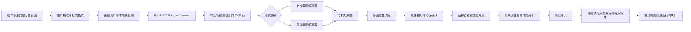

# 老虎与富途截图恢复交易设计

日期：2026-07-31
状态：已确认

## 目标

在现有对账单导入之外新增“从截图恢复交易”入口，使用户可以从老虎证券和富途证券的交易历史截图中恢复成交，并在人工校对后写入现有本地交易库。

首期必须满足：

- 一次选择并合并多张 JPG、PNG 或 WebP；
- 支持本需求提供的老虎和富途深色交易历史长截图版式；
- OCR、版式识别和字段解析全部在浏览器内执行，图片不上传；
- 恢复市场、股票代码、股票名称、买卖方向、数量、价格和精确到秒的成交时间；
- 低置信字段和跨来源冲突必须经过人工处理；
- 与已有对账单、其他截图和其他导入批次进行跨来源去重；
- 用户确认后复用现有证券补全、导入历史、交易库持久化和行情更新链路。

## 非目标

首期不包括：

- 通用截图或任意券商版式识别；
- 云端 OCR 或视觉模型；
- 手机摄像头实时扫描；
- 从持仓、订单委托、资金流水或收益截图推断成交；
- 保存原始截图或未完成的校对草稿；
- 自动猜测无法证明的市场、时区或成交字段；
- HEIC、GIF、PDF 或视频输入。

## 设计原则

1. 原始图片和裁剪图不离开浏览器，也不写入持久化存储。
2. OCR 结果只是待校对草稿；只有用户确认后的完整成交才能进入交易库。
3. 版式解析必须 fail closed。无法证明为受支持版式时停止解析，不按相似文字猜测。
4. 去重分为“候选匹配”和“内容判断”，不能只因股票和时间相同就静默删除记录。
5. 同一来源内真实存在的同秒相同成交必须保留；不同来源之间按出现次数一一配对。
6. 截图入口复用现有领域模型和持久化边界，不建立第二套交易库。
7. OCR 引擎与券商版式解析器相互隔离，便于单独升级模型或适配券商改版。

## 总体架构



### 模块边界

新增能力分为以下独立单元：

- `image-pipeline`：校验、解码、切片、预处理和释放图片资源；
- `ocr-worker`：加载本地 OCR 资源并返回文字、坐标、置信度和耗时；
- `screenshot-detector`：只判断受支持的券商和版式版本；
- `tiger-screenshot`、`futu-screenshot`：把 OCR 行组合为券商无关的待校对成交；
- `screenshot-review`：维护字段编辑、人工确认、删除、补录和时区确认；
- `execution-reconciliation`：分析跨来源自动重复、冲突和出现次数；
- 现有 `enrich-import`、导入预览、事务式持久化和行情同步继续作为下游。

每个版式解析器只依赖标准 OCR 行，不直接依赖 PaddleOCR.js，也不操作 UI 或存储。

## 本地 OCR

采用 PaddleOCR.js 的浏览器端 PP-OCRv5 中文移动模型。官方浏览器 SDK 支持 `Blob`、`ImageBitmap`、`ImageData` 和多图输入，并能在专用 Worker 中运行，返回每行文字、坐标和识别分数：

- [PaddleOCR.js 浏览器部署](https://www.paddleocr.ai/latest/en/version3.x/inference_deployment/cross_platform/browser.html)
- [ONNX Runtime Web](https://onnxruntime.ai/docs/tutorials/web/)

模型、ONNX Runtime WASM、OpenCV 资源和 Worker 必须由应用同源托管，不从第三方 CDN 动态加载。构建产物保留上游要求的许可证和通知文件。

首次使用需要从应用域名下载 OCR 资源。资源使用不可变文件名和长期缓存；完成下载后，识别仍完全在浏览器本地执行。WebGPU 只能作为可选加速，WASM 是兼容性基线，不能因浏览器没有 WebGPU 而阻断功能。

### 输入与资源限制

- 每个批次最多 20 张图片；
- 单张压缩文件最大 25 MiB；
- 单张解码后最大 60 百万像素；
- 每次只解码和识别一张原图；
- 超长图片按纵向切片处理，切片之间保留足够重叠区覆盖一整行成交；
- 切片完成后立即释放临时 canvas、`ImageBitmap` 和 object URL；
- 取消或关闭时终止 Worker，并释放当前批次全部图片资源。

超过限制时在读取 OCR 模型前给出明确错误，不尝试降采样后静默继续。

### 图像预处理与切片

预处理保留原图，同时为 OCR 生成工作副本：

- 根据短边尺寸放大过小文字；
- 将深色界面转换为适合 OCR 的亮度图；
- 增强局部对比度，但不改变几何位置；
- 对文字检测使用完整切片，对已定位的数字字段可使用局部裁剪再次识别；
- 保存工作副本坐标到原图坐标的可逆映射，供校对页定位截图局部。

切片重叠产生的同一 OCR 行通过原图坐标和规范化文字合并。这个步骤只去除同一图片处理过程中的技术重复，不参与业务成交去重。

## OCR 与版式解析契约

OCR 层输出：

```ts
type OcrTextLine = {
  imageId: string;
  tileIndex: number;
  text: string;
  score: number;
  polygon: Array<{ x: number; y: number }>;
  sourceBounds: { x: number; y: number; width: number; height: number };
};
```

截图版式解析器输出待校对字段，而不是直接生成 `TradeExecution`：

```ts
type ScreenshotTradeDraft = {
  id: string;
  broker: "futu" | "tiger";
  layoutVersion: string;
  imageId: string;
  sourceRowIndex: number;
  sourceBounds: { x: number; y: number; width: number; height: number };
  market?: "US" | "HK" | "CN-SH" | "CN-SZ";
  symbol?: string;
  sourceName?: string;
  side?: "buy" | "sell";
  quantity?: string;
  price?: string;
  sourceTimestampText?: string;
  fieldEvidence: Record<
    "market" | "symbol" | "side" | "quantity" | "price" | "executedAt",
    {
      rawText: string;
      confidence: number;
      requiresConfirmation: boolean;
      confirmedByUser: boolean;
    }
  >;
};
```

解析器必须保留每个字段的 OCR 原文、综合置信度和原图位置。综合置信度可以低于 OCR 分数，例如字段经过字符替换、跨行拼接或格式修复时。

### 受支持版式

首期只适配本需求提供的版式族：

- 富途“订单记录”成交列表；
- 老虎证券交易历史/订单成交列表；
- 与样例相同的深色主题、纵向普通截图和纵向长截图。

检测依据必须组合使用页面标题、账户/市场标签、列标题、买卖词、成交状态以及多行字段位置。单个券商名称或单个“买入/卖出”词不能独立构成匹配。

每个解析器以 `layoutVersion` 标识规则版本。券商改版后检测失败时返回“暂不支持该截图版式”，而不是落入另一个券商解析器。

### 行重建

行重建使用纵向中心距离、列位置和相邻文本关系：

- 方向列识别买入、卖出以及券商对应颜色和词汇；
- 名称与代码必须来自同一成交行或解析器定义的稳定相邻行；
- 数量和价格使用十进制定点字符串，去除千位分隔符但不使用二进制浮点；
- 日期与时间必须来自同一成交行；
- “全部成交”等订单状态只作为成交资格证据，不映射为交易字段；
- 页头、搜索框、导航栏和底部说明必须排除。

无法组成全部必填字段的疑似成交仍进入“待确认”列表，允许用户补全或删除；完全无法定位为成交行的零散 OCR 文字只进入图片诊断，不生成交易。

## 时间与账户

### 时间

截图解析器先保留券商展示的墙上时间 `sourceTimestampText`，不立即猜测 UTC。

校对页显示该批次的建议时区，但用户必须明确确认一次。多市场截图仍按券商界面展示时区解释，不按股票市场分别换算。确认后：

1. 使用确认时区解析墙上时间；
2. 转换为精确到秒的 UTC ISO 字符串；
3. 将原文写入 `source.sourceTimestampText`；
4. 将 IANA 时区写入 `source.sourceTimezone`；
5. 将 `source.timePrecision` 写为 `second`。

日期或秒数缺失时不得补零生成精确成交，必须由用户修正。不存在或夏令时重复导致的歧义本地时间必须标为待确认。

### 账户

解析器优先读取截图页头中的账户类型和脱敏尾号。若批次无法得到稳定账户标识，校对页要求用户：

- 选择已有账户；或
- 创建一个本地截图账户标签，例如“老虎截图账户”。

账户选择不会参与重复候选键，但会影响交易回合和账户筛选，因此在确认导入前必须完成。

## 多图合并

用户选择图片时的顺序就是批次顺序，可在识别前调整。每张图片拥有独立内容指纹和序号。

多图合并分两步：

1. 同一图片的切片重叠按原图坐标消除；
2. 不同图片的重叠成交进入跨来源去重分析。

第二步不能依赖图片像素相似度，也不能全局删除相同 OCR 行。这样既支持相邻长截图的内容重叠，也保留同一张截图里真实发生的同秒多笔成交。

## 校对界面

采用已确认的“总表优先”布局。

### 页面结构

- 顶部显示批次名称、识别进度、总成交数、待确认数、自动重复数和冲突数；
- 左侧按选择顺序显示图片缩略导航、识别状态、成交数和问题数；
- 中间是可编辑成交总表；
- 右侧抽屉显示当前字段对应的原截图局部、OCR 原文、置信度和修改控件；
- 底部提供取消和确认导入操作。

总表至少包含：

- 状态；
- 市场和股票；
- 买卖方向；
- 数量；
- 价格；
- 成交时间；
- 来源图片；
- 重复或冲突状态。

支持筛选“全部、待确认、冲突、自动重复”，并支持按成交时间排序。用户可以修改字段、确认当前识别值、删除一行或手工补录一笔。

### 待确认条件

以下任一情况使字段或记录进入待确认：

- 综合置信度低于 `0.85`；
- OCR 字符经过模糊替换或格式修复；
- 必填字段缺失；
- 股票代码与市场组合无效；
- 日期、时间或时区存在歧义；
- 股票 + 时间命中已有记录，但核心成交字段冲突；
- 证券名称或资产类型无法通过现有补全链路确认。

人工修改字段即视为用户确认该字段；保留原识别值则需要显式执行“确认识别值”。编辑股票、时间、方向、数量或价格后，证券补全、重复分析和冲突状态立即重新计算。

存在未确认字段、未处理冲突、未确认时区或未选择账户时，“确认导入”保持禁用。

## 跨来源去重与冲突

### 术语

- **来源实例**：一个独立文件或一张独立截图，以内容指纹标识；
- **候选键**：标准市场 + 标准股票代码 + UTC 成交时间（精确到秒）；
- **核心成交字段**：方向 + 标准化数量 + 标准化价格；
- **自动重复**：候选键和核心成交字段都一致、且记录来自不同来源实例；
- **冲突**：候选键一致，但核心成交字段至少一项不同。

账户和手续费不参与自动重复判断。截图通常没有手续费；自动重复时优先保留字段更完整的对账单记录，并可用另一来源补充更可靠的证券名称。来源证据不得被无痕覆盖，导入历史记录本批次跳过的重复数。

### 出现次数

去重按来源实例统计相同核心成交的出现次数。跨来源合并后保留各来源中最大的出现次数，而不是只保留一条。

例如，同一文件中有两笔完全相同的真实成交，另一张截图只覆盖其中一笔，最终保留两笔。这样兼容现有“同一导出中相同成交不能被误删”的约束。

### 冲突处理

每个冲突组提供：

- 保留已有记录，跳过冲突截图记录；
- 使用截图记录，移除被替代的已有记录；
- 全部保留，将其视为真实的同秒不同成交。

冲突选择只作用于当前明确列出的记录。系统不得把一次选择扩展到其他股票、时间或未来导入。

### 应用位置

重复和冲突分析发生在导入预览阶段，并同时比较：

- 当前截图批次内的不同图片；
- 当前截图批次与已保存交易；
- 以后导入的对账单或截图与已保存截图成交。

底层执行库继续按稳定 ID 合并，并把自动重复规则应用于不同来源实例。冲突核心字段不同，因此不会在持久化加载时被静默折叠。

## 数据模型与持久化

`TradeExecution.source` 增加可选截图证据：

```ts
type ScreenshotExecutionSource = {
  inputKind: "statement" | "screenshot";
  fileFingerprint?: string;
  batchId?: string;
  captureIndex?: number;
  sourceBounds?: { x: number; y: number; width: number; height: number };
  sourceTimestampText?: string;
  sourceTimezone?: string;
};
```

持久化时不保存：

- 原始图片；
- 图片缩略图或裁剪图；
- 完整 OCR 文本；
- OCR 模型中间结果。

成交只保留追踪来源所需的文件指纹、图片序号、原图行位置、时间原文和时区。新增字段均为可选，现有本地执行记录不需要破坏性迁移。

导入历史新增输入类型和图片数量，来源文案显示“富途截图”或“老虎截图”，并继续记录有效成交、排除、重复、冲突处理和未识别数量。

## 失败、取消与恢复

- 单张图片识别失败不清空已完成图片；用户可重试或移除该图片；
- OCR 模型或 WASM 加载失败时保留当前内存草稿，并提供重试；
- 未知版式显示券商/版式不支持诊断，不生成猜测成交；
- 图片解码失败、尺寸超限和格式不支持在图片列表中显示独立错误；
- 解析器只把局部坏行标为待确认，不因一行错误阻断其他完整成交；
- 用户取消时中止当前 OCR 操作并释放所有图片资源；
- 浏览器刷新或关闭页面后未确认草稿丢弃，这是首期明确行为；
- 最终保存继续使用现有事务式批次写入；任一步失败时交易库和导入历史一起恢复到导入前状态；
- 行情补齐失败不回滚已确认成交，沿用现有可重试状态。

## 隐私与安全

- 图片、OCR 行、截图局部和人工修改草稿只存在于当前浏览器内存；
- OCR Worker 不执行网络上传；
- OCR 资源只允许从应用同源静态路径加载；
- 证券名称补全仍只向现有服务发送标准市场和代码，不发送图片、OCR 原文、账户、成交时间、方向、数量或价格；
- 错误日志只记录错误类别、版式版本和耗时，不记录图片内容或交易字段；
- 测试夹具不得包含真实账户信息或原始用户截图。

## 测试策略

### 图片管线

- 支持 JPG、PNG、WebP，拒绝其他格式；
- 在读取 OCR 模型前拒绝数量、文件大小和像素数超限；
- 超长图片切片覆盖完整高度，边界重叠不少切且不重复输出同一 OCR 行；
- 取消后 Worker、canvas、`ImageBitmap` 和 object URL 被释放；
- 多图严格保持用户选择顺序。

### OCR 边界与版式解析

- 使用冻结的匿名化 `OcrTextLine` 夹具覆盖富途和老虎样例版式；
- 列标题、页头、导航和成交状态不会误生成为交易；
- 买卖方向、市场、代码、名称、数量、价格和秒级时间正确组合；
- 深色主题、小数字、千位分隔符和两位年份正确标准化；
- 不完整行进入待确认，未知版式 fail closed；
- OCR SDK 只在适配器测试中替换，券商解析器测试不加载模型。

### 时间

- 未确认时区时不能生成最终成交；
- IANA 时区正确转换为 UTC；
- 夏令时边界的不存在时间和重复时间进入待确认；
- 缺少日期、时分秒任一部分时不得伪造精确时间；
- 时区修改后重复和冲突分析重新运行。

### 校对状态

- 置信度 `< 0.85`、模糊修复、缺字段和无效代码都进入待确认；
- 手工修改或显式确认解除对应阻断；
- 删除和补录会更新批次统计；
- 图片失败可以独立重试或移除；
- 存在未确认字段、冲突、时区或账户时禁止导入；
- 关闭页面不会把原图或草稿写入本地存储。

### 去重与冲突

- 不同来源、候选键和核心成交字段相同会自动去重；
- 手续费和账户不同不阻止自动去重；
- 候选键相同但方向、数量或价格不同会生成冲突；
- 同一来源实例内同秒相同成交全部保留；
- 多来源使用最大出现次数，一一配对后不多删；
- “保留已有”“使用截图”“全部保留”分别产生预期执行集合；
- 编辑候选键或核心字段后重新归类；
- 同一文件重复导入和相邻截图重叠不会增加交易；
- 已有对账单中的较完整费用和账户信息优先保留。

### UI、事务与端到端

- 组件测试覆盖总表筛选、原图局部抽屉、字段编辑、确认、删除、补录、进度、取消和重试；
- 工作区测试覆盖独立截图入口、现有文件入口不回归、预览统计、确认落库和行情更新；
- 存储失败时交易库与导入历史一起回滚；
- 仓库只提交匿名化 OCR 坐标/文字夹具和必要的合成小图；
- 本需求提供的三张真实图片只在本机执行端到端验收，不复制进仓库、不进入快照、不上传；
- OCR 模型的 live smoke test 不作为普通单元测试前置条件，但发布前必须用三张本机样例完成一次人工校对验收。

## 验收标准

1. 用户能从独立入口一次选择本需求提供的三张图片并看到逐图进度。
2. 应用能识别老虎和富途版式，并将可定位的疑似成交全部送入校对总表。
3. 每个最终成交都有市场、标准股票代码、方向、正数数量、正数价格和精确到秒的已确认时间。
4. 所有低置信、修复、缺失、时区和冲突状态都可定位到原图局部，并在处理前阻止导入。
5. 相邻截图重叠、重复导入截图以及截图与已有对账单重叠时不会增加自动重复成交。
6. 股票和时间相同但方向、数量或价格冲突时不会静默删除，必须由用户选择处理方式。
7. 同一来源内真实存在的同秒相同成交不会被去重算法删除。
8. 确认导入后成交进入现有交易库、导入历史和行情更新流程。
9. 原始图片、OCR 原文和校对草稿不会写入持久化存储，也不会发送到服务端。
10. 原有富途 XLS/XLSX、Tiger PDF 和招商证券 PDF 导入测试继续通过。
